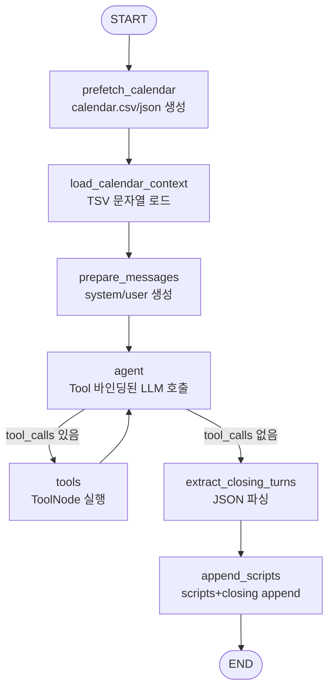

# ClosingAgent 구현 계획

> 목적: Opening+Theme 단계까지 완성된 장마감 브리핑 대본(`scripts`)을 입력으로 받아  
> **클로징(마무리) 파트**를 추가한다.  
> 클로징은 (1) 오늘 방송 내용 요약, (2) 향후 주요 경제 일정 하이라이트, (3) 투자자 인사이트/주의 당부로 끝맺는다.

---

## 0. 요구사항 정리 (이번 에이전트의 제약)

- 제공 Tool: **`get_ohlcv`**, **`get_calendar`**만 바인딩
- 프롬프트로 주입하는 외부 컨텍스트: **오늘(브리핑 날짜) 및 이후의 경제 캘린더 리스트만**
  - 리스트만 주입하고, 필요한 세부(예측치/이전치/중요도 등)는 에이전트가 `get_calendar`로 추가 조회
- 내부 실행 구조: 다른 에이전트와 동일하게 **prefetch → load → LLM invoke** 패턴을 따른다.

---

## 1. 상위 Orchestrator 관점: 입력/출력 인터페이스

`orchestrator.py`는 `BriefingState`를 공유하며 노드 체인으로 각 서브그래프를 호출한다.

### 1-1. BriefingState (요약)

```python
class ScriptTurn(TypedDict):
    speaker: str                 # "진행자" | "해설자"
    text: str
    sources: list[dict]          # 최소 { "pk": str, "title": str } 권장

class BriefingState(TypedDict, total=False):
    date: str                    # YYYYMMDD (EST)
    user_tickers: list[str]
    nutshell: str
    themes: list[dict]
    scripts: list[ScriptTurn]    # 누적 대본 (Opening+Theme까지)
    current_section: str         # "opening" | "theme" | "stock" | "closing" | "ending" | "citation"
```

### 1-2. ClosingAgent 입력 (권장)

- `date`: 필수
- `scripts`: 필수 (`BriefingState.scripts`, 즉 Opening+Theme까지의 누적 대본)

> 현 시점에서는 `stock` 단계 제작이 지연되어 Theme 다음을 **ClosingAgent로 바로 연결**한다.

### 1-3. ClosingAgent 출력 (권장)

- `closing_turns`: 4~8턴 정도의 클로징 파트(새로 생성)
- `scripts`: 기존 `scripts` 뒤에 `closing_turns`를 **append**한 완성 대본
- `current_section`: 오케스트레이터에서 `"closing"`으로 설정 (또는 유지)

상위 노드 스케치:

```python
from ClosingAgent.src import closing_agent

def closing_node(state: BriefingState) -> BriefingState:
    graph = closing_agent.build_graph()
    result = graph.invoke({
        "date": state["date"],
        "scripts": state.get("scripts", []),
    })
    return {
        **state,
        "scripts": result["scripts"],
        "current_section": "closing",
    }
```

---

## 2. 캐시/컨텍스트 전략 (Calendar only)

ClosingAgent는 뉴스/시장지표 컨텍스트를 만들지 않는다. 오직 경제 캘린더만 프리페치해:

- `ClosingAgent/data/closing/calendar.csv` : **리스트(경량)**, 프롬프트 주입용
  - 컬럼: `id, est_date(YYYYMMDD), title`
- `ClosingAgent/data/closing/calendar.json` : **상세(중량)**, Tool 조회용

### 2-1. 프리페치 범위 (권장 기본값)

- 앵커: `state.date` (EST)
- 수집 범위:
  - `date ~ date+7일` : impact 1~3 전체
  - `impact=3(High)` : `date ~ 다음달 말`까지 확장 (큰 이벤트 놓치지 않기)

> 범위/정렬/필터는 추후 환경변수로 제어 가능하도록 설계한다.

### 2-2. 프롬프트 주입 문자열 포맷

다른 에이전트와 동일하게 TSV 텍스트로 주입한다.

```
id	est_date	title
417228	20251223	US GDP QoQ (3Q) - Final
...
```

LLM은 이 리스트에서 “지금 당장 중요한 것”을 고르고, 필요한 것은 `get_calendar(id=...)`로 디테일을 확인한다.

---

## 3. Tool 설계 (ClosingAgent에서 제공하는 2개)

### 3-1. `get_calendar`

- 입력
  - `id="417228"` 또는
  - `date="20251223"` 또는 `date=["20251223","20251224"]` 또는 `"20251223,20251224"`
- 동작
  - 로컬 캐시(`data/closing/calendar.json`)에서 이벤트 검색 후 반환
- 출력 (권장 형태)
  - `{"mode":"id","found":True,"event":{...}}`
  - `{"mode":"date","count":N,"dates":[...],"events":[...]}`

> ThemeAgent/OpeningAgent의 `calendar_tools.py` 구현을 그대로 이식해 일관성을 맞춘다.

### 3-2. `get_ohlcv`

- yfinance 래퍼로 OHLCV 조회
- Closing에서는 “오늘 흐름 요약”에서 지수/대표 ETF를 짧게 인용할 때 사용 가능
- 단, 이미 `scripts`(누적 대본)에 포함된 수치/팩트와 상충하지 않도록
  - 수치를 새로 꺼낼 경우 `sources`에 명시하거나
  - 혹은 “수치 언급 없이 방향성/맥락만”으로 마무리할 수 있도록 프롬프트에서 제약을 둔다.

---

## 4. ClosingAgent 내부 그래프 설계 (prefetch → load → LLM invoke)

### 4-1. 디렉터리 구조 (제안)

```text
ClosingAgent/
├── PLAN.md
├── ARCHITECTURE.md               # (구현 후) 실제 구조 요약
├── prompt/
│   └── closing_main.yaml         # system/user_template
├── data/
│   └── closing/
│       ├── calendar.csv
│       └── calendar.json
├── src/
│   ├── __init__.py
│   ├── closing_agent.py          # LangGraph 그래프 정의
│   ├── prefetch.py               # prefetch_calendar만 담당
│   └── tools/
│       ├── __init__.py
│       ├── calendar_tools.py     # get_calendar
│       └── ohlcv.py              # get_ohlcv
└── requirements.txt              # (필요 최소) langgraph/langchain_openai/requests/bs4/pytz/yfinance 등
```

### 4-2. LangGraph 플로우 (ReAct 포함 옵션)

Closing도 tool을 쓸 수 있어야 하므로, OpeningAgent와 같은 “agent ⇄ tools” 루프를 사용한다.



### 4-3. State 스키마 (제안)

```python
class ClosingState(TypedDict, total=False):
    date: str
    scripts: list[ScriptTurn]                  # 누적 대본 (입력/출력)

    calendar_context: str                      # TSV 문자열 (주입 컨텍스트)
    messages: Annotated[Sequence[BaseMessage], add_messages]

    closing_turns: list[ScriptTurn]            # LLM이 만든 클로징 파트
```

---

## 5. 프롬프트 설계 (closing_main.yaml)

### 5-1. System 역할

- “클로징 방송 작가/편집자” 역할
- **사실/수치 생성 금지**: 누적 대본(`scripts`)에 없는 수치나, tool로 확인하지 않은 값은 쓰지 않기
- Tool 사용 가이드:
  - “캘린더 리스트에서 중요한 이벤트를 고르고, 세부는 `get_calendar`로 조회”
  - “OHLCV는 꼭 필요할 때만, 대표 지수/ETF 정도로 제한”
- 출력은 반드시 JSON(또는 ```json 블록)로 고정

### 5-2. User 입력 (중요)

요구사항을 만족시키기 위해, “외부 컨텍스트 주입”은 `calendar_context` 한 덩어리만 넣고,
누적 대본은 `scripts`로 전달한다(요약/마무리 대상 원고).

권장 출력 포맷 2가지 중 하나:

1) **closing_turns만 반환** (append는 코드에서 수행)
```json
{ "closing_turns": [ { "speaker": "...", "text": "...", "sources": [...] } ] }
```

2) **전체 scripts 반환** (append까지 LLM이 수행)
```json
{ "scripts": [ ...base..., ...closing... ] }
```

> 1) 방식을 권장: LLM이 기존 `scripts`를 복사/수정하며 생기는 변형 리스크를 줄인다.

### 5-3. 경제 일정 선택 규칙 (프롬프트에 명시)

- 리스트에서 앞으로 시장 전체에 영향을 미칠 이벤트 선정
- 선정 기준 예:
  - High impact(impact=3) 우선
  - “미국” + 시장 영향 큰 카테고리(물가/고용/성장/연준/국채입찰)
  - 발표 시간이 명확한 이벤트
- 각 이벤트는:
  - “무엇(지표/행사) / 언제(EST 날짜·시간) / 왜 중요한지(한 문장)”로 구성
  - 예측치·이전치·가이던스가 있으면 `get_calendar(id=...)`로 확인 후 포함

### 5-4. sources 정책 (일관성)

- `scripts` 요약 문장은 원칙적으로 새 sources를 만들지 않는다(이미 앞에서 출처가 달려 있음).
- 캘린더 기반 문장에는 `sources`에 캘린더 이벤트를 넣는다(권장):
  - 예: `{"pk": "calendar#417228", "title": "US GDP QoQ (3Q) - Final (20251223)"}`

---

## 6. 구현 체크리스트 (작업 순서)

1. `ClosingAgent/src/prefetch.py`에 `prefetch_calendar(today: date)` 구현 (TradingEconomics 파서 재사용)
2. `ClosingAgent/src/tools/calendar_tools.py` + `ohlcv.py` 작성 (기존 구현 이식)
3. `ClosingAgent/prompt/closing_main.yaml` 작성 (출력 JSON 고정 + tool 사용 규칙)
4. `ClosingAgent/src/closing_agent.py`:
   - prefetch → load_calendar_context → prepare_messages → agent⇄tools → extract → append
   - `ClosingAgent/data/closing_result.json` 저장
5. `cleanup_cache()`로 `data/closing/calendar.*` 정리
6. `orchestrator.py`에서 Theme 다음을 `closing_node`로 연결하고 `current_section="closing"`으로 설정
