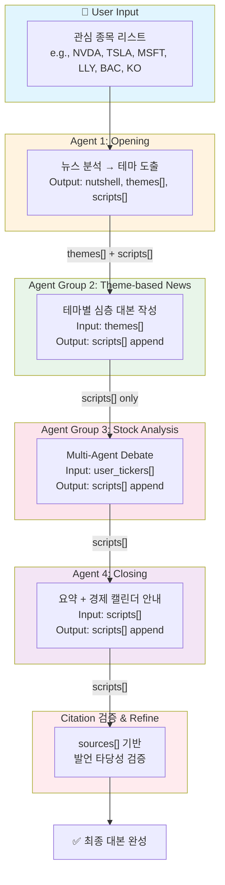
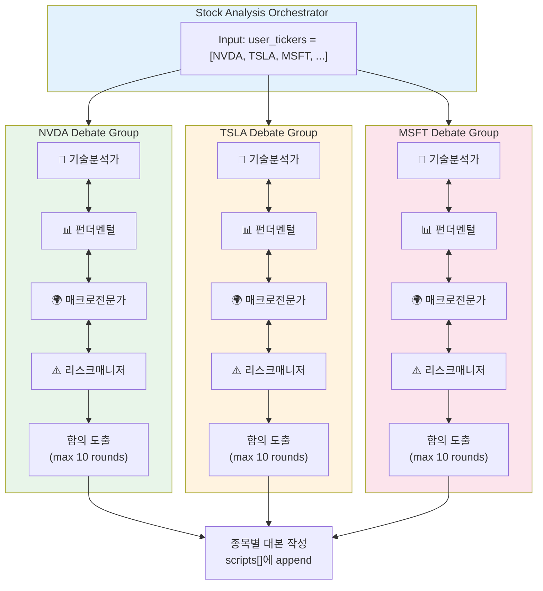

## LangGraph State 전달 구조

멀티에이전트 시스템에서 각 에이전트 그룹 간 **State 전달 흐름**을 설명합니다.

---

### 전체 파이프라인 개요



---

### State 스키마 정의

```python
from typing import TypedDict, Annotated
from langgraph.graph import add_messages

class Theme(TypedDict):
    headline: str
    description: str
    related_news: list[dict]  # [{"pk": str, "title": str}, ...]

class ScriptTurn(TypedDict):
    speaker: str              # "진행자" | "해설자"
    text: str
    sources: list[dict]       # [{"pk": str, "title": str}, ...]

class BriefingState(TypedDict):
    # ─── User Input ───
    user_tickers: list[str]           # 사용자 선택 종목
    
    # ─── Agent 1 Output ───
    nutshell: str                     # 오늘의 시장 한마디
    themes: list[Theme]               # 1~3개 핵심 테마
    
    # ─── Accumulated Scripts ───
    scripts: Annotated[list[ScriptTurn], add_messages]  # 누적 대본
    
    # ─── Metadata ───
    current_section: str              # "opening" | "theme" | "stock" | "closing"
```

---

### 단계별 State 전달

### **1️⃣ Agent 1 (Opening) → Agent Group 2 (Theme)**

<aside>
📤

**전달 항목**: `themes[]` + `scripts[]`

</aside>

Agent 1이 생성하는 JSON 구조:

```json
{
  "nutshell": "12월 연준 금리인하 기대에 3일째 랠리...",
  "theme": [
    {
      "headline": "연준 12월 인하 베팅 랠리",
      "description": "연속된 부진한 9월 소매판매와...",
      "related_news": [{"pk": "id#...", "title": "..."}, ...]
    },
    ...
  ],
  "scripts": [
    {"speaker": "진행자", "text": "...", "sources": []},
    {"speaker": "해설자", "text": "...", "sources": [...]},
    ...
  ]
}
```

- **State 업데이트**:

```python
state["nutshell"] = output["nutshell"]
state["themes"] = output["theme"]
state["scripts"].extend(output["scripts"])
state["current_section"] = "theme"
```

---

### **2️⃣ Agent Group 2 (Theme) → Agent Group 3 (Stock Analysis)**

<aside>
📤

**전달 항목**: `scripts[]` only (themes는 제외)

</aside>

Agent Group 2는 `state["themes"]`를 참조하여 **테마별 심층 대본**을 작성:

- 테마 개수만큼 병렬/순차 에이전트 실행
- 각 테마별 Q&A 형식의 대본 생성
- 완료된 대본을 `scripts[]`에 append
- **State 업데이트**:

```python
for theme in state["themes"]:
    theme_scripts = theme_[agent.run](http://agent.run)(theme)
    state["scripts"].extend(theme_scripts)

# themes는 더 이상 다음 단계로 전달할 필요 없음
state["current_section"] = "stock"
```

---

### **3️⃣ Agent Group 3 (Stock Analysis) → Agent 4 (Closing)**

<aside>
📤

**전달 항목**: `scripts[]`

</aside>

Agent Group 3의 **Multi-Agent Debate** 구조:



**Debate 종료 조건**:

- 모든 페르소나가 **동일한 결론**에 도달
- 또는 **최대 라운드(10회)** 도달 시 다수결
- **State 업데이트**:
    
    ```python
    for ticker in state["user_tickers"]:
        consensus = debate_[group.run](http://group.run)(ticker)
        stock_scripts = script_[writer.run](http://writer.run)(ticker, consensus)
        state["scripts"].extend(stock_scripts)
    
    state["current_section"] = "closing"
    ```
    

---

### **4️⃣ Agent 4 (Closing)**

<aside>
📤

**입력**: `scripts[]` (Opening + Theme + Stock 전체)

**출력**: 요약 + 경제 캘린더 안내

</aside>

Closing Agent의 역할:

1. **전체 대본 리뷰**: 핵심 포인트 요약
2. **경제 캘린더 조회**: 향후 1~2주 주요 이벤트
3. **마무리 대본 작성**: 앞으로의 관전 포인트
- **State 업데이트**:
    
    ```python
    closing_scripts = closing_[agent.run](http://agent.run)(
        scripts=state["scripts"],
        economic_calendar=get_upcoming_events()
    )
    state["scripts"].extend(closing_scripts)
    state["current_section"] = "complete"
    ```
    

---

### Citation 검증 & Refine

<aside>
🔍

**최종 검증 단계**: 각 ScriptTurn의 `sources[]`를 기반으로 발언 타당성 검증

</aside>

```python
class CitationValidator:
    def validate(self, script_turn: ScriptTurn) -> ValidationResult:
        """
        1. sources[]에 명시된 뉴스 본문 조회
        2. text 내용과 sources 간 일치도 검증
        3. 불일치 시 text 수정 또는 sources 추가/제거
        """
        for source in script_turn["sources"]:
            article = get_news_content(source["pk"])
            relevance = check_relevance(script_turn["text"], article)
            if relevance < threshold:
                # Flag for refinement
                ...
```

**검증 항목**:

- 발언 내용이 source 뉴스에 **실제로 언급**되어 있는가?
- **수치/팩트**가 source와 일치하는가?
- source가 누락된 발언이 있는가?

---

### LangGraph 노드 구성

```python
from langgraph.graph import StateGraph, END

workflow = StateGraph(BriefingState)

# 노드 추가
workflow.add_node("opening", opening_agent)
workflow.add_node("theme", theme_agent_group)
workflow.add_node("stock_analysis", stock_debate_orchestrator)
workflow.add_node("closing", closing_agent)
workflow.add_node("citation_validator", citation_validator)

# 엣지 연결
workflow.add_edge("opening", "theme")
workflow.add_edge("theme", "stock_analysis")
workflow.add_edge("stock_analysis", "closing")
workflow.add_edge("closing", "citation_validator")
workflow.add_edge("citation_validator", END)

# 시작점 설정
workflow.set_entry_point("opening")

# 컴파일
app = workflow.compile()
```

---

### State 요약 테이블

| 단계 | 입력 State | 출력 State | 비고 |
| --- | --- | --- | --- |
| **Agent 1 (Opening)** |  | `nutshell`, `themes[]`, `scripts[]` | 테마 도출 + 오프닝 대본 |
| **Agent Group 2 (Theme)** | `themes[]` | `scripts[]` (append) | 테마별 심층 대본 |
| **Agent Group 3 (Stock)** | `user_tickers`, `scripts[]` | `scripts[]` (append) | Multi-Agent Debate |
| **Agent 4 (Closing)** | `scripts[]` | `scripts[]` (append) | 요약 + 캘린더 |
| **Citation Validator** | `scripts[]` | `scripts[]` (refined) | 팩트체크 & 수정 |