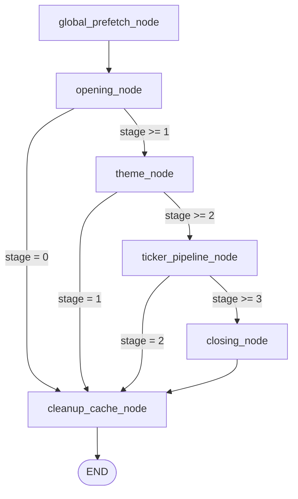
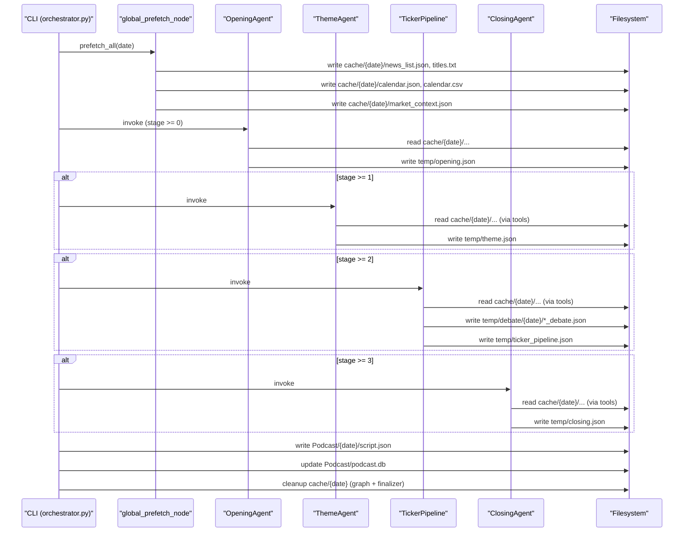

# Orchestrator 파이프라인 (`orchestrator.py`)

`orchestrator.py`는 장마감 브리핑을 위한 상위 LangGraph 오케스트레이터입니다. 실행 시점에 필요한 데이터를 한 번에 프리페치(`cache/{date}/`)하고, 에이전트(Opening → Theme → TickerPipeline → Closing)를 순차 실행한 뒤 결과를 저장합니다.

## 실행 모드

### Stage 모드 (`--stage`)

- `--stage 0`: OpeningAgent까지만 실행
- `--stage 1`: ThemeAgent까지 실행
- `--stage 2`: TickerPipeline까지 실행(Closing 제외)
- `--stage 3`: ClosingAgent까지 실행(기본값)

Stage 모드는 항상 `Opening -> (Theme) -> (TickerPipeline) -> (Closing)` 순서이며, 중간부터 단독 실행은 `--agent` 모드를 사용합니다.

### Agent 모드 (`--agent`)

`--agent opening|theme|ticker|closing`을 지정하면 **단일 에이전트만 실행**합니다. 이때도 아래 두 노드는 항상 실행됩니다.

- `global_prefetch_node()` (항상 실행)
- `cleanup_cache_node()` (항상 실행)

단, Theme/Ticker/Closing 단독 실행은 `temp/` 중간 산출물이 필요합니다.

- `--agent theme` 실행 전: `temp/opening.json` 필요
- `--agent ticker` 실행 전: `temp/theme.json` 필요
- `--agent closing` 실행 전: `temp/ticker_pipeline.json` 우선 사용 (없으면 `temp/theme.json`)

## CLI 사용 예시

```text
python orchestrator.py 20251222
python orchestrator.py 2025-12-22 --stage 1
python orchestrator.py 20251222 -t NVDA AAPL

# 단독 실행(중간 산출물 기반)
python orchestrator.py 20251222 --agent opening
python orchestrator.py 20251222 --agent theme
python orchestrator.py 20251222 --agent ticker
python orchestrator.py 20251222 --agent closing
```

## 상위 그래프 토폴로지



## 캐시/임시파일 라이프사이클



## 디렉토리 구조(런타임 아티팩트)

```text
cache/{YYYYMMDD}/              # 실행 중 생성되는 공유 캐시(종료 시 삭제)
  news_list.json
  titles.txt
  bodies/                      # get_news_content가 다운로드한 본문(동일 런에서만 유효)
  calendar.json
  calendar.csv
  market_context.json

temp/                          # 단계 분리(standalone)용 중간 산출물(유지)
  opening.json
  theme.json
  ticker_pipeline.json
  closing.json
  debate/
    {YYYYMMDD}/
      {TICKER}_debate.json

Podcast/{YYYYMMDD}/
  script.json                  # 최종 산출물(TTS 입력)
```

## Prefetch(공유 캐시) 상세 설명

`global_prefetch_node()`는 `shared/fetchers/prefetch_all()`을 호출해 아래 데이터를 한 번에 생성합니다.

1) 뉴스 인덱스: `shared/fetchers/news.py`
   - DynamoDB에서 기사 메타데이터를 읽어 `cache/{date}/news_list.json`로 저장
   - 제목만 모아 `cache/{date}/titles.txt`로 저장
2) 캘린더: `shared/fetchers/calendar.py`
   - TradingEconomics 캘린더 페이지를 스크래핑해 `calendar.json/csv`로 저장
3) 시장 컨텍스트: `shared/fetchers/market_context.py`
   - yfinance 기반으로 지수/금리/원자재/크립토 등 요약을 `market_context.json`로 저장

## 상태(State)와 챕터 범위 계산

`orchestrator.py`의 상위 상태는 `BriefingState`이며, 에이전트 실행 결과를 누적합니다. 특히 `chapter`는 최종 `scripts`에서 “각 챕터가 차지하는 구간”을 나타냅니다.

- `scripts`는 각 단계에서 `normalize_script_turns()`로 정규화되며, `id`는 항상 0..N-1로 재부여됩니다.
- `chapter[*].start_id/end_id`는 **scripts의 인덱스/ID 범위**를 의미합니다(둘 다 inclusive).
- 해당 챕터가 비어 있으면 `-1/-1`로 저장됩니다.

## 상태 스키마 (State Schema)

```yaml
BriefingState:
  date: string                    # YYYYMMDD (EST)
  user_tickers: string[]          # CLI (-t/--tickers)
  nutshell: string                # produced by OpeningAgent
  themes: Theme[]                 # produced by OpeningAgent
  scripts: ScriptTurn[]           # accumulated scripts (opening + theme + ticker + closing)
  current_section: string         # internal marker
  chapter: ChapterRange[]         # scripts[].id ranges for each chapter

ChapterRange:
  name: enum["opening", "theme", "ticker", "closing"]
  start_id: integer               # inclusive (or -1 when empty)
  end_id: integer                 # inclusive (or -1 when empty)
```

## 요청 스키마 (Request Schema)

### CLI Arguments

```json
{
  "type": "object",
  "required": ["date"],
  "properties": {
    "date": { "type": "string", "description": "YYYYMMDD or YYYY-MM-DD (normalized to YYYYMMDD)." },
    "stage": { "type": "integer", "enum": [0, 1, 2, 3], "default": 3 },
    "agent": { "type": ["string", "null"], "enum": ["opening", "theme", "ticker", "closing"], "default": null },
    "tickers": { "type": "array", "items": { "type": "string" }, "description": "Space- or comma-separated." }
  },
  "additionalProperties": false
}
```

### Graph Invoke Input

```json
{
  "type": "object",
  "required": ["date"],
  "properties": {
    "date": { "type": "string", "pattern": "^[0-9]{8}$" },
    "user_tickers": { "type": "array", "items": { "type": "string" }, "default": [] }
  },
  "additionalProperties": true
}
```

## 응답 스키마 (Response Schema)

### Graph Output (`BriefingState`)

```json
{
  "type": "object",
  "required": ["date", "scripts"],
  "properties": {
    "date": { "type": "string", "pattern": "^[0-9]{8}$" },
    "user_tickers": { "type": "array", "items": { "type": "string" } },
    "nutshell": { "type": "string" },
    "themes": { "type": "array", "items": { "type": "object" } },
    "scripts": { "type": "array", "items": { "type": "object" } },
    "current_section": { "type": "string" },
    "chapter": { "type": "array", "items": { "type": "object" } }
  },
  "additionalProperties": true
}
```

### Saved Payload (`Podcast/{date}/script.json`)

```json
{
  "type": "object",
  "required": ["date", "nutshell", "user_tickers", "chapter", "scripts"],
  "properties": {
    "date": { "type": "string", "pattern": "^[0-9]{8}$" },
    "nutshell": { "type": "string" },
    "user_tickers": { "type": "array", "items": { "type": "string" } },
    "chapter": { "type": "array", "items": { "type": "object" } },
    "scripts": { "type": "array", "items": { "type": "object" } }
  },
  "additionalProperties": true
}
```

## 결과 저장 및 DB 업데이트

- `Podcast/{date}/script.json`:
  - TTS 파이프라인의 입력 파일로 사용됩니다.
- `Podcast/podcast.db`:
  - `podcast_db.py`를 통해 날짜별 인덱스(예: `nutshell`, `user_tickers`, `script_saved_at`)를 업데이트합니다.

## 에러 처리 및 재실행 특성

- `cleanup_cache_node()` + `main()`의 `finally`에서 `cleanup_cache_dir()`가 호출되어, 정상/비정상 종료 모두 `cache/{date}`가 정리됩니다.
- Theme/Ticker/Closing 단독 실행은 `temp/` 중간 산출물에 의존합니다.
  - 파일이 없으면 해당 에이전트 그래프가 `FileNotFoundError`로 실패합니다.
