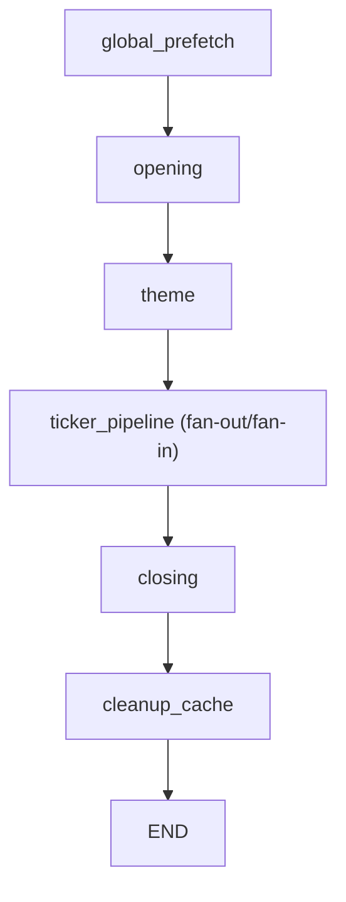
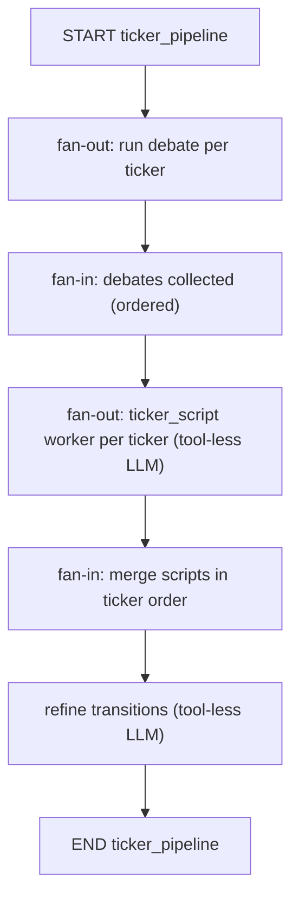

# Orchestrator ↔ `debate/` 통합 계획 (Theme ↔ Closing 사이)

목표: 기존 `orchestrator.py` 파이프라인의 `ThemeAgent`와 `ClosingAgent` 사이에 **User ticker 기반 “디베이트 → 티커 스크립트 생성/리파인” 단계**를 삽입합니다.  
SEC filing은 **오직 디베이트(`debate/`) 단계에서만** tool-call로 사용합니다(스크립트 작성 LLM에는 tools 미부여).

---

## 1) 목표 파이프라인(Top-level)



- `global_prefetch`는 기존과 동일하게 `cache/{date}/`를 채웁니다.
- `ticker_pipeline`은 `orchestrator.py` 첫 실행 때 입력받은 `user_tickers`를 사용합니다.
- `closing`은 `ticker_pipeline`까지 포함된 누적 스크립트를 입력으로 받아 마무리 파트를 생성합니다.

---

## 2) `ticker_pipeline` 내부 구조(Fan-out / Fan-in 유지)



핵심 원칙
- **디베이트 출력(모든 라운드의 모든 발언)**을 티커 스크립트 worker의 컨텍스트로 그대로 주입합니다(“마지막 결론만” 금지).
- 티커 스크립트 worker/refiner는 **tools를 전혀 부여하지 않습니다**(입력으로만 작성).
- `fan-out → fan-in` 구조를 유지해, 티커 개수 증가에도 스케일하도록 설계합니다.

---

## 3) 디렉토리/모듈 구조(현행 재사용 + Orchestrator 연결)

통합 시 “새 도메인(디베이트)”는 이미 분리된 `debate/`를 그대로 사용하고, `orchestrator.py`에는 **새 노드 1개(또는 2개)**만 추가하는 형태를 권장합니다.

```text
orchestrator.py

debate/
  graph.py                    # 티커 1개 디베이트 실행 (4 expert + moderator, tools 포함)
  prompt_new.py               # 디베이트 프롬프트(역할별/중재자, XML 스타일)
  sec_tools.py                # (debate-local) SEC filing tools + 캐싱 + page index 요약
  ticker_script.py            # fan-out worker → merge → refiner (LLM은 tool-less)
  prompt/
    ticker_script_worker.yaml # tool-less 티커 스크립트 작성 프롬프트(XML 스타일)
    ticker_script_refine.yaml # tool-less 전환/흐름 리파인 프롬프트(XML 스타일)

shared/
  tools/ohlcv.py              # get_ohlcv (debate에서 30d 1d + 당일 5m 요약, ticker_script에서 당일 5m context 주입)
  tools/news.py               # get_news_list/get_news_content (debate expert tool-call)
```

런타임 아티팩트(제안)
```text
temp/
  opening.json
  theme.json
  ticker_pipeline.json        # (신규) opening+theme+tickers 누적 스크립트
  debate/                     # (신규, 선택) 티커별 debate 산출물 보관
    {YYYYMMDD}/
      {TICKER}_debate.json
```

> `cache/{date}/`는 기존처럼 실행 종료 시 정리되므로, 디버깅 목적의 산출물은 `temp/`에 저장하는 편이 안전합니다.

---

## 4) Orchestrator 변경 범위(코드 레벨 계획)

### 4.1 State/출력 스키마 확장

- `BriefingState`에 신규 필드 추가(권장)
  - `ticker_debates`: `List[dict]` 또는 `List[path]` (티커별 debate 결과)
  - `ticker_sections`: `List[{ticker,start_id,end_id}]` (티커별 스크립트 구간; `debate/ticker_script.py` 출력 재사용)
- `chapter`는 기존 `opening/theme/closing`에 더해 **`ticker`(또는 `tickers`) 챕터**를 추가하는 것을 권장
  - 챕터 범위는 “theme 끝 다음 id ~ ticker_pipeline 끝 id”로 계산

### 4.2 Orchestrator 노드 추가(Theme ↔ Closing 사이)

`orchestrator.py`에 아래 중 하나로 추가합니다.

1) **단일 노드 방식(권장)**: `ticker_pipeline_node`
- 입력: `date`, `user_tickers`, `scripts`(opening+theme 누적)
- 처리:
  - 티커별 `debate.graph.run_debate(date, ticker, prefetch=False)` 실행(가능하면 batch/병렬)
  - `debate.ticker_script.run_ticker_script_pipeline(date, user_tickers, base_scripts=scripts, debate_outputs=...)` 실행
  - 결과의 `scripts`를 `state["scripts"]`로 반영
  - `ticker_sections`/`chapter` 갱신
  - `temp/ticker_pipeline.json` 저장(선택)
- 출력: 갱신된 `state`

2) **2노드 분리 방식**: `ticker_debate_node` → `ticker_script_node`
- 장점: 디베이트/스크립트 단독 재실행(디버그) 쉬움
- 단점: state 필드가 조금 더 늘어남

### 4.3 Graph edge 업데이트

- 기존: `theme -> closing`
- 변경: `theme -> ticker_pipeline -> closing`

### 4.4 CLI stage/agent 옵션(권장안)

현재 `--stage 0/1/2`(opening/theme/closing) 구조를 아래처럼 확장합니다.

- `--stage 0`: OpeningAgent
- `--stage 1`: ThemeAgent
- `--stage 2`: TickerPipeline (debate + ticker_script)
- `--stage 3`: ClosingAgent

선택적으로 `--agent ticker`를 추가해 `temp/theme.json` 기반으로 ticker 단계만 단독 실행할 수 있게 합니다.

---

## 5) 프롬프트 구성(통합 시 그대로 사용)

### 5.1 Debate (tools 포함)

- 파일: `debate/prompt_new.py`
- 대상:
  - 4 전문가 에이전트(펀더멘털/리스크/성장/심리)
  - 중재자(라운드 지속 여부 + “자세한 결론” 작성)
- 출력:
  - 매 라운드: 각 전문가가 `text/action/confidence/sources` JSON
  - 최종: 중재자 `conclusion.text`(대본 톤 금지) + `action/confidence`

### 5.2 Ticker script worker/refiner (tool-less)

- Worker: `debate/prompt/ticker_script_worker.yaml`
  - 입력 컨텍스트: (opening+theme) base scripts + debate JSON(전체 라운드) + 당일 5분봉(요약/JSON)
  - 지시:
    - Step1에서 **당일 5분봉 흐름을 먼저 해석**
    - Step2 대본 초반(1~2턴)에 **“오늘 장에서 주가 움직임”을 반드시 언급**
- Refiner: `debate/prompt/ticker_script_refine.yaml`
  - 입력: merged scripts(minimal) + ticker_sections
  - 출력: 전환/흐름만 다듬는 edits(JSON)

---

## 6) ENV 추가/정리(통합에 필요한 항목)

### 6.1 Debate LLM (gpt-5.1 thinking low)

- `DEBATE_FUNDAMENTAL_OPENAI_MODEL="gpt-5.1"`
- `DEBATE_RISK_OPENAI_MODEL="gpt-5.1"`
- `DEBATE_GROWTH_OPENAI_MODEL="gpt-5.1"`
- `DEBATE_SENTIMENT_OPENAI_MODEL="gpt-5.1"`
- `DEBATE_MODERATOR_OPENAI_MODEL="gpt-5.1"`
- 각 역할 공통: `*_OPENAI_REASONING_EFFORT="low"`

라운드 제어(선택)
- `DEBATE_MIN_ROUNDS=2`
- `DEBATE_MAX_ROUNDS=2`
- `DEBATE_CONSENSUS_CONFIDENCE=0.7`

### 6.2 SEC filing page index 요약 (gpt-5-mini, thinking none)

- `SEC_USER_AGENT="kubig-mas (contact: ehddus416@korea.ac.kr)"`  *(권장/사실상 필수)*
- `SEC_PAGE_SUMMARY_MODEL="gpt-5-mini"`
- `SEC_FILING_PAGE_CHARS=20000`
- `SEC_TIMEOUT=30` *(옵션)*

> SEC EDGAR는 연락처 포함 User-Agent 헤더를 요구합니다. 미설정 시 403/차단 또는 tool-call 실패 가능성이 큽니다.

### 6.3 Ticker script worker/refiner (gpt-5.1 thinking none)

- `TICKER_SCRIPT_WORKER_OPENAI_MODEL="gpt-5.1"`
- `TICKER_SCRIPT_REFINER_OPENAI_MODEL="gpt-5.1"`
- `*_OPENAI_REASONING_EFFORT`는 **미설정(또는 none 처리)**로 통일(Theme refiner와 동일)

---

## 7) Tool 래핑(특히 SEC filing) — Debate에서만 사용

디베이트 전문가 LLM에만 아래 tools를 바인딩합니다.

- Shared tools
  - `get_news_list`, `get_news_content` (`shared/tools/news.py`)
  - `get_ohlcv` (`shared/tools/ohlcv.py`)
- Debate-local SEC tools *(debate에서만)*: `debate/sec_tools.py`
  - `get_sec_filing_list(ticker, forms?, limit?)`
  - `get_sec_filing_content(ticker, accession_numbers, page?)`

SEC content 조회 정책(중요)
- `page`를 **비우면** `content` 없이 `index`만 반환 → LLM이 목차/페이지 요약을 보고 필요한 페이지만 재조회
- 페이지 크기: `SEC_FILING_PAGE_CHARS`(기본 20000자)
- `index`는 “페이지별 요약”으로 구성되며, 생성 시 `SEC_PAGE_SUMMARY_MODEL=gpt-5-mini`를 사용하고 캐시합니다.

캐시 위치(기본)
```text
cache/{YYYYMMDD}/sec/
  company_tickers.json
  submissions_CIK{cik}.json
  filings_full/{TICKER}_{accessionNoDash}.txt
  filings_index/{TICKER}_{accessionNoDash}.json
```

---

## 8) 통합 구현 순서(체크리스트)

1. `orchestrator.py`에 `ticker_pipeline_node` 추가 (Theme ↔ Closing 사이)
2. `BriefingState`/`chapter` 확장(신규 챕터 + ticker 메타데이터)
3. stage/agent CLI 확장(`--stage 3` 도입 등) 및 `ORCHESTRATOR.md` 업데이트
4. `temp/` 아티팩트 저장 규칙 확정(`temp/ticker_pipeline.json`, `temp/debate/{date}/*.json`)
5. E2E 확인
   - `python orchestrator.py 20251222 --stage 3 -t GOOG`
   - 결과: `Podcast/20251222/script.json`에 (opening+theme+tickers+closing) 순서로 `scripts`가 누적되는지 확인

