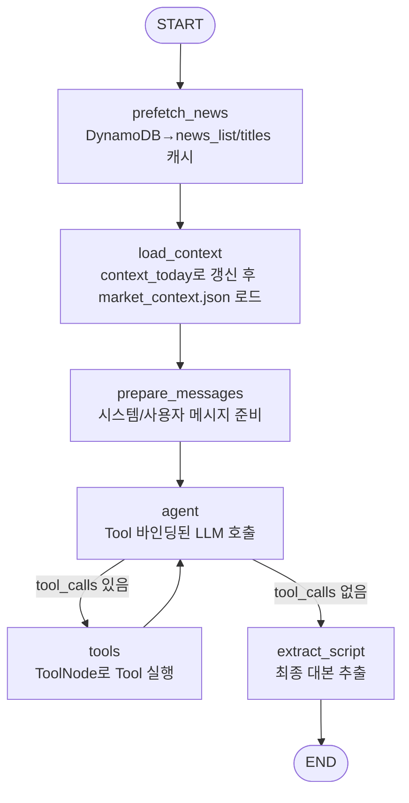
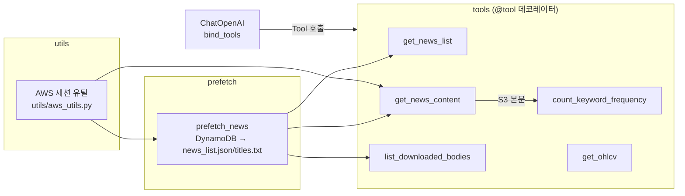

# Opening Agent 구조 정리

현재 구현된 오프닝 에이전트의 구성요소와 흐름을 요약합니다. (TODAY=20251125, SSO 프로파일 기반)

## LangGraph 실행 플로우 (ReAct 패턴)

- 상태 스키마: `OpeningState = { messages, context_json, news_meta, script_markdown }`
- 프리페치: `prefetch_news`로 DynamoDB `gsi_latest_utc` 범위를 조회해 `data/opening/news_list.json`/`titles.txt`/`bodies/`를 준비(실패 시 경고 후 계속).
- 컨텍스트 로딩/보강: `context_today`를 실행해 `data/market_context.json`을 갱신 후 읽고, `data/opening/titles.txt`에서 상위 30개 단어 빈도(`title_top_words`)를 계산해 `context_json`에 포함.
- 메시지 준비: `prompt/opening_script.yaml`의 system/user 템플릿에 `{{tools}}`와 `{{context_json}}`을 채워 초기 메시지 생성.
- ReAct 루프: `agent` 노드에서 Tool 바인딩된 LLM 호출 → `tool_calls`가 있으면 `tools` 노드에서 실행 → 다시 `agent` 호출 (반복).
- 대본 추출: ReAct 루프가 끝나면 최종 AIMessage에서 대본 추출.
- 종료 처리: 대본 생성 후 `data/market_context.json`, `data/opening`의 뉴스 캐시, `data/_tmp_csv` 임시 파일을 삭제.

## Tool 및 유틸 구조 (src/)

### Tool 목록 (LLM에 바인딩됨)

| Tool | 설명 |
|------|------|
| `get_news_list` | 로컬 캐시된 뉴스 목록 필터링 (tickers, keywords) |
| `get_news_content` | S3에서 뉴스 본문 조회 또는 로컬 캐시 반환 |
| `list_downloaded_bodies` | 로컬에 저장된 본문 파일 목록 반환 |
| `count_keyword_frequency` | 제목/본문에서 키워드 출현 빈도 계산 |
| `get_ohlcv` | yfinance로 과거 OHLCV 데이터 조회 (start_date, end_date 기반) |

- `src/prefetch.py`: TODAY 기준 전일 16:00 ET ~ 당일 18:00 ET, 최근 3일 `gsi_utc_pk` 파티션을 DynamoDB `gsi_latest_utc`로 쿼리 → `data/opening/news_list.json`, `titles.txt`, `bodies/`.
- `src/tools/news_tools.py`: `@tool` 데코레이터로 LangChain Tool 정의. 로컬 캐시 조회/필터링, S3 본문 다운로드+캐시, 다운로드된 본문 목록, 키워드 빈도 분석.
- `src/tools/ohlcv.py`: `@tool` 데코레이터로 LangChain Tool 정의. yfinance 래퍼로 OHLCV 조회.
- `src/utils/aws_utils.py`: SSO 프로파일 기반 boto3 세션/클라이언트 헬퍼.

## 데이터 경로

- `data/market_context.json`: 시장 지표 컨텍스트 (context_today.py로 생성).
- `data/opening/news_list.json`, `titles.txt`, `bodies/*.txt`: 프리페치/본문 캐시.

## 설정 및 추적

- OpenAI: `OPENAI_API_KEY`, `OPENAI_MODEL`, `OPENAI_REASONING_EFFORT`, `OPENAI_TEMPERATURE`.
- AWS/SSO: `AWS_SDK_LOAD_CONFIG=1`, `AWS_PROFILE=Admins`, `AWS_REGION`, `NEWS_TABLE`, `NEWS_BUCKET`, `TODAY`.
- LangSmith(LangChain tracing_v2): `LANGCHAIN_TRACING_V2`, `LANGCHAIN_API_KEY`, `LANGCHAIN_PROJECT`, `LANGCHAIN_ENDPOINT`(선택).

## 테스트

- `test/test_prefetch.py`: 가짜 DynamoDB로 프리페치 결과와 파일 생성 확인.
- `test/test_news_tools.py`: 뉴스 필터/본문 캐시/S3 목업/키워드 빈도 검사.
- `test/test_ohlcv.py`: yfinance 목업으로 OHLCV 응답 포맷 검사.
