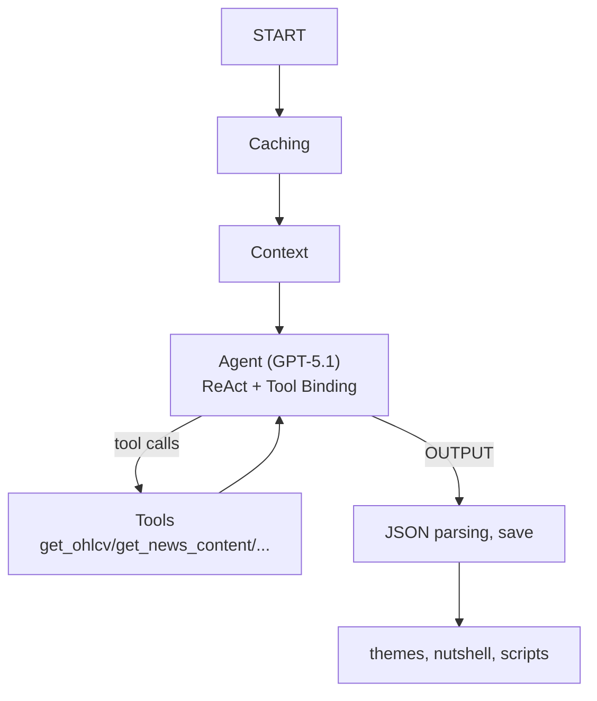
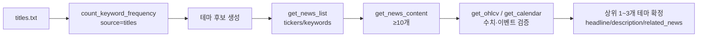
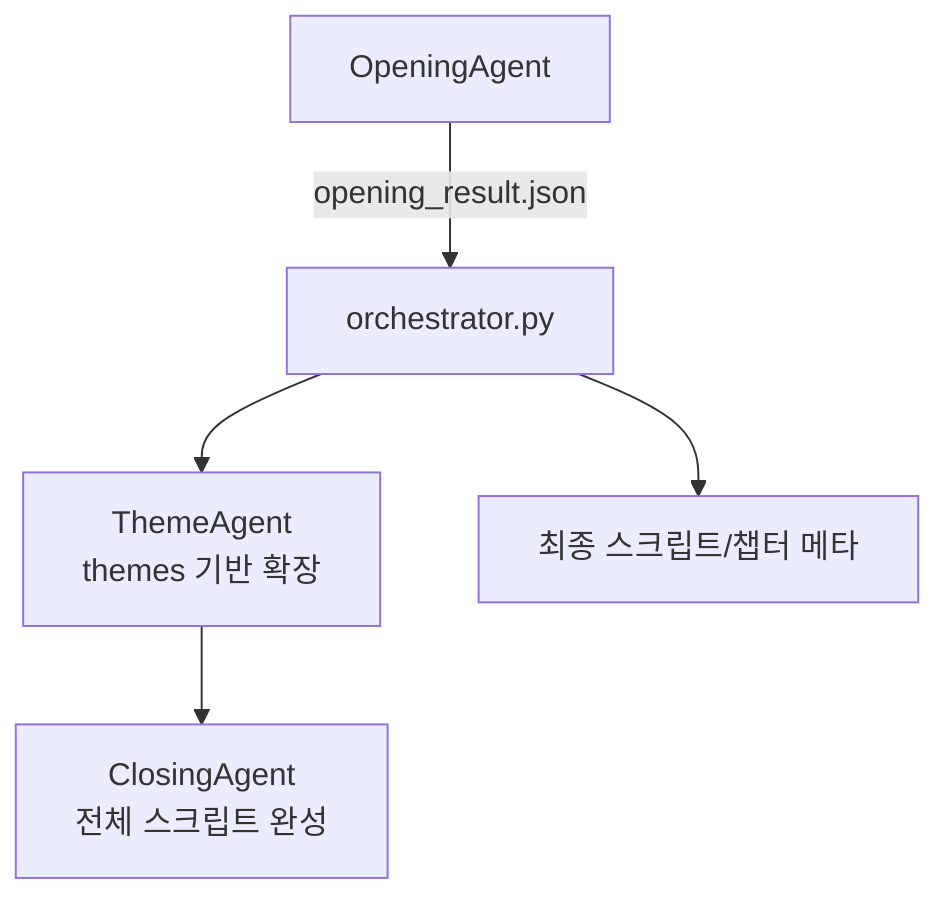

# OpeningAgent 소개 슬라이드 초안 (3장)

## 1. 무엇을 위한 에이전트인가, 어떤 Context/Tool이 들어가는가

### 슬라이드 텍스트(장표용)
**제목**: OpeningAgent, 장마감 브리핑의 첫 60초를 자동 생성

**핵심 문장(1줄)**: 뉴스와 시장 데이터를 근거로 테마 1~3개와 시장 한마디, 진행자·해설자 오프닝 대본을 만든다.

**본문(불릿)**:
- 입력: 뉴스(제목/본문) + 시장 지표 + 경제 캘린더
- 방식: LangGraph ReAct, LLM이 Tool로 근거를 직접 조회
- 검증: 기사 언급 수치는 `get_ohlcv`로 재확인(전일 종가 대비)
- 출력: `themes[]`, `nutshell`, `scripts[]` (후속 에이전트가 그대로 소비)

**하단 캡션(작게)**: “프롬프트만”이 아니라 “근거를 읽고 수치로 검증하는” 오프닝 생성 파이프라인

### 한 줄 정의
- **미국 주요 지수 장마감 브리핑 방송**의 “오프닝 구간”을 자동 생성하는 에이전트
  - 당일 뉴스/시장 데이터를 근거로 핵심 테마(1~3개)와 “시장 한마디”를 만들고,
  - 진행자/해설자 대화 형식의 짧은 오프닝 대본을 출력합니다.

### 입력 Context (LLM에 주입되는 근거)
- **뉴스 메타/제목 캐시**: `data/opening/news_list.json`, `data/opening/titles.txt` (prefetch 단계에서 생성)
- **시장 컨텍스트**: `data/market_context.json` (지수/금리/원자재/BTC 등, yfinance 기반)
- **경제 캘린더 컨텍스트**: `data/opening/calendar.json` (TradingEconomics 프리페치 기반)
- **title_top_words**: 제목 상위 단어 빈도(불용어 제외) → 테마 후보 발굴용 힌트

| Context | 주요 내용 | 생성/저장 위치 | 사용 목적 |
|---|---|---|---|
| 뉴스 메타 | 기사 pk, 제목, 티커, 발행시각 등 | `OpeningAgent/data/opening/news_list.json` | 관련 기사 목록 필터링, 근거 연결 |
| 뉴스 제목 텍스트 | 제목 단일 텍스트 라인들 | `OpeningAgent/data/opening/titles.txt` | 키워드 빈도 기반 테마 후보 탐색 |
| 시장 컨텍스트 | 지수/금리/원자재/BTC 등 시계열 요약 | `OpeningAgent/data/market_context.json` | “시장 반응”을 수치로 검증/인용 |
| 경제 캘린더 | 이벤트 id, 날짜, 제목 | `OpeningAgent/data/opening/calendar.json` | 거시 이벤트 맥락 연결 및 근거화 |
| `title_top_words` | 상위 단어 + 빈도 | (메시지 주입용 JSON) | 빠른 스캐닝으로 테마 후보 수렴 |

### Tool (LLM이 “반드시” 호출하는 데이터 접근 수단)
- `get_news_list(tickers, keywords)`: 뉴스 목록 필터링 (로컬 캐시 기반)
- `count_keyword_frequency(keywords, source, news_pks)`: 제목/본문 키워드 빈도 집계
- `get_news_content(pks)`: 뉴스 본문 조회 (S3 다운로드 + 로컬 캐시)
- `get_ohlcv(ticker, start_date, end_date, interval)`: 지수/종목 OHLCV로 수치 검증
- `get_calendar(id|date)`: 캘린더 이벤트 상세 조회

| Tool | 입력 | 출력(요지) | 장표에서 강조할 포인트 |
|---|---|---|---|
| `get_news_list` | tickers/keywords | 기사 목록 | “관련 기사 풀”을 좁히는 1차 필터 |
| `count_keyword_frequency` | keywords, source | 키워드별 count + 기사 pk | 테마 후보를 데이터로 뽑는 출발점 |
| `get_news_content` | pks | 제목+본문 | 최소 10개 이상 실독(근거 강화) |
| `get_ohlcv` | ticker, 기간/interval | OHLCV rows | 뉴스 주장 재검증(전일 종가 대비) |
| `get_calendar` | id 또는 date | 이벤트 상세/목록 | 시장 반응의 “트리거” 연결 |

### 전체 동작 흐름 (LangGraph + ReAct)


---

## 2. 어떻게 핵심 테마를 LLM이 찾아내는가

### 슬라이드 텍스트(장표용)
**제목**: 테마는 “빈도 + 근거 실독 + 가격 검증”으로 찾는다

**핵심 문장(1줄)**: 제목에서 후보를 뽑고, 본문을 읽어 인과를 만들고, OHLCV로 시장 반응을 교차검증해 1~3개로 압축한다.

**본문(불릿)**:
- 후보 생성: `count_keyword_frequency(titles)`로 반복 키워드 탐색
- 근거 확보: `get_news_content`로 본문 ≥10개 읽고 요약
- 풀 정제: `get_news_list`로 테마별 기사 묶음 구성(노이즈 감소)
- 사실 검증: `get_ohlcv`로 전일 종가 대비 수치 재확인, 필요 시 `get_calendar`로 트리거 연결

**하단 캡션(작게)**: 테마 선정 규칙으로 “두루뭉실한 설명”과 “주식 영향 불명확”을 배제

### 목표
- “오늘 시장을 움직인 이유”를 **서로 구별 가능한 1~3개 테마**로 압축하고,
- 각 테마를 **기사 근거 + 가격/지표 검증**으로 뒷받침합니다.

### 테마 탐색 로직 (도구 기반, 근거 우선)
1) **제목 스캔 → 후보 키워드 발굴**
   - `titles.txt`를 기반으로 `count_keyword_frequency(source="titles")`로 빈도 상위 키워드를 확인
   - 빈도가 높아도 “시장 전반 두루뭉실”하거나 “주식시장 영향이 불명확”하면 후보에서 제외
2) **후보 키워드 → 관련 기사 풀 구성**
   - `get_news_list(tickers, keywords)`로 관련 기사 목록을 좁힘
3) **본문 최소 10개 이상 실독**
   - `get_news_content(pks=[...])`로 기사 본문을 읽고,
   - 테마를 “원인-전파-결과(섹터/종목/지수)” 형태로 재구성
4) **가격/지표로 교차 검증**
   - 뉴스가 언급한 움직임을 `get_ohlcv(...)`로 재확인 (전일 종가 대비 기준)
   - 필요 시 `get_calendar(...)`로 이벤트 맥락을 연결
5) **테마 규칙으로 상위 1~3개 선택**
   - 원자재/크립토 자체는 단독 테마로 금지(단, 주식 영향 설명 수단으로는 허용)
   - FOMC/FED 등 거시 이벤트는 항상 민감하게 점검

| 단계 | LLM의 행동 | 사용 Tool | 체크포인트(선정 기준) |
|---|---|---|---|
| 1. 후보 발굴 | 제목에서 반복 패턴 탐지 | `count_keyword_frequency(titles)` | 단순 “분위기”가 아니라 원인/대상 명확 |
| 2. 풀 구성 | 관련 기사 묶기 | `get_news_list` | AND 필터로 노이즈 감소 |
| 3. 근거 확보 | 기사 본문 읽고 요약 | `get_news_content` | 본문 ≥10개, 테마별 설명력 확보 |
| 4. 검증 | 수치/이벤트로 교차검증 | `get_ohlcv`, `get_calendar` | 전일 종가 대비, 뉴스 주장 재확인 |
| 5. 확정 | 1~3개로 압축 | (규칙 적용) | 서로 구별 가능, 시장 영향 설명 가능 |

### “테마가 된다”의 판정 기준 (슬라이드용 요약)
- **뉴스 비중**: 관련 기사/키워드가 충분히 반복되는가
- **시장 반응**: 지수/섹터/대표 종목의 움직임이 실제로 동행하는가
- **설명력**: 다른 테마와 겹치지 않고 “왜 올랐/내렸나”를 설명하는가



---

## 3. Structured Output: 왜/어떻게/무슨 목적으로 JSON 스키마를 쓰는가

### 슬라이드 텍스트(장표용)
**제목**: Structured Output은 후속 에이전트와의 “계약”이다

**핵심 문장(1줄)**: 사람이 읽기 좋은 대본을, 시스템이 안전하게 이어서 쓰기 위해 JSON 스키마로 고정한다.

**본문(줄글)**:
OpeningAgent의 출력은 사람이 읽는 오프닝 대본이지만, 동시에 다음 단계 에이전트가 그대로 받아 확장해야 하는 입력 데이터입니다. 그래서 자연어로만 “그럴듯하게” 쓰는 대신, `themes`, `nutshell`, `scripts`처럼 필드가 고정된 JSON 스키마로 결과를 내보냅니다. 이렇게 하면 필드 누락이나 형식 오류를 즉시 감지할 수 있고, 각 문장에 `sources[]`를 붙여 기사, 차트, 이벤트 같은 근거를 구조적으로 남길 수 있습니다. 최종 결과가 `opening_result.json`으로 저장되기 때문에 재현, 디버깅, 평가까지 한 번에 가능한 파이프라인이 됩니다.

**하단 캡션(작게)**: Output을 데이터로 만들면, 대본 생성이 파이프라인이 된다

### 왜(Why): “대본”을 파이프라인에서 안전하게 쓰기 위해
- **파싱 가능성**: 자연어만으로는 후속 단계가 안정적으로 소비하기 어려움 → JSON으로 고정
- **추적 가능성**: 테마/대사마다 근거(`sources`)를 붙여 “왜 그렇게 말했는지”를 재현 가능
- **자동 검증/평가**: 필드 누락/형식 오류를 기계적으로 감지(예: themes 1~3개, scripts 배열 등)

### 어떻게(How): 프롬프트 강제 + 추출 노드에서 파싱
- LLM에게 최종 응답을 ```json 블록```으로 출력하도록 요구
- LangGraph의 `extract_script` 노드가 JSON만 파싱해 `data/opening_result.json`에 저장
- 내부 상태에서 필요한 필드만 남겨 **다음 에이전트(Theme/Closing)** 로 전달

### 무슨 목적(For what): 후속 에이전트와 “계약(Contract)”을 맺는다
- Orchestrator가 `themes`/`nutshell`/`scripts`를 표준 형태로 받아 **챕터 구간 관리** 및 후속 생성에 재사용
- ThemeAgent는 `themes`를 입력으로 받아 테마별 심층 구간을 확장하기 쉬움
- ClosingAgent는 전체 `scripts`를 받아 마무리 구간을 일관된 형식으로 생성 가능

| 필드 | 타입(개념) | 담는 것 | 후속 단계에서의 쓰임 |
|---|---|---|---|
| `themes[]` | 배열 | 오늘 핵심 테마 1~3개 | ThemeAgent 확장 입력(테마별 심층) |
| `themes[].related_news[]` | 배열 | 테마 근거 기사 메타 | 근거 추적/재검증/감사 |
| `nutshell` | 문자열 | 오늘 장 한마디(헤드라인) | 오프닝 초반 메시지 일관성 유지 |
| `scripts[]` | 배열 | 진행자/해설자 대사 | 전체 방송 대본의 뼈대 |
| `scripts[].sources[]` | 배열 | 기사/차트/이벤트 근거 | “왜 이 문장인가”를 구조적으로 남김 |



### 출력 스키마(예시, 축약)
```json
{
  "themes": [
    {
      "headline": "…",
      "description": "…",
      "related_news": [{"pk": "id#…", "title": "…"}]
    }
  ],
  "nutshell": "오늘 장 한마디",
  "scripts": [
    {
      "id": 0,
      "speaker": "진행자",
      "text": "…",
      "sources": [
        {"type": "article", "pk": "id#…", "title": "…"},
        {"type": "chart", "ticker": "^GSPC", "start_date": "YYYY-MM-DD", "end_date": "YYYY-MM-DD"},
        {"type": "event", "id": "417228", "title": "…", "date": "YYYY-MM-DD"}
      ]
    }
  ]
}
```
