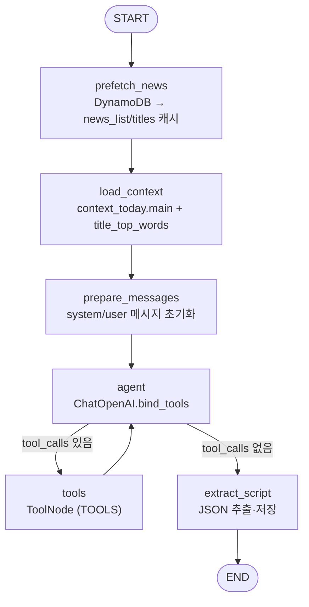

# Opening Agent: LangGraph 구현 설명

이 문서는 `OpeningAgent/` 코드와 설계 문서([Opening-Agent-Design.md](../Opening-Agent-Design.md), [ARCHITECTURE.md](./ARCHITECTURE.md))를 기준으로 실제 LangGraph 구현과 상태 스키마를 기술합니다.

## LangGraph 플로우



- 진입: `main()`에서 `.env` 로드 후 `build_graph().invoke({})` 실행.
- ReAct 루프: `agent`가 tool_calls를 내면 `ToolNode`가 실행하고 다시 `agent`로 돌아갑니다.
- 종료: 최종 AI 응답에서 JSON을 파싱해 `data/opening_result.json`에 기록 후 상태를 테마/한마디/대본만 남기고 반환합니다. `main()` 마지막에 `cleanup_cache()`로 캐시 삭제.

## 상태 스키마 (`OpeningState`)

| 필드 | 타입 | 생성 시점 | 설명 |
| --- | --- | --- | --- |
| `messages` | `Sequence[BaseMessage]` (Annotated `add_messages`) | prepare_messages, agent | ReAct 히스토리 누적 |
| `context_json` | `dict` | load_context | yfinance 기반 시장 컨텍스트 + `title_top_words` |
| `news_meta` | `dict` | prefetch_news | DynamoDB 쿼리 결과 (`news_list.json`/`titles.txt` 캐시) |
| `theme` | `list[Theme]` | extract_script | 핵심 테마 1~3개 (headline/description/related_news) |
| `nutshell` | `str` | extract_script | 오늘 장 한마디 |
| `scripts` | `list[ScriptTurn]` | extract_script | 진행자/해설자 대본 배열 |

`Theme`, `ScriptTurn`, `NewsSource`는 `src/opening_agent.py`에 TypedDict로 정의되어 있으며, `scripts`의 `sources`는 `get_news_content`로 읽은 뉴스만 포함합니다.

## 노드 동작 요약

- **prefetch_news → `prefetch_node`** (`src/prefetch.py`): `TODAY`를 기준으로 전일 16:00 ET ~ 당일 18:00 ET, 최근 3개 `gsi_utc_pk` 파티션을 `gsi_latest_utc`로 조회. 결과를 `data/opening/news_list.json`/`titles.txt`에 저장(캐시 실패 시 경고 후 진행).
- **load_context → `load_context_node`** (`src/context_today.py`): yfinance로 지수/채권/원자재/BTC 데이터를 수집해 `data/market_context.json`을 갱신. `titles.txt`에서 불용어(`config/stopwords.txt`)를 제외한 상위 단어 빈도(`title_top_words`, 기본 50개)를 컨텍스트에 주입.
- **prepare_messages → `_prepare_initial_messages`**: `prompt/opening_script.yaml`을 읽어 system/user 메시지를 채움. `{{tools}}`는 사용 가능한 Tool 설명으로, `{{context_json}}`은 컨텍스트 JSON 문자열로 치환해 초기 메시지 2개를 구성.
- **agent → `agent_node`**: OpenAI Chat 모델(`OPENAI_MODEL` 기본 `gpt-5.1`, `reasoning_effort` 기본 `medium`, `temperature` 기본 0.0)을 `TOOLS`로 바인딩해 호출. 응답 메시지를 상태에 추가.
- **조건 분기 → `should_continue`**: 마지막 `AIMessage`에 `tool_calls`가 있으면 `tools`, 없으면 `extract_script`로 이동.
- **tools → `ToolNode(TOOLS)`**: LangGraph `ToolNode`가 아래 Tool들을 실행 후 `agent`로 반환.
- **extract_script → `extract_script_node`**: 마지막 AI 응답에서 ```json ... ``` 블록을 찾아 파싱 → `theme`/`nutshell`/`scripts`만 남긴 결과를 `data/opening_result.json`에 저장 후 반환. 중간 필드는 상태에서 제거.
- **cleanup_cache**: `main()` 종료 시 `data/market_context.json`, `data/opening/news_list.json`/`titles.txt`/`bodies/*.txt`, `data/_tmp_csv`를 삭제.

## Tool 세트 (LangChain @tool)

| Tool | 구현 | 기능/입력 | 동작 요약 |
| --- | --- | --- | --- |
| `get_news_list` | `src/tools/news_tools.py` | `tickers: list[str] \| None`, `keywords: list[str] \| None` | `news_list.json` 로컬 캐시 필터링(AND, 대소문자 무시) |
| `get_news_content` | same | `pks: list[str]`, `bucket: str \| None` | 캐시 조회 후 미스 시 S3(`NEWS_BUCKET`/`BUCKET_NAME`)에서 XML 다운로드+저장 |
| `list_downloaded_bodies` | same | 입력 없음 | `data/opening/bodies/*.txt` 목록을 pk/title로 반환 |
| `count_keyword_frequency` | same | `keywords: list[str]`, `source: "titles" \| "bodies"`, `news_pks: list[str] \| None` | `titles.txt` 또는 캐시된 본문에서 키워드 빈도 집계 |
| `get_ohlcv` | `src/tools/ohlcv.py` | `ticker: str`, `start_date: str`, `end_date: str`, `interval: str` | yfinance 래퍼. 멀티인덱스 정규화 후 OHLCV 배열로 반환 |

`prefetch_news`가 선행되어야 `titles.txt`/`news_list.json` 기반 Tool들이 정상 동작합니다.

## 프롬프트 구성 (`prompt/opening_script.yaml`)

- **system**: ReAct 강제, 필수 Tool 호출(get_news_list, count_keyword_frequency, get_news_content≥10개), `get_ohlcv` 검증 요구, 시장 한마디 유형 가이드 포함.
- **user_template**: `context_json`(시장 지표 + `title_top_words`) 삽입, 작업 단계/대본 규칙/최종 JSON 스키마 명시. 진행자 첫 멘트 형식, sources 규칙, JSON 출력 강제.

## 데이터 경로와 캐시

- 입력/캐시: `data/opening/news_list.json`, `titles.txt`, `bodies/*.txt` (prefetch + on-demand S3).
- 시장 컨텍스트: `data/market_context.json` (yfinance 결과, `title_top_words` 포함).
- 최종 출력: `data/opening_result.json` (theme/nutshell/scripts).
- 임시 CSV: `data/_tmp_csv` (yfinance 원본 저장 후 `cleanup_cache`에서 삭제).

## Tool 요청/응답 예시

`get_news_list`

- 요청 예시

```json
{"tickers": ["NVDA", "TSLA"], "keywords": ["AI"]}
```
- 응답 예시

```json
{
  "count": 5,
  "filters": {"tickers": ["NVDA", "TSLA"], "keywords": ["AI"]},
  "articles": [
    {
      "pk": "h#abc123",
      "title": "NVIDIA and Tesla ride AI wave",
      "tickers": ["NVDA", "TSLA"],
      "publish_et_iso": "2025-11-24T15:30:00-05:00"
    }
  ]
}
```

`get_news_content`

- 요청 예시

```json
{"pks": ["h#abc123", "h#def456"], "bucket": "kubig-news-bucket"}
```
- 응답 예시

```json
{
  "count": 2,
  "articles": [
    {
      "pk": "h#abc123",
      "title": "NVIDIA and Tesla ride AI wave",
      "body": "<뉴스 본문 텍스트>",
      "cached": false
    },
    {
      "pk": "h#def456",
      "title": "Fed signals rate pause",
      "body": "<뉴스 본문 텍스트>",
      "cached": true
    }
  ]
}
```

`list_downloaded_bodies`

- 요청 예시

```json
{}
```
- 응답 예시

```json
{
  "count": 3,
  "articles": [
    {"pk": "h#abc123", "title": "NVIDIA and Tesla ride AI wave"},
    {"pk": "h#def456", "title": "Fed signals rate pause"},
    {"pk": "h#ghi789", "title": "Oil steadies on OPEC rumors"}
  ]
}
```

`count_keyword_frequency`

- 요청 예시 1 (titles)

```json
{"keywords": ["AI", "earnings"], "source": "titles"}
```
- 응답 예시 1

```json
{
  "AI": {"count": 42, "article_pks": []},
  "earnings": {"count": 18, "article_pks": []}
}
```

- 요청 예시 2 (bodies, 특정 기사)

```json
{"keywords": ["datacenter", "China"], "source": "bodies", "news_pks": ["h#abc123", "h#ghi789"]}
```
- 응답 예시 2

```json
{
  "datacenter": {"count": 12, "article_pks": ["h#abc123"]},
  "China": {"count": 3, "article_pks": ["h#ghi789"]}
}
```

`get_ohlcv`

- 요청 예시

```json
{"ticker": "^GSPC", "start_date": "2025-10-25", "end_date": "2025-11-25", "interval": "1d"}
```
- 응답 예시

```json
{
  "ticker": "^GSPC",
  "start_date": "2025-10-25",
  "end_date": "2025-11-25",
  "interval": "1d",
  "rows": [
    {"ts": "2025-11-20T00:00:00-05:00", "open": 5170.5, "high": 5188.2, "low": 5155.1, "close": 5180.3, "volume": 0},
    {"ts": "2025-11-21T00:00:00-05:00", "open": 5182.0, "high": 5201.4, "low": 5175.2, "close": 5199.8, "volume": 0}
  ]
}
```

## 실행 방법

```bash
cd OpeningAgent
python -m src.opening_agent  # 또는 python src/opening_agent.py
```

필수 환경변수:
- OpenAI: `OPENAI_API_KEY` (옵션: `OPENAI_MODEL`, `OPENAI_REASONING_EFFORT`, `OPENAI_TEMPERATURE`)
- AWS/뉴스: `AWS_SDK_LOAD_CONFIG=1`, `AWS_PROFILE`(기본 Admins), `AWS_REGION`, `NEWS_TABLE`, `NEWS_BUCKET`, `TODAY`
- LangSmith(선택): `LANGCHAIN_TRACING_V2`, `LANGCHAIN_API_KEY`, `LANGCHAIN_PROJECT`, `LANGCHAIN_ENDPOINT`

실행 후 콘솔에 테마/한마디/대본이 요약되며, 결과 파일 저장 → 캐시 정리 순으로 종료됩니다.
