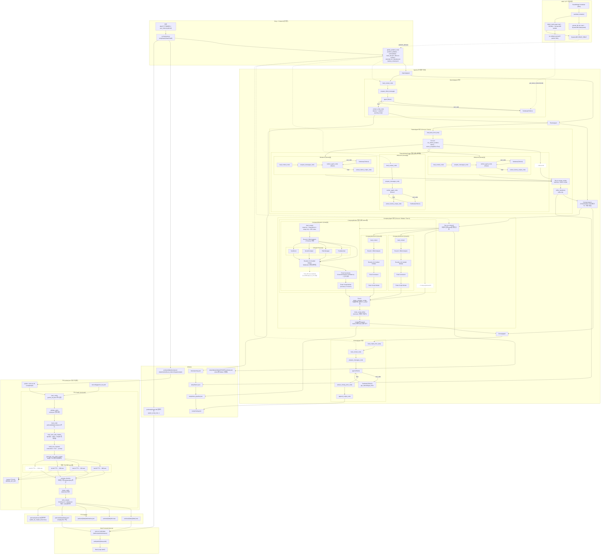
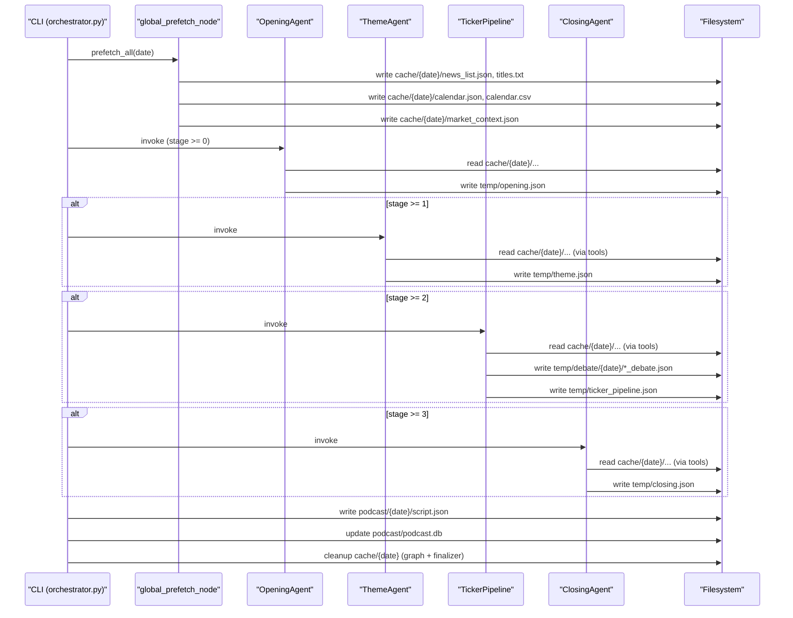
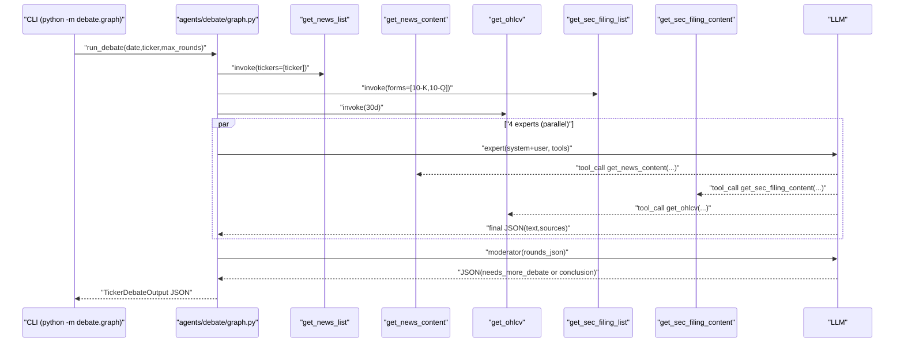

# 미국 주식 장마감 AI 브리핑 서비스

25FW KUBIG Conference Project
<br>
Team: `지피티야 팀명 추천해줘`

이 레포는 “장마감 브리핑 스크립트 생성 → TTS로 오디오 생성”까지의 파이프라인과, 그 입력이 되는 뉴스 데이터 수집용 AWS Lambda를 포함합니다.  
또한, 생성된 산출물을 재생/탐색하기 위한 Next.js 웹 플레이어(`web/`)를 포함합니다.

## 아키텍처 한눈에 보기



### Orchestrator 캐시/산출물 시퀀스



### Debate 실행 시퀀스 (per ticker)



## 실행 (Quick Start)

### 0) 설정 파일

- **비밀키(API Key)**: `.env`에만 저장(권장)
  - 예: `OPENAI_API_KEY`, `GEMINI_API_KEY`, `LANGSMITH_API_KEY`
- **비밀이 아닌 런타임 설정(모델/timeout/라운드/AWS 등)**: `config/app.yaml`로 관리(권장)
  - 로딩 우선순위: (shell export) > (`config/app.yaml`) > (`.env`, `override=False`)

시작:
1. `.env.example` → `.env` 복사 후 API 키 채우기
2. 필요하면 `config/app.yaml` 수정

### 1) 장마감 브리핑 스크립트 생성 (Opening → Theme → Ticker → Closing)

```bash
python orchestrator.py 20251222 -t GOOG AAPL
```

- 결과: `podcast/20251222/script.json`
- 참고: orchestrator는 실행 중 `cache/20251222/`를 만들고 종료 시 정리합니다(디버깅용 산출물은 `temp/`와 `podcast/`에 남음).

### 2) TTS 실행 (turn 단위 오디오 생성 + 합본)

```bash
python -m tts.src.tts 20251222
```

- 입력: `podcast/20251222/script.json`
- 출력:
  - `podcast/20251222/tts/*.wav` (turn별)
  - `podcast/20251222/tts/timeline.json`
  - `podcast/20251222/20251222.wav` (합본)
  - `podcast/20251222/20251222.json` (time 주입된 최종 스크립트)

### 3) Web 플레이어 실행 (Next.js)

```bash
cd web
npm install

# DB에서 데이터 빌드 + 개발 서버 실행
npm run dev:fresh
```

- 접속: `http://localhost:3000`
- 참고: `podcast/podcast.db`가 갱신된 뒤에는 `npm run build:data`가 필요합니다.

## 스크립트 파이프라인 상세

상위 오케스트레이터: `orchestrator.py` (문서: `ORCHESTRATOR.md`)

### 단계 구성

- **global_prefetch**
  - `cache/{date}/news_list.json`, `calendar.csv`, `market_context.json` 등을 미리 생성
- **OpeningAgent** (`agents/opening/graph.py`)
  - `nutshell`(한 줄 요약), `themes`(테마 후보), 오프닝 대본 생성 → `temp/opening.json`
- **ThemeAgent** (`agents/theme/graph.py`)
  - 테마별 Worker 병렬 실행(fan-out) → 병합(fan-in) → 전환 Refiner → `temp/theme.json`
- **TickerPipeline** (`orchestrator.py:ticker_pipeline_node`)
  - 사용자 티커(`-t/--tickers`) 기준
  - fan-out: 티커별 Debate → `temp/debate/{date}/{TICKER}_debate.json`
  - fan-out: 티커별 Script Worker(tool-less) → fan-in merge → Refiner(tool-less) → `temp/ticker_pipeline.json`
- **ClosingAgent** (`agents/closing/graph.py`)
  - 누적 대본 입력으로 마무리 파트 생성 → `temp/closing.json`

### 최종 산출물(`podcast/{date}/script.json`) 구조(요약)

```json
{
  "date": "20251222",
  "nutshell": "string",
  "user_tickers": ["GOOG"],
  "chapter": [
    { "name": "opening", "start_id": 0, "end_id": 5 },
    { "name": "theme", "start_id": 6, "end_id": 25 },
    { "name": "ticker", "start_id": 26, "end_id": 40 },
    { "name": "closing", "start_id": 41, "end_id": 45 }
  ],
  "scripts": [
    { "id": 0, "speaker": "진행자", "text": "…", "sources": [] }
  ]
}
```

## TTS 파이프라인 상세

엔트리포인트: `tts/src/tts.py` (문서: `tts/ARCHITECTURE.md`)

- 입력: `podcast/{date}/script.json`
- 설정: `tts/config/gemini_tts.yaml` (speaker별 instruction/voice/timeout/병렬도 등)
- 필수 환경변수: `GEMINI_API_KEY`

## AWS Lambda (뉴스 수집 파이프라인)

문서: `LAMBDA.md`, 코드: `Lambda/`, 이미지: `Lambda.Dockerfile`

- 트리거: EventBridge 스케줄러 `kubig-LambdaTrigger` (약 30분 주기)
- 기능:
  - Yahoo Finance Latest News(US) 크롤링 → DynamoDB에 메타데이터 적재(멱등)
  - 상세 기사 크롤링 → XML 직렬화 후 S3 저장 → DynamoDB에 `path/publish_et_iso/provider/related_articles` 업데이트
- 환경변수(대표):
  - `TABLE_NAME` (DynamoDB)
  - `BUCKET_NAME` (S3)
  - `AWS_REGION`

이 Lambda가 채운 DynamoDB/S3 데이터는 스크립트 파이프라인의 뉴스 툴(`shared/tools/news.py`) 및 프리페치(`shared/fetchers/news.py`)에서 사용됩니다.

## Web Frontend

문서: `WEB.md`, 코드: `web/`

### Quick Start

```bash
cd web

# 의존성 설치
npm install

# DB에서 데이터 빌드 + 개발 서버 실행
npm run dev:fresh

# 또는 개발 서버만 실행 (기존 데이터 사용)
npm run dev
```

### Scripts

| 명령어 | 설명 |
|--------|------|
| `npm run dev` | 개발 서버 실행 (localhost만) |
| `npm run dev:network` | 개발 서버 실행 (외부 네트워크 접근 허용, `내IP:3000`) |
| `npm run dev:fresh` | 데이터 빌드 + 개발 서버 |
| `npm run build:data` | DB → public/ 데이터 빌드만 |
| `npm run build` | 데이터 빌드 + 프로덕션 빌드 |
| `npm run start` | 프로덕션 서버 실행 |

### 데이터 흐름

```
../podcast/podcast.db          # SQLite DB (에피소드 메타데이터)
../podcast/{date}/{date}.json  # 에피소드 스크립트 데이터
../podcast/{date}/{date}.wav   # 에피소드 오디오 파일
        ↓
  npm run build:data (scripts/build-data.ts)
        ↓
public/data/episodes.json      # 에피소드 목록
public/data/{date}.json        # 에피소드 상세 데이터
public/audio/{date}.wav        # 오디오 파일
```

## 주요 디렉토리

```text
agents/            # Opening/Theme/Closing (+ Debate는 agents/debate)
debate/            # Debate/Types wrapper + ticker_script 파이프라인(티커 대본)
shared/            # tools/fetchers/config/utils (공용)
config/            # app.yaml (비밀 아닌 런타임 설정)
podcast/           # 최종 산출물 + DB
tts/               # TTS 파이프라인
Lambda/            # 뉴스 수집 AWS Lambda
web/               # Next.js 웹 플레이어
```

## 참고 문서

- `ORCHESTRATOR.md`
- `agents/opening/ARCHITECTURE.md`
- `agents/theme/ARCHITECTURE.md`
- `agents/closing/ARCHITECTURE.md`
- `debate/ARCHITECTURE.md`
- `podcast/ARCHITECTURE.md`
- `tts/ARCHITECTURE.md`
- `LAMBDA.md`
- `WEB.md`
