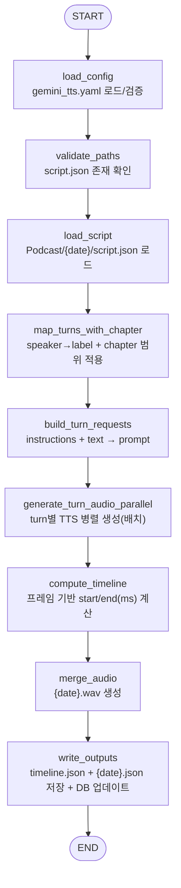

# TTS 파이프라인 (`TTS/`)

`TTS/`는 `Podcast/{date}/script.json`을 입력으로 받아 **턴(turn) 단위 음성 합성(TTS)** 을 수행하고, 최종 오디오 파일과 타임라인을 생성합니다. 구현은 LangGraph 기반이며, 합성은 Gemini TTS API를 사용합니다.

## 역할 (전체 파이프라인에서)

- Orchestrator가 생성한 `Podcast/{YYYYMMDD}/script.json`을 읽어 `scripts[]`를 turn으로 변환
- turn별 음성을 병렬 생성(`tts/*.wav`)
- turn 길이(프레임) 기반으로 타임라인 계산(`tts/timeline.json`)
- 전체를 이어 붙인 최종 오디오 생성(`Podcast/{date}/{date}.wav`)
- `script.json`에 `time=[start_ms,end_ms]`를 주입한 날짜 파일 생성(`Podcast/{date}/{date}.json`)
- `Podcast/podcast.db`에 TTS 완료 상태 업데이트

---

## 실행 방법 (CLI)

```bash
python -m TTS.src.tts 20251222
python -m TTS.src.tts 2025-12-22
```

입력 파일:
- `Podcast/{date}/script.json`

출력 디렉토리:
- `Podcast/{date}/tts/`

최종 산출물:
- `Podcast/{date}/{date}.wav`
- `Podcast/{date}/tts/timeline.json`
- `Podcast/{date}/{date}.json`

---

## 필수/옵션 환경변수

- 필수:
  - `GEMINI_API_KEY`: Gemini TTS 호출 API 키
- 옵션:
  - `GEMINI_TTS_MODEL`: TTS 모델 경로 오버라이드 (예: `models/gemini-2.5-pro-preview-tts` 또는 `gemini-...` 형태도 허용)

설정 파일:
- `TTS/config/gemini_tts.yaml`
  - `instructions.speaker1/speaker2`: turn 프롬프트 앞에 붙는 지시문(진행자/해설자)
  - `voices.speaker1/speaker2`: 음성 모델 voiceName
  - `temperature`, `timeout_seconds`, `max_parallel_requests`, `batch_timeout_seconds`
  - `common_gap_seconds`, `chapter_gap_seconds`

---

## TTS LangGraph 토폴로지



---

## 입력/출력 데이터 계약

### 입력: `Podcast/{date}/script.json` (요약)

- `scripts[]`: `{id, speaker, text, sources...}`
- `chapter[]`(선택): 오케스트레이터가 계산한 챕터 범위. turn의 `chapter` 매핑에 사용됩니다.

TTS는 `speaker`가 `"진행자"`면 `speaker1`, `"해설자"`면 `speaker2`로 매핑합니다.

### 출력: per-turn WAV (`Podcast/{date}/tts/*.wav`)

- 파일명: `{id}.wav`를 **0 padding**한 형태로 저장합니다.
  - padding 폭: `max(2, len(str(max_id)))`
  - 예: `00.wav`, `01.wav` … 또는 `000.wav`…
- 이미 존재하는 WAV는 재사용하며(skip) 프레임 수만 다시 계산합니다.
- 레거시 호환: 과거 `tts/turns/*.wav`가 있으면 `tts/*.wav`로 이동합니다.

### 출력: `Podcast/{date}/tts/timeline.json`

- 오디오 포맷: `sample_rate_hz=24000`, `channels=1`, `sample_width_bytes=2`(s16le)
- `turns[]`: `{id, chapter, speaker, wav, start_time_ms, end_time_ms, duration_ms}`
- `gaps`: `common_gap_ms`, `chapter_gap_ms`
  - 인접 turn의 `chapter`가 바뀌고 둘 다 알려진 챕터(`opening/theme/closing`)면 `chapter_gap_seconds` 적용
  - 그 외는 `common_gap_seconds` 적용

### 출력: `Podcast/{date}/{date}.wav`

- `tts/*.wav`를 timeline 순서대로 이어 붙이고, turn 사이에 gap(무음)을 삽입합니다.

### 출력: `Podcast/{date}/{date}.json`

- `script.json`을 복사한 뒤 `scripts[*].time=[start_ms,end_ms]`를 주입해 저장합니다.

---

## 병렬/배치 실행 전략

- turn 합성은 `max_parallel_requests` 크기만큼 **배치**로 나눠 실행합니다.
- 각 배치는 ThreadPoolExecutor로 동시 실행합니다.
- 배치 내에서 timeout이 발생하면 전체 실행이 실패합니다.
- 중간 실패 후 재실행 시, 이미 생성된 turn WAV는 재사용하여 재합성 비용을 줄입니다.

---

## DB 업데이트 (`Podcast/podcast.db`)

TTS 파이프라인 완료 시 `podcast_db.update_tts_row(...)`로 다음을 업데이트합니다.

- `tts_done = true`
- `final_saved_at`: 최종 WAV의 mtime(UTC ISO)
- `script_saved_at`: 입력 `script.json`의 mtime(UTC ISO)
- (가능한 경우) `nutshell`, `user_tickers`도 함께 갱신

