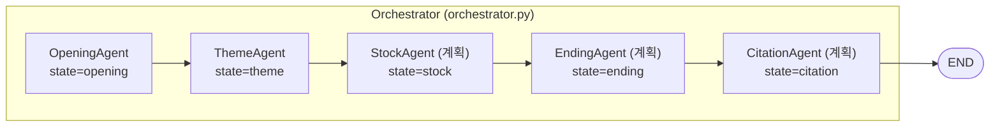
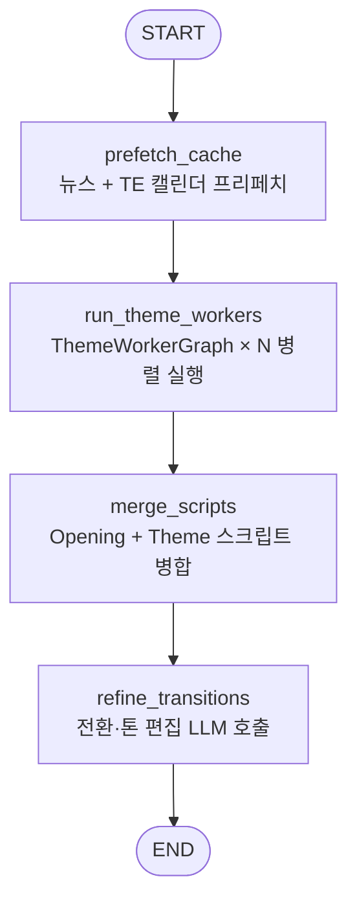
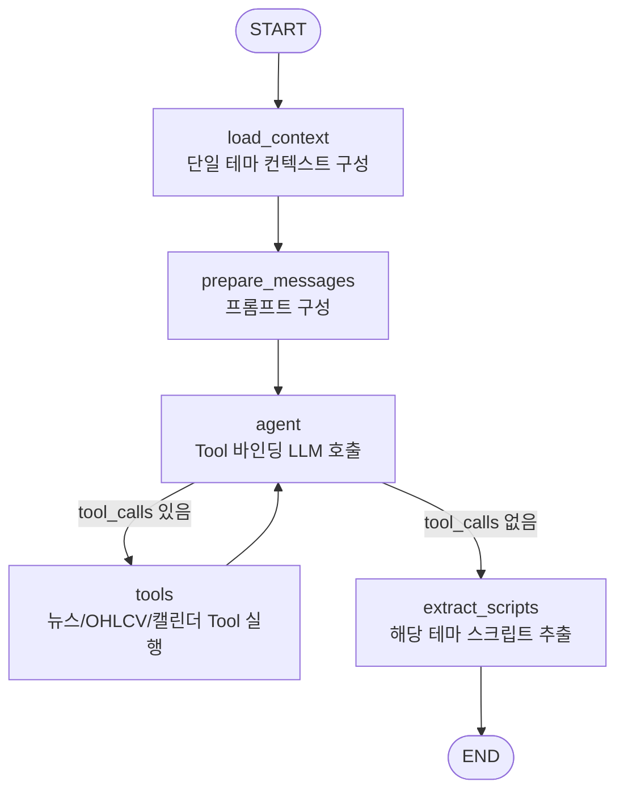

# Theme Agent 구조 정리

현재 설계된 ThemeAgent의 구성요소와 흐름을 요약합니다.  
(OpeningAgent/ARCHITECTURE.md와 동일한 스타일로, 날짜는 Orchestrator에서 CLI 인자로 전달)

---

## 1. 역할 및 목표

### 1-1. ThemeAgent의 역할

- 상위 Orchestrator에서 **OpeningAgent가 만든 결과**를 입력으로 받는다.
  - `nutshell`: 오늘 시장 한마디
  - `themes[]`: 1~3개의 핵심 테마 (headline / description / related_news)
  - `scripts`: 오프닝 대본 (진행자/해설자)
- 각 테마별로 **심층 분석 대본**을 생성한다. (ThemeWorkerAgent × N 병렬)
- 오프닝 대본과 테마별 대본을 **하나의 연속된 방송 대본**처럼 자연스럽게 이어지도록 재편집한다.
  - 테마 사이 전환 멘트
  - 톤/호흡 정리 (역할/팩트는 유지)
- 최종적으로 상위 `BriefingState.scripts`를 **Opening+Theme 완성본**으로 교체하고,  
  `current_section = "stock"`으로 넘겨서 다음 StockAgent 단계로 연결한다.

### 1-2. 입력 / 출력 (상위 Orchestrator 기준)

```python
class Theme(TypedDict):
    headline: str
    description: str
    related_news: list[dict]  # {"pk", "title", ...}

class ScriptTurn(TypedDict):
    id: int
    speaker: str              # "진행자" | "해설자"
    text: str
    sources: list[dict]       # {"pk", "title", ...}

class BriefingState(TypedDict, total=False):
    date: str                 # YYYYMMDD, EST 기준
    user_tickers: list[str]
    nutshell: str
    themes: list[Theme]
    scripts: list[ScriptTurn]
    current_section: str      # "opening" | "theme" | "stock" | "closing" | "ending" | "citation"
```

- ThemeAgent 진입 시 (Opening 이후):
  - `current_section = "theme"`
  - `scripts`: **오프닝 대본**만 포함
- ThemeAgent 종료 시:
  - `scripts`: 오프닝 + 테마별 심층 대본을 포함한 **완성본**
  - `current_section = "stock"`

---

## 2. 최상위 Orchestrator와 ThemeAgent

### 2-1. 상위 LangGraph에서의 위치



- Orchestrator는 `BriefingState`를 공유하면서  
  `opening → theme → stock → ending → citation` 순으로 하위 그래프를 호출한다.

### 2-2. theme 노드 구현 스케치

```python
from ThemeAgent.src import theme_agent

def theme_node(state: BriefingState) -> BriefingState:
    ta_graph = theme_agent.build_theme_graph()
    result = ta_graph.invoke({
        "date": state["date"],
        "nutshell": state["nutshell"],
        "themes": state["themes"],
        "base_scripts": state.get("scripts", []),
    })

    try:
        theme_agent.cleanup_cache()
    except Exception:
        # 캐시 삭제 실패는 치명적이지 않으므로 경고만 남긴다.
        ...

    return {
        **state,
        "scripts": result["scripts"],   # Opening+Theme 완성본
        "current_section": "stock",     # 다음은 StockAgent 단계
    }
```

---

## 3. ThemeAgent 상위 그래프 (ThemeGraph)

ThemeAgent는 내부적으로 **ThemeGraph + ThemeWorkerGraph × N** 구조를 가진다.

### 3-1. ThemeGraph 흐름



### 3-2. ThemeGraph 상태 스키마 (`ThemeState`)

```python
class ThemeState(TypedDict, total=False):
    # 공통 메타
    date: str
    nutshell: str

    # 입력 데이터
    themes: list[Theme]               # OpeningAgent에서 전달
    base_scripts: list[ScriptTurn]    # 오프닝 대본 (읽기 전용)

    # 중간 결과
    theme_scripts: list[list[ScriptTurn]]  # 각 ThemeWorker가 생성한 스크립트 묶음

    # 출력
    scripts: list[ScriptTurn]         # Opening+Theme 전체를 편집·정제한 최종 스크립트
```

### 3-3. ThemeGraph 노드별 역할

 - **`prefetch_cache`**
   - ThemeAgent 실행 시작 시 1회만 수행한다.
   - DynamoDB 뉴스 메타 프리페치(`prefetch.prefetch_news`)로 `data/theme/news_list.json`/`titles.txt` 캐시 생성.
   - TradingEconomics 경제 캘린더 프리페치(`prefetch.prefetch_calendar`)로 `data/theme/calendar.csv`/`calendar.json` 생성.

- **`run_theme_workers`**
  - `themes[]`를 순회하며 ThemeWorker 입력을 만들고, `ThemeWorkerGraph`를 **병렬 실행**한다.
  - 결과를 `theme_scripts`에 저장:
    ```python
    theme_results = [...]  # [{"scripts": [...]}, ...]
    state["theme_scripts"] = [res["scripts"] for res in theme_results]
    ```

- **`merge_scripts`**
  - Opening 스크립트와 ThemeWorker 스크립트를 테마 순서대로 연결:
    ```python
    opening_scripts = state.get("base_scripts", [])
    merged: list[ScriptTurn] = []
    merged.extend(opening_scripts)
    for idx, theme_sc in enumerate(state.get("theme_scripts", [])):
        for turn in theme_sc:
            # 선택: section/theme_index 메타 추가 가능
            # turn["section"] = "theme"
            # turn["theme_index"] = idx
            merged.append(turn)
    # 전역 id(0..N-1) 재부여(Refiner patch 적용을 위해 id 안정화)
    state["scripts"] = normalize_script_turns(merged)
    ```

- **`refine_transitions` (Refiner)**
  - 역할:
    - `scripts` 전체를 보고,  
      Opening → Theme1, Theme1 → Theme2 등 **경계 지점**에서 전환이 부드럽도록  
      연결 문장/브릿지 멘트를 추가·수정.
    - 사실/수치/출처는 최대한 유지하고, 표현/호흡만 다듬는 **방송 대본 편집자** 역할.
    - Refiner 단계는 Tool을 바인딩하지 않는다(단순 편집).
  - 입력:
    - `ThemeState.scripts` (Opening+Theme 전체)에서 **최소 표현(minimal)** 으로 변환해 전달:
      - `[{id, speaker, text}, ...]` (sources 미제공)
    - `themes` (참고용)
  - 출력:
    ```json
    {
      "edits": [
        {"id": 12, "speaker": "진행자", "text": "..."},
        {"id": 13, "speaker": "해설자", "text": "..."}
      ]
    }
    ```
  - Refiner는 “수정이 필요한 턴만” 반환하며, ThemeAgent는 해당 `id`의 `speaker/text`만 덮어쓴다.
    - sources는 Refiner 입력/출력에 포함되지 않으며, 원본 scripts의 sources를 그대로 유지한다.
  - 운영 안전장치:
    - Refiner 입력은 sources를 제외한 최소 표현을 사용하고, JSON은 indent 없이 압축해 전송해 토큰/전송량을 줄인다.
    - 파싱 실패/스키마 불일치 시 최대 재시도 후, 실패하면 refine 없이 merge 결과를 그대로 사용한다.
    - 타임아웃/네트워크 오류 시, refine 없이 merge 결과를 그대로 사용한다.

---

## 4. ThemeWorkerGraph (단일 Theme 워커 그래프)

각 ThemeWorker는 “한 개의 테마”에 대해 심층 분석 대본을 작성한다.

### 4-1. 전체 흐름



### 4-2. ThemeWorker 상태 스키마 (`ThemeWorkerState`)

```python
class ThemeWorkerState(TypedDict, total=False):
    # 공통 메타
    date: str               # YYYYMMDD
    nutshell: str           # 오늘 시장 한마디

    # 단일 테마 입력
    theme: Theme            # 이 워커가 담당하는 단일 테마
    base_scripts: list[ScriptTurn]  # (선택) 오프닝 대본 전체, 참고용

    # ReAct용
    messages: Annotated[Sequence[BaseMessage], add_messages]
    theme_context: dict[str, Any]   # 이 테마에 대한 뉴스/지표 요약 JSON

    # 출력
    scripts: list[ScriptTurn]       # 이 테마에서 새로 생성된 턴들만 포함
```

### 4-3. Worker 노드별 역할

#### (참고) 프리페치

- WorkerGraph에서는 프리페치를 수행하지 않는다.
- ThemeGraph의 `prefetch_cache`에서 뉴스(`data/theme/news_list.json`, `titles.txt`)와
  캘린더(`data/theme/calendar.csv`, `calendar.json`)를 1회 생성한 뒤,
  ThemeWorker들은 해당 로컬 캐시를 조회하는 구조다.

#### `load_context`

- 역할:
  - `theme`와 `related_news` 정보, 그리고 `prefetch_cache`에서 준비한 로컬 캐시를 바탕으로
    **이 테마 전용 컨텍스트 JSON**을 구성.
  - (현재 구현) `theme_context`는 입력 테마+nutshell 요약만 포함하며, 뉴스/지표/캘린더 조회는 Tool을 통해 수행한다.
  - 1차 구현 예:
    - `theme.headline`, `theme.description`
    - `related_news`의 제목/티커 요약
    - 필요 시 `get_news_content`로 일부 뉴스 본문을 조회하여 핵심 내용을 추출
    - 필요 시 `get_ohlcv`로 관련 지수/섹터/티커 추세 간단 요약
- 출력:
  - `state["theme_context"] = {...}` (JSON)  
    → 그대로 프롬프트에 주입.

#### `prepare_messages`

- 역할:
  - `ThemeAgent/prompt/theme_worker.yaml`를 로드.
  - 플레이스홀더 치환:
    - `{date}` → 한국어 날짜 (예: `"11월 25일"`)
    - `{nutshell}` → 오늘 시장 한마디
    - `{theme}` → 현재 단일 테마의 headline/description/related_news 요약
    - `{theme_context}` → 위에서 구성한 테마 컨텍스트 JSON
    - `{base_scripts}` → (선택) 오프닝 스크립트 전체, 맥락 전달용
    - `{calendar_context}` → 캘린더 TSV(id, est_date, title)
    - `{tools}` → 바인딩된 Tool 목록/설명
  - 출력:
    - `state["messages"] = [SystemMessage(...), HumanMessage(...)]`

#### `agent` / `tools`

- `agent`:
  - `_build_llm()`로 OpenAI Chat 모델 생성 (OpeningAgent와 동일 패턴).
  - `llm.bind_tools(TOOLS)`로 뉴스/지표 Tool을 바인딩 후 `messages`를 입력으로 호출.
- `tools`:
  - `langgraph.prebuilt.ToolNode(TOOLS)` 사용.
  - Tool 목록은 아래 **5장 Tool 구조** 참조.
- 흐름:
  - `agent` → (tool_calls 존재 시) `tools` → 다시 `agent` (ReAct 루프).

#### `extract_scripts`

- 역할:
  - 마지막 `AIMessage.content`에서 ```json ... ``` 블록을 추출해 파싱.
  - 스키마 예:
    ```json
    {
      "scripts": [
        {
          "id": 0,
          "speaker": "진행자",
          "text": "...",
          "sources": [{"pk": "...", "title": "..."}]
        },
        {
          "id": 1,
          "speaker": "해설자",
          "text": "...",
          "sources": [{"pk": "...", "title": "..."}]
        }
      ]
    }
    ```
- 출력:
  - `state["scripts"] = parsed["scripts"]`  
    (해당 Theme에 대한 스크립트만 포함).

---

## 5. Tool 및 캐시 구조

### 5-1. Tool 목록 (OpeningAgent와 공통)

ThemeAgent에서도 뉴스/지표/캘린더 Tool을 바인딩해 사용한다.

| Tool | 설명 |
|------|------|
| `get_news_list` | 로컬 캐시된 뉴스 목록 필터링 (tickers, keywords) |
| `get_news_content` | S3에서 뉴스 본문 조회 또는 로컬 캐시 반환 (LLM 입력용: 태그 제거/길이 절단) |
| `list_downloaded_bodies` | 로컬에 저장된 본문 파일 목록 반환 |
| `count_keyword_frequency` | 제목/본문에서 키워드 출현 빈도 계산 |
| `get_calendar` | 프리페치된 캘린더에서 이벤트 상세 조회(id/date) |
| `get_ohlcv` | yfinance로 과거 OHLCV 데이터 조회 (행 수 제한/반올림 포함) |

- `get_ohlcv`는 rows가 200개를 초과하면 `rows=[]`와 함께 재조회 가이드를 반환하며,
  open/high/low/close는 소수점 3자리로 반올림해 반환한다.

### 5-2. ThemeAgent 캐시 디렉터리 (예시)

```text
ThemeAgent/data/theme/
├── news_list.json          # DynamoDB 조회 결과 (prefetch_cache)
├── titles.txt              # 모든 뉴스 제목 (prefetch_cache)
├── calendar.csv            # 경제 캘린더 목록 (prefetch_cache)
├── calendar.json           # 경제 캘린더 상세 (prefetch_cache)
└── bodies/                 # get_news_content가 온디맨드로 채우는 본문 캐시
    ├── h#abcdef01.txt
    └── ...
```

- ThemeAgent는 실행이 끝난 후 `cleanup_cache()`에서 위 디렉터리 및 임시 파일들을 삭제한다.

---

## 6. State 요약 테이블

| 이름 | 사용 위치 | 주요 필드 | 비고 |
|------|-----------|-----------|------|
| `BriefingState` | Orchestrator | `date`, `user_tickers`, `nutshell`, `themes`, `scripts`, `current_section` | 상위 공용 State |
| `OpeningState` | OpeningAgent 내부 | `date`, `messages`, `context_json`, `news_meta`, `themes`, `nutshell`, `scripts` | OpeningAgent 전용 (이미 구현) |
| `ThemeState` | ThemeGraph | `date`, `nutshell`, `themes`, `base_scripts`, `theme_scripts`, `scripts` | ThemeAgent 상위 그래프 State |
| `ThemeWorkerState` | ThemeWorkerGraph | `date`, `nutshell`, `theme`, `base_scripts`, `messages`, `theme_context`, `scripts` | 단일 Theme 워커용 State |

---

## 7. 설정 및 환경변수 (공통)

OpeningAgent와 동일한 환경변수 세트를 사용한다.

- OpenAI:
  - 공통: `OPENAI_API_KEY`, `OPENAI_MODEL`, `OPENAI_REASONING_EFFORT`(추론 모델일 때만), `OPENAI_TEMPERATURE`, `OPENAI_TIMEOUT`, `OPENAI_MAX_RETRIES`
  - ThemeAgent 오버라이드:
    - Worker: `THEME_WORKER_OPENAI_*`
    - Refiner: `THEME_REFINER_OPENAI_*`
  - Refiner 전용 timeout(호환): `OPENAI_REFINER_TIMEOUT`
- AWS/SSO:
  - `AWS_SDK_LOAD_CONFIG=1`
  - `AWS_PROFILE`, `AWS_REGION`
  - `NEWS_TABLE`, `NEWS_BUCKET`
- Tool 출력 제한: `NEWS_BODY_MAX_CHARS` (get_news_content가 LLM 입력용 body를 절단)
- 기타:
  - LangSmith/LangChain 추적: `LANGCHAIN_TRACING_V2`, `LANGCHAIN_API_KEY`, `LANGCHAIN_PROJECT`, `LANGCHAIN_ENDPOINT`(선택)

---

## 8. 정리

- ThemeAgent는 **Opening 이후 Theme 섹션 전체**를 책임지는 에이전트로,
  - ThemeWorkerGraph × N 병렬 실행으로 각 테마별 심층 대본 생성,
  - Refiner LLM으로 Opening+Theme 전체 스크립트의 전환과 톤을 다듬는다.
- 각 실행은 ThemeAgent 전용 캐시 디렉터리를 사용하며,  
  종료 시 `cleanup_cache()`를 통해 캐시를 정리하는 구조로 OpeningAgent와 패턴을 맞춘다.
