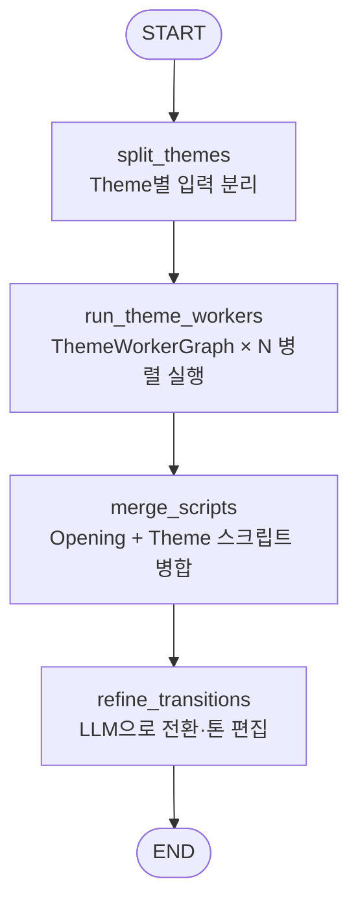
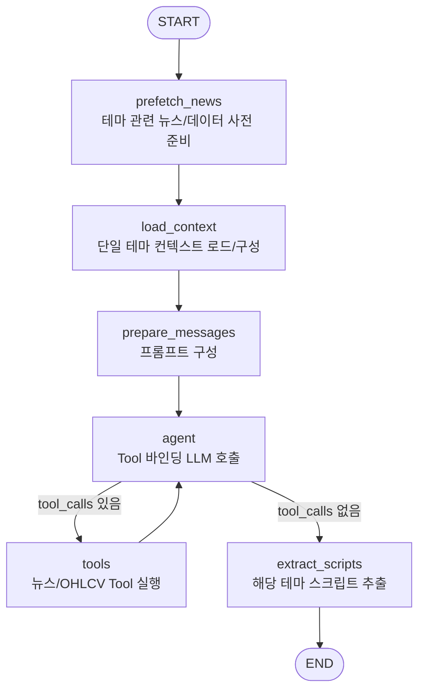

# Theme Agent 구현 계획

> 목적: OpeningAgent가 도출한 `themes[]`와 오프닝 스크립트를 입력으로 받아  
> 각 테마별 심층 대본을 생성하고, **하나의 연속된 방송 대본처럼 자연스럽게 이어지도록**  
> 기존 스크립트 턴까지 포함해 편집·정제한 결과를 상위 `BriefingState.scripts`에 반영하는 LangGraph 에이전트 설계

---

## 1. 상위 멀티에이전트 구조와 ThemeAgent의 위치

### 1-1. 최상위 오케스트레이터 (`orchestrator.py`)

- 엔트리 포인트: `python orchestrator.py 20251125`
- State 스키마 (요약):
  ```python
  class Theme(TypedDict):
      headline: str
      description: str
      related_news: list[dict]  # {"pk", "title", ...}

  class ScriptTurn(TypedDict):
      speaker: str              # "진행자" | "해설자"
      text: str
      sources: list[dict]       # {"pk", "title", ...}

  class BriefingState(TypedDict, total=False):
      date: str                 # YYYYMMDD, EST 기준
      user_tickers: list[str]
      nutshell: str
      themes: list[Theme]
      scripts: list[ScriptTurn]
      current_section: str      # "opening" | "theme" | "stock" | "closing" | "ending" | "citation"
  ```
- 최상위 오케스트레이터의 타임라인(계획):
  - `opening` 노드: OpeningAgent (`state="opening"`)
  - `theme` 노드: ThemeAgent (`state="theme"`)
    - 내부에서 ThemeWorkerAgent × N 병렬 실행
    - ThemeAgent 자체 LLM으로 전체 스크립트 전환·톤 편집
  - `stock` 노드: StockAgent (Multi-Agent Debate, 추후)
  - `ending` 노드: EndingAgent (Closing, 추후)
  - `citation` 노드: CitationAgent (팩트체크 및 sources 정제, 추후)

### 1-2. 그래프 안에 그래프 구조

- 상위 그래프: **Briefing Orchestrator (LangGraph / `BriefingState`)**
  - 노드: `opening` → `theme` → (향후) `stock` → `ending` → `citation`
  - 각 노드는 **자체 LangGraph 서브그래프**를 호출하는 래퍼
- 하위 그래프 1: **OpeningAgent (이미 구현)**
  - `OpeningState` 기반 ReAct + ToolNode 구조
  - 최종 출력: `{"themes": [...], "nutshell": "...", "scripts": [...]}` (JSON)
- 하위 그래프 2: **ThemeAgent (이번 계획 대상)**  
  - 입력: 상위 `BriefingState` 중 `date`, `nutshell`, `themes`, `scripts`(오프닝)
  - 출력: 각 Theme별 심층 스크립트를 생성하고, **Opening+Theme 전체를 하나의 흐름으로 편집한** `scripts`를 반환, `current_section="stock"`

---

## 2. Opening → Theme 단계에서의 State 인터페이스

### 2-1. Opening 노드 출력 (`opening_node`)

```python
oa_result = oa_graph.invoke({"date": date_str})

themes = oa_result.get("themes", [])
scripts = list(state.get("scripts", []))
scripts.extend(oa_result.get("scripts", []))

return {
    **state,
    "nutshell": oa_result.get("nutshell", ""),
    "themes": themes,
    "scripts": scripts,
    "current_section": "theme",
}
```

- ThemeAgent 진입 시 `BriefingState`는 최소 다음 필드를 보장:
  - `date`: YYYYMMDD
  - `user_tickers`: (향후 종목 분석용, 지금은 빈 리스트 가능)
  - `nutshell`: 오늘 장 한마디
  - `themes`: OpeningAgent가 생성한 1~3개 테마
    - 각 테마: `{headline, description, related_news[{pk, title}]}` 구조
  - `scripts`: 오프닝 대본 전체
  - `current_section`: `"theme"`

### 2-2. Theme 노드에서 기대되는 역할

ThemeAgent가 완료되면 상위 그래프에서 다음이 만족되어야 한다.

```python
result = theme_graph.invoke({
    "date": state["date"],
    "nutshell": state["nutshell"],
    "themes": state["themes"],
    "base_scripts": state.get("scripts", []),
})

# ThemeAgent는 Opening+Theme 전체를 자연스럽게 이어지는 최종 scripts로 반환
state["scripts"] = result["scripts"]
state["current_section"] = "stock"
```

- **입력 불변**: `date`, `user_tickers`, `nutshell`, `themes` 자체는 Theme 단계에서 변경하지 않음
- **출력 변경**:
  - `scripts`: 기존 오프닝 스크립트를 포함하되, ThemeWorkerAgents가 생성한 테마별 스크립트와 함께  
    ThemeAgent LLM이 전환·톤을 고려해 편집한 **완성본**으로 교체
  - `current_section`: `"theme"` → `"stock"`

---

## 3. ThemeAgent 전체 아키텍처 개요

### 3-1. 모듈 구성 제안

`ThemeAgent/` 디렉터리 아래에 다음 구조를 추가한다.

```text
ThemeAgent/
├── ARCHITECTURE.md        # (선택) 구현 완료 후 실제 구조 요약
├── PLAN.md                # (현재 파일)
├── prompt/
│   ├── theme_worker.yaml  # 테마별 심층 대본 프롬프트(Worker)
│   └── theme_refine.yaml  # 전환/문맥 편집 프롬프트(Refiner)
├── src/
│   ├── __init__.py
│   └── theme_agent.py     # LangGraph 그래프 정의
└── requirements.txt       # OpeningAgent와 동일 또는 부분 집합
```

### 3-2. 상위 오케스트레이터와의 연결

- `orchestrator.py`의 `theme_node`를 다음과 같이 교체하는 것을 목표로 한다.

```python
from ThemeAgent.src import theme_agent

def theme_node(state: BriefingState) -> BriefingState:
    ta_graph = theme_agent.build_theme_graph()
    result = ta_graph.invoke({
        "date": state["date"],
        "nutshell": state["nutshell"],
        "themes": state["themes"],
        "base_scripts": state.get("scripts", []),
    })

    return {
        **state,
        "scripts": result["scripts"],
        "current_section": "stock",
    }
```

- **그래프 안의 그래프**:
  - 상위: `BriefingState` 기반 그래프 노드 `theme`
  - 하위 1: ThemeAgent 상위 그래프 (`ThemeGraph`) – ThemeWorker들을 병렬 실행하고 결과를 합친 뒤, 전체 대본을 편집
  - 하위 2: ThemeWorkerAgent 그래프 (`ThemeWorkerGraph`) – 단일 Theme에 대한 심층 대본을 생성

---

## 4. ThemeAgent 내부 State 설계 (Group / Worker / Refiner)

### 4-1. 공통 타입

```python
from typing import Annotated, Any, Dict, List, Literal, Sequence, TypedDict
from langgraph.graph.message import add_messages
from langchain_core.messages import BaseMessage

class NewsSource(TypedDict):
    pk: str
    title: str

class Theme(TypedDict):
    headline: str
    description: str
    related_news: List[NewsSource]

class ScriptTurn(TypedDict):
    speaker: Literal["진행자", "해설자"]
    text: str
    sources: List[NewsSource]
    # 선택: 후처리용 메타
    # section: Literal["opening", "theme", "stock", "ending"] | None
    # theme_index: int | None
```

### 4-2. ThemeGraph용 State (`ThemeState`)

```python
class ThemeState(TypedDict, total=False):
    # 공통 메타
    date: str
    nutshell: str

    # 입력 데이터
    themes: List[Theme]               # OpeningAgent에서 전달
    base_scripts: List[ScriptTurn]    # OpeningAgent가 만든 오프닝 대본 (읽기 전용)

    # 중간 결과
    theme_scripts: List[List[ScriptTurn]]  # 각 ThemeWorker가 생성한 스크립트 묶음

    # 출력
    scripts: List[ScriptTurn]         # Opening+Theme 전체를 편집·정제한 최종 스크립트
```

### 4-3. ThemeWorkerGraph용 State (`ThemeWorkerState`)

```python
class ThemeWorkerState(TypedDict, total=False):
    # 공통 메타
    date: str
    nutshell: str

    # 단일 테마 입력
    theme: Theme                      # 이 워커가 담당하는 단일 테마
    base_scripts: List[ScriptTurn]    # (선택) 오프닝 대본 전체, 참고용

    # ReAct용
    messages: Annotated[Sequence[BaseMessage], add_messages]
    theme_context: Dict[str, Any]     # 이 테마에 대한 뉴스/지표 요약 JSON

    # 출력
    scripts: List[ScriptTurn]         # 이 테마에서 새로 생성된 턴들만 포함
```

### 4-4. Refiner (전환·톤 편집 단계) State

- Refiner는 ThemeGraph 내부의 한 노드로 구현하고, 별도 TypedDict 없이
  `ThemeState.scripts`를 입력·출력으로 사용하는 구조를 기본으로 한다.
- 필요 시:
  - `refine_context: dict` (테마 목록, nutshell, 구간별 인덱스 등)
  - `messages: Annotated[...]` 를 추가해 별도 LLM 호출 상태를 명시할 수 있다.

### 4-5. 입출력 규칙 요약

- ThemeGraph 입력:
  - `date`, `nutshell`, `themes`, `base_scripts`
- ThemeWorkerGraph 입력:
  - 위 중 단일 `theme`와 (선택) 전체 `base_scripts`
- 최종 ThemeAgent 출력:
  - `scripts`: 기존 Opening 스크립트를 포함해 ThemeWorker 결과를 합치고,
    Refiner LLM이 전환과 톤을 다듬은 **완성된 Opening+Theme 대본 전체**

---

## 5. LangGraph 노드 설계

### 5-1. ThemeGraph (상위 ThemeAgent 그래프)

#### 5-1-1. 노드 구성



- `split_themes`  
  - `themes[]`를 순회하며 각 ThemeWorker에 전달할 입력 패킷 생성:
    ```python
    worker_inputs = [
        {
            "date": state["date"],
            "nutshell": state["nutshell"],
            "theme": theme,
            "base_scripts": state.get("base_scripts", []),
        }
        for theme in state.get("themes", [])
    ]
    ```
  - `ThemeState`에 `worker_inputs`는 저장하지 않고, 바로 다음 노드로 전달하거나 지역 변수로만 사용.

- `run_theme_workers`  
  - 각 입력에 대해 `ThemeWorkerGraph`를 **병렬 실행**:
    - 예: `asyncio.gather(*(worker_graph.ainvoke(inp) for inp in worker_inputs))`
    - 또는 LangGraph의 map/batch 유틸을 활용.
  - 결과: `theme_results = [{"scripts": [...]}, ...]`
  - `ThemeState["theme_scripts"] = [res["scripts"] for res in theme_results]`

- `merge_scripts`  
  - Opening 스크립트와 ThemeWorker 스크립트들을 테마 순서대로 연결:
    ```python
    opening_scripts = state.get("base_scripts", [])
    merged: list[ScriptTurn] = []
    merged.extend(opening_scripts)
    for idx, theme_sc in enumerate(state.get("theme_scripts", [])):
        # 필요 시 section/theme_index 메타를 추가
        for turn in theme_sc:
            # turn["section"] = "theme"
            # turn["theme_index"] = idx
            merged.append(turn)
    state["scripts"] = merged
    ```

- `refine_transitions` (ThemeAgent 고유 LLM 호출)  
  - 역할:
    - `scripts` 전체를 보고, Opening → Theme1, Theme1 → Theme2 ... 경계에서
      “툭 끊기는 느낌”이 들지 않도록 **전환 문장/연결 표현을 추가·수정**.
    - 사실/수치/출처는 최대한 그대로 유지하되, 문장 앞뒤에 연결구·브릿지 멘트를 붙이는 수준의 편집을 수행.
  - 입력:
    - `ThemeState.scripts` (Opening+Theme 전체)
    - `themes`, `nutshell` (참고용)
  - 출력:
    ```json
    {
      "scripts": [
        {"speaker": "진행자", "text": "...", "sources": [...]},
        ...
      ]
    }
    ```
  - Refiner는 새로운 배열을 반환하고, 이를 `ThemeState["scripts"]`에 덮어쓴다.

### 5-2. ThemeWorkerGraph (단일 Theme용 워커 그래프)

#### 5-2-1. 전체 흐름



#### 5-2-2. `prefetch_news` 노드

- 역할:
  - OpeningAgent의 `prefetch_news(today=...)`와 **동일한 시간 범위/쿼리 로직**으로,
    지정된 브리핑 날짜 기준 **전일 16:00 ET ~ 당일 18:00 ET** 사이의 뉴스를
    DynamoDB `NEWS_TABLE`의 `gsi_latest_utc`에서 조회한다.
  - 조회 결과를 ThemeAgent 전용 캐시 디렉터리(예: `ThemeAgent/data/opening/news_list.json`, `titles.txt`, `bodies/`)에 저장한다.
    - `news_list.json`: pk/title/url/tickers/publish_et_iso/path 등 메타데이터
    - `titles.txt`: 모든 뉴스 제목 텍스트
    - `bodies/*.txt`: 필요 시 온디맨드로 채워질 본문 캐시 (Tool에서 사용)
  - ThemeAgent 실행이 끝나면, OpeningAgent와 마찬가지로 **자신의 캐시 디렉터리를 정리하는 cleanup 노드/함수**를 두어
    다음 실행에 영향을 주지 않도록 한다.
  - 출력:
    - ThemeWorkerState에 별도 필드를 추가하지 않고, 이후 Tool들이 참조할 로컬 캐시 파일들을 준비하는 side-effect 위주 노드로 설계한다.

#### 5-2-3. `load_context` 노드

- 역할:
  - 단일 `theme`와 그 `related_news`를 기반으로, 이 테마 전용 요약 컨텍스트를 준비한다.
  - 1차 구현에서는:
    - `theme.headline`, `theme.description`
    - `related_news`의 제목 리스트
    - (선택) `get_news_content`로 일부 뉴스 본문 조회
    - (선택) `get_ohlcv`로 관련 지수/섹터/티커 추세 확인
- 출력:
  - `state["theme_context"] = {...}` 형태의 JSON (프롬프트에 그대로 주입)

#### 5-2-4. `prepare_messages` 노드

- 역할:
  - `ThemeAgent/prompt/theme_worker.yaml` / `ThemeAgent/prompt/theme_refine.yaml`를 로드
  - 플레이스홀더 치환:
    - `{{date}}` → 한국어 날짜 (예: `"11월 25일"`)
    - `{{nutshell}}` → OpeningAgent가 만든 시장 한마디
    - `{{theme}}` → 현재 단일 테마의 headline/description/related_news 요약
    - `{{theme_context}}` → 위에서 구성한 테마 컨텍스트 JSON
    - `{{base_scripts}}` → (선택) 오프닝 스크립트 전체, 맥락 전달용
    - `{{tools}}` → 바인딩할 Tool 설명
  - 결과:
    - `state["messages"] = [SystemMessage(...), HumanMessage(...)]`

#### 5-2-5. `agent` / `tools` 노드

- `agent`:
  - `_build_llm()`로 OpenAI Chat 모델 생성 (OpeningAgent와 동일 패턴 재사용)
  - `llm.bind_tools(TOOLS)`로 Tool 바인딩 후 `messages`를 입력으로 호출
- `TOOLS` (후보):
  - `get_news_list` (필요 시 테마 관련 추가 기사 탐색)
  - `get_news_content` (관련 뉴스 본문 상세 읽기)
  - `list_downloaded_bodies`
  - `count_keyword_frequency`
  - `get_ohlcv` (테마와 연관된 지수/섹터/티커의 가격 흐름 확인)
- `tools`:
  - `langgraph.prebuilt.ToolNode(TOOLS)` 사용 (OpeningAgent와 동일)
- 흐름:
  - `agent` → (tool_calls 존재 시) `tools` → 다시 `agent` (ReAct 루프)

#### 5-2-6. `extract_scripts` 노드

- 역할:
  - 마지막 `AIMessage`에서 `content`를 추출하고, ```json ... ``` 블록에서 JSON 파싱
  - 스키마:
    ```json
    {
      "scripts": [
        {
          "speaker": "진행자",
          "text": "...",
          "sources": [{"pk": "...", "title": "..."}]
        },
        {
          "speaker": "해설자",
          "text": "...",
          "sources": [{"pk": "...", "title": "..."}]
        }
      ]
    }
    ```
  - Worker는 **해당 테마에 대한 스크립트만** 반환한다.
- 출력:
  - `state["scripts"] = parsed["scripts"]` (해당 Theme 전용)

---

## 6. 프롬프트 설계 (`prompt/theme_worker.yaml`, `prompt/theme_refine.yaml`)

### 6-1. System 메시지 핵심 요구사항

- 역할 정의:
  - ThemeWorkerAgent: Opening 이후 **단일 테마 심층 분석 파트**의 대본 작성자
  - ThemeAgent Refiner: Opening+Theme 전체 대본을 검토하는 **방송 대본 편집자**
  - 진행자/해설자 듀오 유지 (톤, 역할은 Opening과 동일)
- 입력 컨텍스트:
  - Worker용:
    - `nutshell`: 오늘 시장을 한 줄로 요약한 문장
    - `theme`: 해당 테마의 `headline`, `description`, `related_news`
    - (선택) 시장 지표 요약, 오프닝에서 이미 언급된 핵심 포인트
  - Refiner용:
    - Opening+Theme 전체 `scripts`
    - `themes[]`, `nutshell`
- 출력 요구:
  - Worker: 단일 테마 스크립트용 JSON
  - Refiner: Opening+Theme 전체 스크립트용 JSON (동일 `ScriptTurn` 스키마)

### 6-2. User 템플릿 개요

- Worker 프롬프트 예시 섹션:
  1. `[0] {{date}} 장마감 및 시장 한마디` (nutshell 포함)
  2. `[1] 이번에 다룰 테마 정보` (headline, description, related_news 요약)
  3. `[2] 작성 규칙`
     - 이 테마만 집중해서 2~4턴 정도 대화
     - 진행자: 질문/전환, 해설자: 뉴스/데이터 기반 분석
     - 이미 오프닝에서 언급한 내용은 간단히 상기시키고, **새로운 근거/디테일**에 집중
     - `sources`에는 반드시 `get_news_content`로 읽은 뉴스만 포함
  4. `[3] 최종 출력 JSON 스키마`

- Refiner 프롬프트 예시 섹션:
  1. `[0] 전체 스크립트 개요` (Opening+Theme scripts 를 모두 제공)
  2. `[1] 테마 목록 및 순서`
  3. `[2] 편집 규칙`
     - 사실/수치/출처는 되도록 유지
     - Opening → Theme1, Theme1 → Theme2 등 **경계 지점**에서만 전환·연결 문장을 추가/수정
     - 진행자/해설자 톤·역할 유지
  4. `[3] 최종 출력 JSON 스키마 (ScriptTurn 배열)`

---

## 7. Tool 사용 및 캐시 전략

### 7-1. Tool 재사용 방안

- OpeningAgent와 동일한 Tool 세트를 재사용:
  - `OpeningAgent/src/tools/*.py` 모듈을 ThemeAgent에서도 import
  - 공통 경로/유틸을 고려한 리팩터링은 추후 단계에서 진행

### 7-2. 캐시/프리페치 고려 사항

- 각 에이전트는 **자기 폴더 아래에서만 캐시를 생성하고, 실행 종료 시 스스로 캐시를 정리**한다.
  - OpeningAgent: `OpeningAgent/data/...`를 사용하고, `opening_agent.cleanup_cache()`에서 삭제.
  - ThemeAgent: `ThemeAgent/data/...` (예: `data/opening/` 하위)를 사용하고, 별도의 `cleanup_cache()`를 두어 삭제.
- ThemeWorkerGraph의 `prefetch_news`는 OpeningAgent와 동일한 DynamoDB 쿼리 로직을 사용하지만,
  **ThemeAgent 전용 캐시 디렉터리로 결과를 저장**한다.
- 뉴스/본문/키워드 분석 Tool들은 이 ThemeAgent 캐시를 바라보도록 구성하며,
  다른 하위 에이전트(Stock/Ending 등)도 동일 Tool을 바인딩하여 같은 캐시를 재사용할 수 있다  
  (단, 모두 ThemeAgent 실행 범위 내에서만 유효하고, ThemeAgent 종료 시 정리된다).

---

## 8. 구현 단계별 TODO

1. **기반 코드 생성**
   - `ThemeAgent/src/theme_agent.py` 생성
     - `ThemeState`, `ThemeWorkerState` 정의
     - `_load_env`, `_build_llm`, `_format_date_korean` 등 OpeningAgent에서 재사용 가능한 유틸 복사/조정
     - `build_theme_graph()`에서 `split_themes` → `run_theme_workers` → `merge_scripts` → `refine_transitions` 플로우 구성
     - `build_worker_graph()`에서 `prefetch_news` → `load_context` → `prepare_messages` → `agent` ⇄ `tools` → `extract_scripts` 플로우 구성
   - Worker/Refiner 프롬프트를 `ThemeAgent/prompt/theme_worker.yaml`, `ThemeAgent/prompt/theme_refine.yaml`에 작성
2. **orchestrator 연동**
   - `orchestrator.py`의 `theme_node`를 ThemeAgent 호출 방식으로 변경
   - `opening_agent.cleanup_cache()` 호출 위치 재검토 (ThemeAgent에서도 뉴스 캐시를 사용할 경우)
3. **프롬프트 튜닝**
   - 실제 실행 결과를 확인하며:
     - 테마별 턴 수, 정보 밀도, 중복 제거
     - ThemeWorker가 생성한 스크립트와 Refiner가 편집한 스크립트가 자연스럽게 이어지는지
     - `sources` 필드에 관련 뉴스가 잘 매핑되는지 검증
4. **테스트/검증**
   - 샘플 날짜(예: 2025-11-25)에 대해 Orchestrator를 실행
   - `BriefingState.scripts`가 다음 구간을 연속적으로 포함하는지 확인:
     - Opening → Theme(각 테마별 심층 대본, 전환 자연스러움 포함)
   - ThemeAgent 전용 단위 테스트:
     - Worker: 단일 Theme 입력 시, 출력 `scripts` 스키마/길이/`sources` 필드 검증
     - Group+Refiner: 여러 Theme 입력 시, Opening+Theme 전체 스크립트가 끊기지 않고 이어지는지 검증
5. **문서화**
   - 구현 완료 후 `ThemeAgent/ARCHITECTURE.md`에 실제 그래프/노드/프롬프트 구조를 정리
   - `Opening-Agent-Design.md`, `FullPlan.md`와의 정합성 점검

---

이 PLAN.md는 ThemeAgent 구현을 위한 상위 설계 문서이며,  
실제 코드 작성 시에는 여기 정의된 State/노드/프롬프트 스펙을 기준으로 세부 구현을 진행한다.
