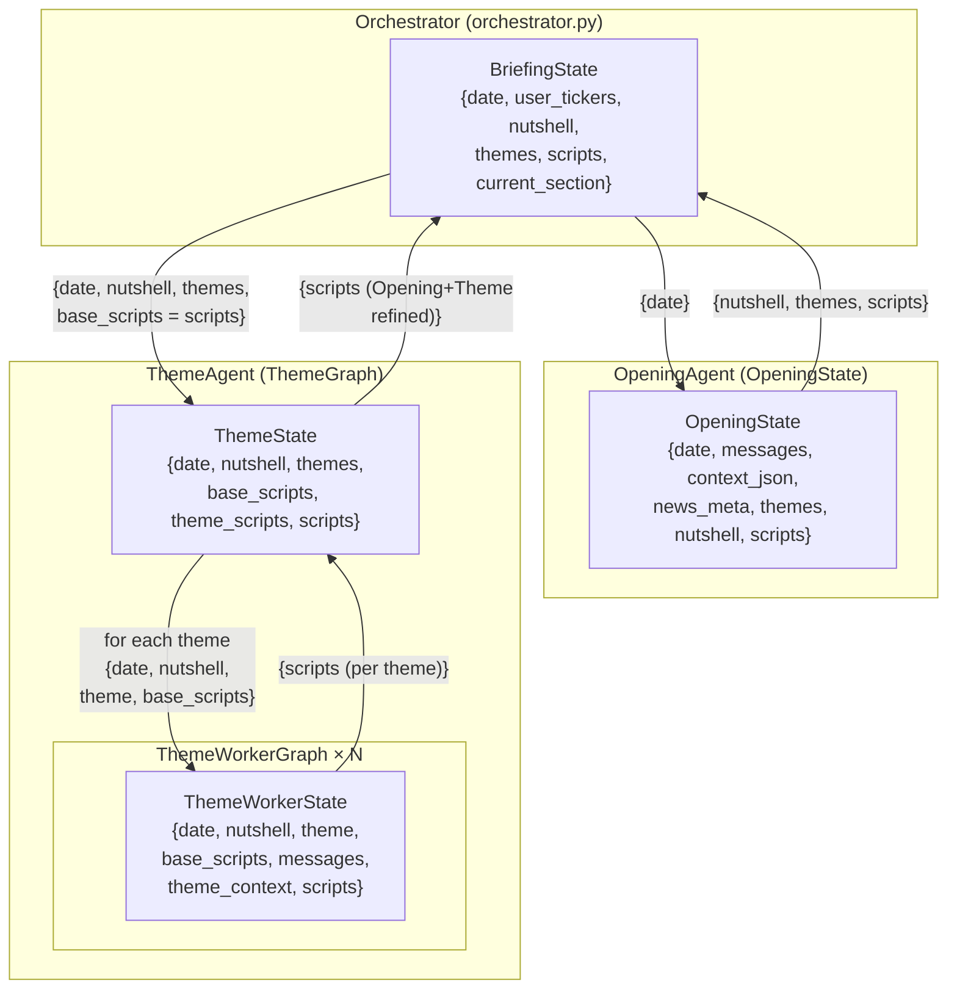

```mermaid
flowchart TD
    %% 최상위 오케스트레이터
    subgraph ORCH["Orchestrator (orchestrator.py)"]
        BS["BriefingState<br>{date, user_tickers, nutshell,<br>themes, scripts, current_section}"]
    end

    %% OpeningAgent 서브그래프
    subgraph OA["OpeningAgent (OpeningState)"]
        OS["OpeningState<br>{date, messages, context_json,<br>news_meta, themes, nutshell, scripts}"]
    end

    %% ThemeAgent 서브그래프
    subgraph TA["ThemeAgent (ThemeGraph)"]
        TS["ThemeState<br>{date, nutshell, themes,<br>base_scripts, theme_scripts, scripts}"]
        
        subgraph TWG["ThemeWorkerGraph × N"]
            TWS["ThemeWorkerState<br>{date, nutshell, theme,<br>base_scripts, messages,<br>theme_context, scripts}"]
        end
    end

    %% 데이터/State 흐름

    %% Orchestrator → OpeningAgent
    BS -->|"{date}"| OS
    OS -->|"{nutshell, themes, scripts}"| BS

    %% Orchestrator → ThemeAgent
    BS -->|"{date, nutshell, themes,<br>base_scripts = scripts}"| TS

    %% ThemeState → ThemeWorkerState (테마별 병렬 실행)
    TS -->|"for each theme<br>{date, nutshell,<br>theme, base_scripts}"| TWS
    TWS -->|"{scripts (per theme)}"| TS

    %% ThemeAgent → Orchestrator
    TS -->|"{scripts (Opening+Theme<br>refined)}"| BS
```