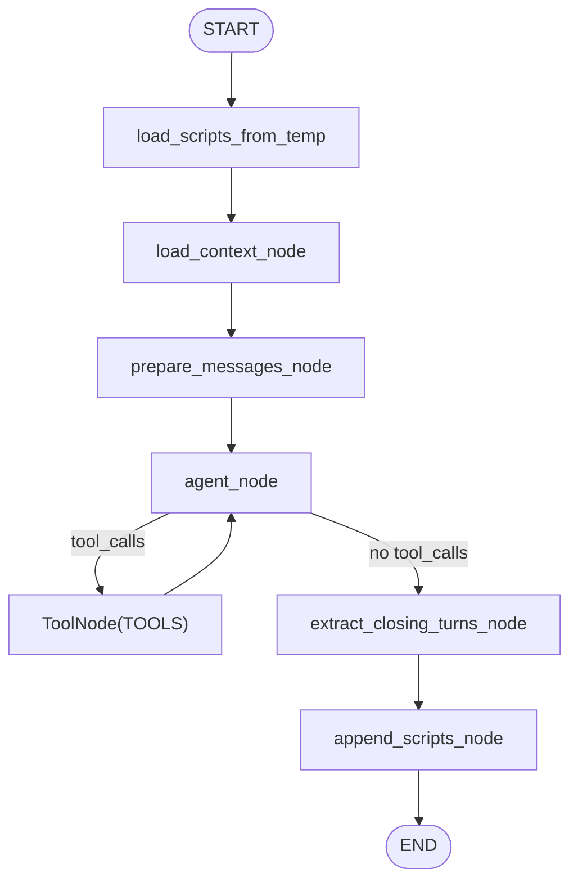

# ClosingAgent 아키텍처

ClosingAgent는 누적된 대본(`scripts`)을 입력으로 받아 **클로징(마무리) 파트**를 생성하고, 기존 스크립트 뒤에 append 합니다. 최종 단계 산출물로 `temp/closing.json`을 저장합니다.

## 전체 파이프라인에서의 역할

- 오케스트레이터 Stage 실행:
  - `--stage 2`에서 ClosingAgent가 실행됩니다.
- 단독 실행:
  - 입력 스크립트가 주어지지 않으면 `temp/theme.json`을 읽어 대본을 로드합니다.
  - 이 모드는 `python orchestrator.py ... --agent closing` 또는 `python -m agents.closing.graph ...`에서 사용됩니다.

## 디렉토리/파일 구조

```text
agents/closing/
  graph.py                      # LangGraph 정의/실행 엔트리
  prompt/closing_main.yaml       # system + user_template 프롬프트
  ARCHITECTURE.md
```

## 입력/출력 및 아티팩트

| 아티팩트 | 경로 | Producer | Consumer | 비고 |
| --- | --- | --- | --- | --- |
| 테마 결과 산출물 | `temp/theme.json` | ThemeAgent | ClosingAgent | standalone 모드에서 필요 |
| 클로징 결과 산출물 | `temp/closing.json` | ClosingAgent | (후속 파이프라인/디버깅) | 최종 누적 scripts 포함 |

- 캐시 입력(툴/컨텍스트):
  - `cache/{date}/calendar.csv` (프롬프트 컨텍스트)
  - `cache/{date}/calendar.json` (캘린더 툴)
  - yfinance 네트워크 호출(get_ohlcv)

## LangGraph 파이프라인



## 노드 상세 동작

| 노드 | 목적 | 주요 입력 | 주요 출력/부작용 |
| --- | --- | --- | --- |
| `load_scripts_from_temp` | scripts가 비어있으면 `temp/theme.json`에서 로드 | `scripts`, (fallback) `temp/theme.json` | `date/scripts` 채움 |
| `load_context_node` | 캘린더 CSV 컨텍스트 구성 | `cache/{date}/calendar.csv` | `calendar_context` |
| `prepare_messages_node` | 프롬프트 렌더링 및 메시지 구성 | `closing_main.yaml`, `scripts`, `calendar_context` | `messages=[System, Human]` |
| `agent_node` | LLM 호출(툴 바인딩) | `messages` | `AIMessage` 생성 |
| `ToolNode(TOOLS)` | 툴콜 실행 | LLM tool calls | tool outputs |
| `extract_closing_turns_node` | JSON 파싱/정규화(클로징 파트만) | 마지막 `AIMessage.content` | `closing_turns` |
| `append_scripts_node` | 기존 scripts에 closing_turns append 후 정규화/저장 | `scripts`, `closing_turns` | `scripts` 갱신 + `temp/closing.json` 저장 |

## 사용 툴(TOOLS)

- `get_ohlcv`: yfinance OHLCV 조회 (`shared/tools/get_ohlcv.md`)
- `get_calendar`: 이벤트 캘린더 조회 (`shared/tools/get_calendar.md`)

## 출력 계약

- LLM은 `closing_turns` 배열을 반환해야 합니다.
- `append_scripts_node`에서 `normalize_script_turns()`가 전체 `id`를 다시 0..N-1로 부여합니다.

## 상태 스키마 (State Schema)

```yaml
ClosingState:
  date: string               # YYYYMMDD (EST)
  scripts: ScriptTurn[]      # accumulated scripts before closing
  calendar_context: string   # TSV-like context from calendar.csv
  messages: BaseMessage[]    # internal
  closing_turns: ScriptTurn[]# model output for closing only
```

## 요청 스키마 (Request Schema)

ClosingAgent는 두 가지 모드를 지원합니다.

1) orchestrator 모드: `scripts`가 주입됩니다.
2) standalone 모드: `scripts`가 비어 있으면 `temp/theme.json`에서 로드합니다.

```json
{
  "type": "object",
  "required": ["date"],
  "properties": {
    "date": { "type": "string", "pattern": "^[0-9]{8}$" },
    "scripts": { "type": ["array", "null"], "items": { "type": "object" } }
  },
  "additionalProperties": true
}
```

## 응답 스키마 (Response Schema)

```json
{
  "type": "object",
  "required": ["date", "scripts"],
  "properties": {
    "date": { "type": "string", "pattern": "^[0-9]{8}$" },
    "scripts": { "type": "array", "items": { "type": "object" } }
  },
  "additionalProperties": true
}
```

## 실행 방법 (Standalone)

- Via orchestrator: `python orchestrator.py 20251222 --agent closing`
  - `global_prefetch_node()` 실행 후 ClosingAgent만 수행합니다.
  - `temp/theme.json`이 없으면 실패합니다.
- Direct module run: `python -m agents.closing.graph 20251222`
  - 내부에서 `prefetch_all()`을 호출해 캐시를 만들고 실행 후 정리합니다.

## 에러 처리 및 재실행 특성

- `temp/theme.json` 누락:
  - standalone 모드에서 `FileNotFoundError`로 실패합니다.
- OHLCV 과다 결과:
  - `get_ohlcv`는 결과가 너무 크면 `too_many_rows=true`로 빈 rows를 반환할 수 있습니다(프롬프트 설계 시 고려).
- 캐시 정리:
  - 종료 시 `cache/{date}`는 삭제되며 `temp/closing.json`은 유지됩니다.

