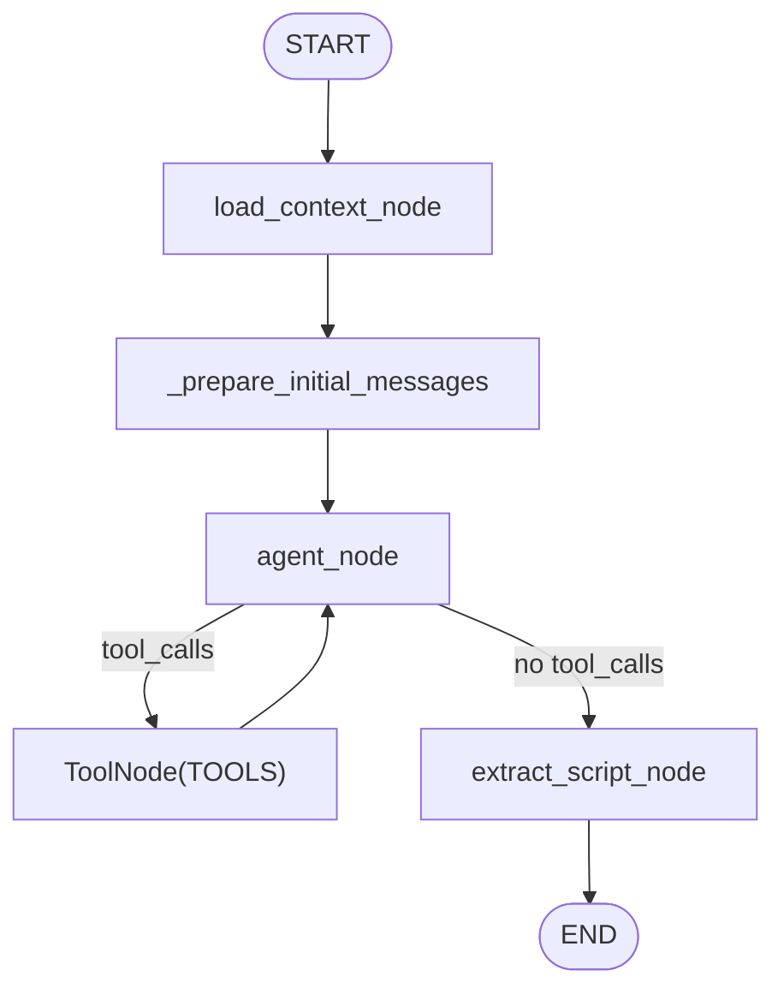

# OpeningAgent 아키텍처

OpeningAgent는 장마감 브리핑의 **오프닝(인트로) 파트**를 생성합니다. 오케스트레이터(`orchestrator.py`)가 미리 채워둔 공유 캐시(`cache/{date}/`)를 읽고 다음 산출물을 만듭니다.

- `nutshell`: 한 줄 요약
- `themes`: 에피소드의 핵심 테마 목록(ThemeAgent 입력)
- `scripts`: 오프닝 대본(턴 리스트)
- `temp/opening.json`: ThemeAgent 단독 실행 시 사용할 **중간 산출물**

## 전체 파이프라인에서의 역할

- 오케스트레이터는 실행 시작 시 `global_prefetch_node()`로 `cache/{date}/`를 생성합니다.
- OpeningAgent는 이 캐시를 바탕으로 “오늘의 시장 컨텍스트 + 뉴스/이벤트 근거”를 포함한 오프닝 대본을 생성합니다.
- ThemeAgent는 필요 시 `temp/opening.json`을 읽어(standalone 모드) 오프닝 결과를 이어서 확장합니다.

## 디렉토리/파일 구조

```text
agents/opening/
  graph.py                      # LangGraph 정의/실행 엔트리
  prompt/opening_main.yaml       # system + user_template 프롬프트
  config/stopwords.txt           # titles.txt 기반 키워드 추출용 불용어
  ARCHITECTURE.md
```

## 입력/출력 및 아티팩트

### 읽는 파일 (cache)

- 필수:
  - `cache/{date}/market_context.json`
- 선택(있으면 프롬프트에 추가 컨텍스트로 포함):
  - `cache/{date}/titles.txt` (`title_top_words` 계산에 사용)
  - `cache/{date}/calendar.csv` (경제 이벤트 컨텍스트 생성에 사용)

### 사용하는 툴이 읽는 파일 (cache)

- `cache/{date}/news_list.json`, `cache/{date}/bodies/*.txt` (뉴스 관련 툴)
- `cache/{date}/calendar.json` (캘린더 툴)

### 쓰는 파일 (temp)

- `temp/opening.json`

### `temp/opening.json` 구조 (요약)

```json
{
  "date": "20251222",
  "nutshell": "string",
  "themes": [
    {
      "headline": "string",
      "description": "string",
      "related_news": [{ "pk": "string", "title": "string" }]
    }
  ],
  "scripts": [
    {
      "id": 0,
      "speaker": "진행자",
      "text": "string",
      "sources": [{ "type": "article", "pk": "string", "title": "string" }]
    }
  ]
}
```

## LangGraph 파이프라인



## 노드 상세 동작

| 노드 | 목적 | 주요 입력 | 주요 출력/부작용 |
| --- | --- | --- | --- |
| `load_context_node` | 공유 캐시에서 시장 컨텍스트 로드 | `market_context.json`, (옵션) `titles.txt` | `context_json` 저장 + `title_top_words` 추가 |
| `_prepare_initial_messages` | 프롬프트 렌더링 및 메시지 구성 | `opening_main.yaml`, (옵션) `calendar.csv`, `context_json` | `messages=[System, Human]` 생성 |
| `agent_node` | LLM 호출(툴 바인딩) | `messages` | `AIMessage` 생성(툴콜 포함 가능) |
| `ToolNode(TOOLS)` | 툴콜 실행 | LLM tool calls | 툴 실행 결과가 `messages`에 누적 |
| `extract_script_node` | 최종 JSON 파싱/정규화 후 저장 | 마지막 `AIMessage.content` | `themes/nutshell/scripts` 반환 + `temp/opening.json` 저장 |

## 프롬프트 렌더링 규칙

프롬프트 파일: `agents/opening/prompt/opening_main.yaml`

- YAML 필수 키:
  - `system`: 시스템 프롬프트 템플릿
  - `user_template`: 유저 프롬프트 템플릿
- 주요 치환 변수:
  - `{tools}`: 툴 이름/설명 목록
  - `{date}`: `YYYYMMDD`를 `"11월 25일"` 형태로 변환한 문자열
  - `{context_json}`: `market_context.json`(일부 필드 제외 후 JSON 문자열)
  - `{title_top_words}`: `titles.txt` 기반 상위 단어 카운트(JSON)
  - `{calendar_context}`: `calendar.csv`를 `id\test_date\ttitle` TSV 형태로 직렬화한 문자열

## 사용 툴(TOOLS)

OpeningAgent는 아래 툴들을 “LLM tool call”로 호출할 수 있습니다.

- `get_news_list`: 캐시된 뉴스 인덱스 필터링 (`shared/tools/get_news_list.md`)
- `get_news_content`: 뉴스 본문 로드(캐시 미스 시 S3 다운로드) (`shared/tools/get_news_content.md`)
- `list_downloaded_bodies`: 로컬에 내려받은 본문 목록 조회 (`shared/tools/list_downloaded_bodies.md`)
- `count_keyword_frequency`: titles/bodies에서 키워드 빈도 계산 (`shared/tools/count_keyword_frequency.md`)
- `get_calendar`: 이벤트 캘린더 조회 (`shared/tools/get_calendar.md`)
- `get_ohlcv`: yfinance OHLCV 조회 (`shared/tools/get_ohlcv.md`)

## JSON 파싱/정규화 규칙

### JSON 추출

- `shared/normalization.parse_json_from_response()`가 다음 중 하나를 파싱합니다.
  - 응답에 포함된 ```json fenced block
  - 또는 전체 텍스트를 JSON으로 가정
- 파싱 실패 시 `{}`를 반환합니다(이 경우 `themes/scripts`는 빈 값으로 귀결될 수 있습니다).

### 스크립트 정규화

- `shared/normalization.normalize_script_turns()`가 `scripts`를 엄격하게 정규화합니다.
  - `speaker`는 `"진행자" | "해설자"`만 허용
  - `text`는 비어있을 수 없음
  - `sources`는 필수이며 타입에 따라 필드 제약이 존재
  - 유효하지 않은 turn/source는 **drop**
  - 최종 `id`는 입력값과 무관하게 **0부터 순차 재부여**됩니다

## 상태 스키마 (State Schema)

```yaml
OpeningState:
  date: string               # YYYYMMDD (EST)
  messages: BaseMessage[]    # LangChain messages (internal)
  context_json: object       # market_context + title_top_words
  themes: Theme[]            # model output
  nutshell: string           # model output
  scripts: ScriptTurn[]      # parsed + normalized

Theme:
  headline: string
  description: string
  related_news: NewsSource[]

NewsSource:
  pk: string
  title: string

ScriptTurn:
  id: integer
  speaker: enum["진행자", "해설자"]
  text: string
  sources: Source[]

Source:
  type: enum["article", "chart", "event"]
  # type-specific fields are defined in `shared/types.py`
```

## 요청 스키마 (Request Schema)

```json
{
  "type": "object",
  "required": ["date"],
  "properties": {
    "date": {
      "type": "string",
      "description": "Briefing date in YYYYMMDD (EST).",
      "pattern": "^[0-9]{8}$"
    }
  },
  "additionalProperties": true
}
```

## 응답 스키마 (Response Schema)

```json
{
  "type": "object",
  "required": ["date", "nutshell", "themes", "scripts"],
  "properties": {
    "date": { "type": "string", "pattern": "^[0-9]{8}$" },
    "nutshell": { "type": "string" },
    "themes": { "type": "array", "items": { "type": "object" } },
    "scripts": { "type": "array", "items": { "type": "object" } }
  },
  "additionalProperties": true
}
```

## 실행 방법 (Standalone)

- Via orchestrator: `python orchestrator.py 20251222 --agent opening`
  - `global_prefetch_node()` 실행 후 OpeningAgent만 수행합니다.
  - 종료 시 `cache/{date}`는 삭제되며, `temp/opening.json`은 유지됩니다.
- Direct module run: `python -m agents.opening.graph 20251222`
  - 내부에서 `prefetch_all()`을 호출해 캐시를 만들고 실행 후 정리합니다.

## 에러 처리 및 재실행 특성

- 필수 입력 누락:
  - `market_context.json`이 없으면 `FileNotFoundError`로 즉시 실패합니다.
- 툴 실행 실패:
  - `ToolNode` 단계에서 예외가 발생하면 그래프 실행이 중단될 수 있습니다(캐시/환경변수 확인 필요).
- 결과 JSON 품질:
  - LLM 출력이 스키마를 어기면 `normalize_script_turns()`에서 turn/source가 제거됩니다.
  - 그 결과 `scripts`가 비거나 매우 짧아질 수 있습니다.
- 캐시 정리:
  - orchestrator/standalone 모두 종료 시 `cache/{date}`는 삭제됩니다.
  - 단, `temp/`는 유지되므로 ThemeAgent 단독 실행이 가능합니다.

