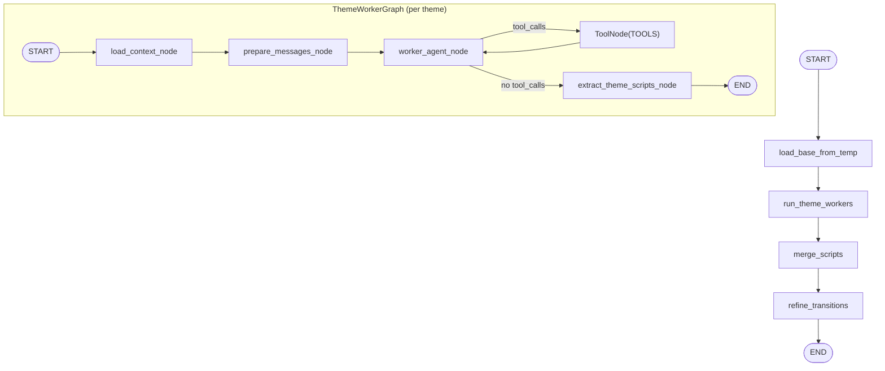

# ThemeAgent 아키텍처

ThemeAgent는 OpeningAgent가 생성한 `themes`를 기준으로 **테마별 심층 파트**를 생성하고, 오프닝 스크립트와 합쳐 “본편 대본”을 구성합니다. 또한 ClosingAgent 단독 실행을 위한 중간 산출물 `temp/theme.json`을 기록합니다.

## 전체 파이프라인에서의 역할

- 오케스트레이터 Stage 실행:
  - `--stage 1` 또는 `--stage 2`에서 ThemeAgent가 실행됩니다.
- 단독 실행:
  - ThemeAgent는 입력(`themes/base_scripts`)이 없으면 `temp/opening.json`을 읽어 자체적으로 초기 입력을 구성합니다.
  - 이 모드는 `python orchestrator.py ... --agent theme` 또는 `python -m agents.theme.graph ...`에서 사용됩니다.

## 디렉토리/파일 구조

```text
agents/theme/
  graph.py                      # ThemeGraph + ThemeWorkerGraph 정의
  prompt/theme_worker.yaml       # 테마별 심층 생성 프롬프트
  prompt/theme_refine.yaml       # 전환부 문장 다듬기(Refiner) 프롬프트
  ARCHITECTURE.md
```

## 입력/출력 및 아티팩트

| 아티팩트 | 경로 | Producer | Consumer | 비고 |
| --- | --- | --- | --- | --- |
| 오프닝 중간 산출물 | `temp/opening.json` | OpeningAgent | ThemeAgent | standalone 모드에서 필요 |
| 테마 결과 산출물 | `temp/theme.json` | ThemeAgent | ClosingAgent | standalone Closing에서 필요 |

ThemeAgent 자체는 직접 파일을 많이 읽지 않지만, 아래 **공유 캐시**를 툴을 통해 사용합니다.

- `cache/{date}/news_list.json`, `cache/{date}/bodies/*.txt` (뉴스 관련 툴)
- `cache/{date}/calendar.csv`, `cache/{date}/calendar.json` (캘린더 컨텍스트/툴)

## LangGraph 파이프라인



## ThemeGraph 노드 상세

| 노드 | 목적 | 주요 입력 | 주요 출력/부작용 |
| --- | --- | --- | --- |
| `load_base_from_temp` | 입력이 비어있을 때 `temp/opening.json`으로부터 초기값 로드 | `themes`, `base_scripts`, (fallback) `temp/opening.json` | `date/nutshell/themes/base_scripts` 채움 |
| `run_theme_workers` | 테마별 Worker 그래프를 병렬 실행 | `themes`, `base_scripts`, `nutshell` | `theme_scripts`(테마별 스크립트 리스트) |
| `merge_scripts` | 오프닝+테마 스크립트를 단순 병합 후 정규화 | `base_scripts`, `theme_scripts` | `scripts`(전체 스크립트), `id` 재부여 |
| `refine_transitions` | 전환부 문장만 최소 수정(Refiner) 후 저장 | `scripts`, `themes` | 수정된 `scripts` + `temp/theme.json` 저장 |

## ThemeWorkerGraph 노드 상세

ThemeWorkerGraph는 “단일 테마”를 입력받아 해당 테마의 심층 파트를 생성합니다.

| 노드 | 목적 | 주요 입력 | 주요 출력 |
| --- | --- | --- | --- |
| `load_context_node` | 테마 컨텍스트 구성 | `theme`, `nutshell` | `theme_context`(headline/description/related_news/...) |
| `prepare_messages_node` | 프롬프트 렌더링 | `theme_context`, `base_scripts` | `messages=[System, Human]` |
| `worker_agent_node` | LLM 호출(툴 바인딩) | `messages` | `AIMessage` |
| `ToolNode(TOOLS)` | 툴콜 실행 | LLM tool calls | tool outputs |
| `extract_theme_scripts_node` | JSON 파싱/정규화 | 마지막 `AIMessage.content` | `scripts`(테마 파트) |

## 병렬 실행/실패 처리 전략

- `run_theme_workers`는 `worker_graph.batch(..., return_exceptions=True)`를 사용합니다.
  - 특정 테마가 실패하더라도 전체 ThemeAgent는 계속 진행합니다.
  - 실패한 테마의 결과는 빈 리스트(`[]`)로 취급되어 병합 시 스킵됩니다.
- 병합 후 `normalize_script_turns()`가 전체 `id`를 다시 0..N-1로 부여하므로, orchestrator의 `chapter` 범위 계산(길이 기반)이 안정적으로 동작합니다.

## Refiner(전환부 다듬기) 동작

- 프롬프트: `agents/theme/prompt/theme_refine.yaml`
- Refiner 입력은 `sources`를 제외한 최소 스크립트(`id/speaker/text`)입니다.
- Refiner 출력은 아래 스키마의 `edits`를 반환해야 하며, 범위를 벗어나거나 비어있으면 적용하지 않습니다.
- 재시도/폴백:
  - `THEME_REFINER_OPENAI_MAX_RETRIES`만큼 재시도합니다.
  - 모델 접근 불가(`model_not_found` 계열) 시 Refiner를 Worker 모델로 폴백합니다.
  - 최종적으로 실패하면 “수정 없이 기존 scripts 유지”로 종료합니다.

## 사용 툴(TOOLS)

ThemeAgent/Worker는 아래 툴들을 호출할 수 있습니다.

- `get_news_list`: 캐시된 뉴스 인덱스 필터링 (`shared/tools/get_news_list.md`)
- `get_news_content`: 뉴스 본문 로드(캐시 미스 시 S3 다운로드) (`shared/tools/get_news_content.md`)
- `count_keyword_frequency`: titles/bodies에서 키워드 빈도 계산 (`shared/tools/count_keyword_frequency.md`)
- `get_ohlcv`: yfinance OHLCV 조회 (`shared/tools/get_ohlcv.md`)
- `get_calendar`: 이벤트 캘린더 조회 (`shared/tools/get_calendar.md`)

## 상태 스키마 (State Schema)

```yaml
ThemeState:
  date: string                 # YYYYMMDD (EST)
  nutshell: string
  themes: Theme[]              # from OpeningAgent
  base_scripts: ScriptTurn[]   # Opening scripts
  theme_scripts: ScriptTurn[][]# Worker outputs (one list per theme)
  scripts: ScriptTurn[]        # merged + normalized

ThemeWorkerState:
  date: string
  nutshell: string
  theme: Theme
  theme_context: object
  base_scripts: ScriptTurn[]
  messages: BaseMessage[]      # internal
  scripts: ScriptTurn[]        # per-theme output
```

## 요청 스키마 (Request Schema)

ThemeAgent는 두 가지 모드를 지원합니다.

1) orchestrator 모드: `themes` + `base_scripts`가 주입됩니다.
2) standalone 모드: `themes` 또는 `base_scripts`가 비어 있으면 `temp/opening.json`에서 로드합니다.

```json
{
  "type": "object",
  "required": ["date"],
  "properties": {
    "date": { "type": "string", "pattern": "^[0-9]{8}$" },
    "nutshell": { "type": "string" },
    "themes": { "type": ["array", "null"], "items": { "type": "object" } },
    "base_scripts": { "type": ["array", "null"], "items": { "type": "object" } }
  },
  "additionalProperties": true
}
```

## 응답 스키마 (Response Schema)

```json
{
  "type": "object",
  "required": ["date", "scripts"],
  "properties": {
    "date": { "type": "string", "pattern": "^[0-9]{8}$" },
    "scripts": { "type": "array", "items": { "type": "object" } }
  },
  "additionalProperties": true
}
```

## 실행 방법 (Standalone)

- Via orchestrator: `python orchestrator.py 20251222 --agent theme`
  - `global_prefetch_node()` 실행 후 ThemeAgent만 수행합니다.
  - `temp/opening.json`이 없으면 실패합니다.
- Direct module run: `python -m agents.theme.graph 20251222`
  - 내부에서 `prefetch_all()`을 호출해 캐시를 만들고 실행 후 정리합니다.

## 에러 처리 및 재실행 특성

- `temp/opening.json` 누락:
  - standalone 모드에서 `FileNotFoundError`로 실패합니다.
- Worker 실패:
  - 해당 테마만 빈 결과로 처리되고 전체 파이프라인은 지속됩니다.
- Refiner 실패:
  - 적용 없이 기존 scripts를 유지합니다(실행 자체는 성공).
- 캐시 정리:
  - 종료 시 `cache/{date}`는 삭제되며 `temp/theme.json`은 유지됩니다.
