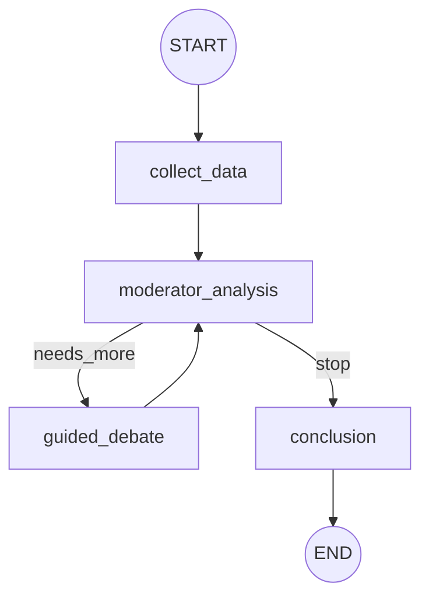
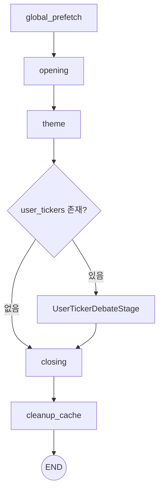
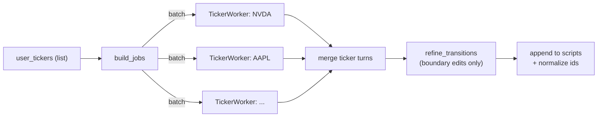
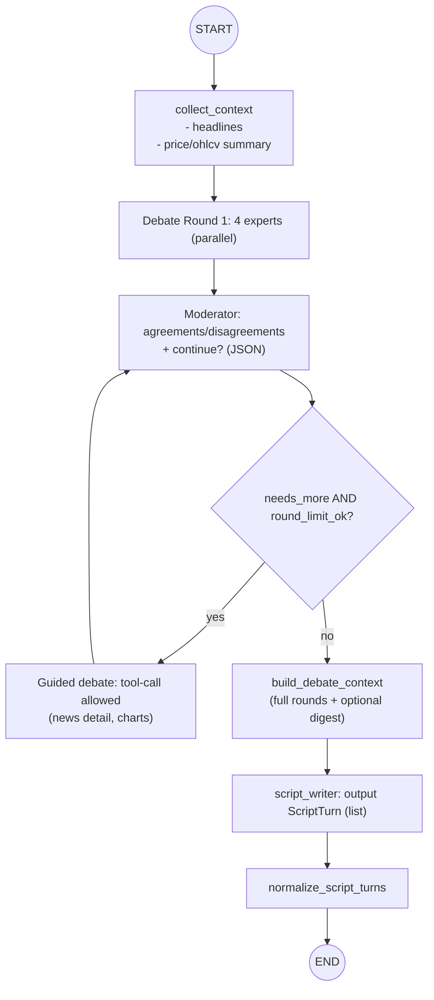

# Theme ↔ Closing 사이 `UserTickerDebate` 단계 추가 계획

## 1) 가능 여부 요약

`stock-morning-main/`에는 **단일 티커 입력 → 데이터 수집 → 4명 전문가 토론(중재자 루프) → 최종 요약**까지 수행하는 LangGraph 파이프라인이 이미 있습니다. 이를 현재 프로젝트의 `orchestrator.py`에 “Theme와 Closing 사이 단계”로 포팅하여, `user_tickers[]` 기반 **티커별 기업 분석 스크립트**를 생성/삽입하는 구성이 가능합니다.

다만 그대로 붙이는 방식보다는, 현재 프로젝트의 **캐시/툴(`cache/{date}` + `shared/tools/*`)**과 **출력 계약(`ScriptTurn[]`)**에 맞게 설계를 재구성하는 편이 안전합니다.

---

## 2) `stock-morning-main/`에서 확인된 구조(재사용 포인트)

### 2.1 토론 그래프 구조(중재자 루프)

- `collect_data → moderator_analysis → (guided_debate ↔ moderator_analysis)* → conclusion`
- 중재자가 라운드별 합의/쟁점을 정리하고 “추가 토론 필요 여부”를 판단합니다.



### 2.2 비용 최적화 아이디어(뉴스 상세는 필요할 때만)

`guided_debate`에서는 뉴스 헤드라인만 주고, 특정 뉴스만 tool-call로 상세 본문을 조회합니다(중복 조회는 캐시로 회피).  
현재 프로젝트에서도 `get_news_list`/`get_news_content` 조합으로 동일한 패턴을 구현할 수 있습니다.

### 2.3 `stock-morning-main`의 출력은 “최종 산출물”보다는 디버그 산출물에 가깝다

예시 파일(`stock-morning-main/GOOG_20251228_154422_debate.json`)은 다음 특성이 있습니다.

- `rounds`, `debate_transcript`처럼 **토론 로그/원문 중심**이라 파일이 매우 큼
- `sources.type = sec_filing`을 포함해, 현재 프로젝트의 `ScriptTurn.sources` 스키마(`article|chart|event`)와 바로 호환되지 않음
- 무엇보다 현재 프로젝트의 TTS 입력은 `podcast/{date}/script.json`의 `scripts: ScriptTurn[]`이므로, “티커 토론 JSON”을 그대로 최종 output으로 두는 방향은 맞지 않음

따라서 이 단계의 “생산용(프로덕션) output”은 **토론 로그가 아니라 `ScriptTurn[]`(대본)** 이어야 하고, 토론 로그는 필요하면 별도 debug artifact로 분리하는 구성이 적합합니다.

---

## 3) 현재 프로젝트에 추가할 단계: `UserTickerDebateStage`

### 3.1 상위 Orchestrator 그래프에 노드 추가(Theme 다음, Closing 이전)

- 입력: `date`, `user_tickers`, `scripts`(Theme까지 누적 결과)
- 출력: `scripts`에 **티커 섹션(turns)**을 append
- 조건: `user_tickers`가 비어 있으면 no-op



### 3.2 Stage/Agent 모드 고려(행동 정의)

- `--stage 0/1`: 기존 동작 유지(Closing 이전이므로 실행되지 않음)
- `--stage 2`: Theme 이후에 `UserTickerDebateStage`(=TickerPipeline)를 실행하고 종료 (Closing 제외)
- `--stage 3`: Theme → TickerPipeline 실행 후 Closing 진행
- (선택) `--agent ticker`: 티커 단계만 단독 실행을 지원하려면, `temp/theme.json`을 입력으로 로드하는 독립 경로가 필요

---

## 4) `UserTickerDebateStage` 내부 설계(티커별 Worker + 병합)

### 4.1 티커별 Worker를 병렬/배치 실행 + merge 후 전환 Refiner

- `user_tickers = ["NVDA", "AAPL", ...]`에 대해 ticker worker를 실행
- 병렬은 제한적으로(예: 1~2개 동시) 운영하여 API 호출 폭증을 피함
- Worker 결과를 단순 concat하면 “티커 간 전환”이 어색해질 수 있으므로, merge 후 **전환부만 최소 수정하는 Refiner**를 두는 구성이 안정적임(ThemeAgent의 `merge_scripts → refine_transitions`와 동일 패턴)



### 4.2 TickerWorker(티커 1개): `debate → (debate_context) → script_writer`

요청하신 방식대로, 티커별 Worker 내부를 “디베이트(리서치)”와 “스크립트 작성(라이팅)”으로 분리합니다.

- 디베이트는 `stock-morning-main`처럼 4인 관점 + 중재자 루프를 유지하되, **최종 산출물이 토론 로그(JSON)**가 되지 않도록 합니다.
- 디베이트 결과(라운드별 모든 발언)를 `debate_context`로 만들어, 다음 단계 `script_writer`의 컨텍스트로 주입합니다.
- 즉, ThemeAgent에서 `theme_context`를 만들어 Worker에 넣는 것처럼, 여기서는 `debate_context`를 만들어 Writer에 넣는 구조입니다.
- 요구사항이 “모든 토론 턴 내용 제공”이므로, `debate_context`에는 **반드시 전체 rounds(원문)**가 포함되어야 합니다.
- (옵션) writer가 빠르게 결론을 잡을 수 있도록, 별도로 **digest(JSON)**를 추가로 생성해 함께 주입할 수 있습니다(원문을 대체하지 않음).



`debate_context`(옵션 digest) 예시:

```json
{
  "ticker": "NVDA",
  "one_line_thesis": "string",
  "bull_case": ["string", "string"],
  "bear_case": ["string", "string"],
  "key_unknowns": ["string"],
  "action_bias": "BUY|HOLD|SELL",
  "risk_notes": ["string"],
  "numbers_to_quote": ["string"],
  "used_news": [{ "pk": "string", "title": "string" }],
  "used_chart": { "ticker": "NVDA", "start_date": "YYYY-MM-DD", "end_date": "YYYY-MM-DD" }
}
```

### 4.3 Refiner 설계(“전환부만” 수정하는 최소 Refiner)

Refiner는 “전체 스크립트를 다시 쓰는” 모델이 아니라, 아래 전환부만 다듬습니다.

- Theme → 첫 티커 섹션 진입
- 티커 i → 티커 i+1 전환(요약/브릿지)
- 마지막 티커 섹션 → Closing 진입(ClosingAgent가 이어받기 쉽게)

권장 구현 방식:

1. merge 단계에서 **브릿지용 turn**을 미리 삽입(예: `진행자` 1턴, sources는 `chart` 또는 대표 `article`로 최소 1개 포함)
2. Refiner 입력은 `id/speaker/text`만 전달(sources 제외)
3. Refiner 출력은 `edits[]`로 제한하고, 적용 대상도 “브릿지 turn id들”로 제한

Refiner 출력 예시(ThemeAgent와 동일 스타일):

```json
{
  "edits": [
    { "id": 42, "speaker": "진행자", "text": "다음은 NVDA 이야기로 넘어가 보겠습니다..." },
    { "id": 57, "speaker": "진행자", "text": "이어서 AAPL 쪽도 짚어보죠..." }
  ]
}
```

---

## 5) 컨텍스트/데이터 수집 설계(현재 프로젝트 캐시/툴 기반)

### 5.1 뉴스(티커별)

- 후보 추출: `get_news_list(tickers=[TICKER])`
- 프롬프트에는 헤드라인 top-K만 포함(예: 3~5개)
- Debate 단계에서 “상세 본문이 필요할 때만”:
  - `get_news_content([pk])`로 body 조회
  - ticker worker state에 `news_cache`를 두고 동일 pk 재조회 방지
- 디베이트/요약 단계에서 “근거로 실제 사용한 기사”를 `used_news_pks[]`로 추적합니다.
  - “뉴스 8번” 같은 번호 기반이 아니라, 반드시 `pk/title` 기반으로 남겨서 스크립트 단계에서 `sources=[{type:"article", pk, title}]`를 안정적으로 구성합니다.

### 5.2 가격/차트

- `get_ohlcv(ticker)`를 호출하고(기본 30일), 아래처럼 짧게 요약해서 프롬프트에 포함:
  - 최근 1일/5일/20일 수익률, 변동성, 고점/저점 근처 여부 등
- `get_ohlcv`는 `BRIEFING_DATE` 기반으로 날짜가 해석되므로 “해당 브리핑 날짜”에 맞춘 결정적 실행이 가능
- 디베이트/요약 단계에서 차트 근거를 `used_chart={ticker,start_date,end_date}`로 고정해 두고, 스크립트 단계가 이를 그대로 `sources`에 포함하도록 합니다.

### 5.3 (선택) 캘린더/이벤트

- 특정 티커에 직접 연관된 이벤트가 없다면 생략 가능
- 다만, 시장 전반 이벤트를 “티커 리스크/촉매”에 연결하고 싶으면 `get_calendar`를 참고로 제공

---

## 6) 출력 포맷(현재 프로젝트 `ScriptTurn[]`에 맞추기)

### 6.1 타겟 출력(턴 단위)

현재 파이프라인 최종 산출물은 `scripts: ScriptTurn[]`이며, 각 turn은 아래 필드가 필수입니다.

- `id`: 후처리에서 재부여되므로 입력값은 임시여도 됨
- `speaker`: `"진행자"` 또는 `"해설자"` 중 하나
- `text`: 공백 불가
- `sources`: 최소 1개 이상(검증/추적용)

### 6.1.1 (추가) Debate 출력물 JSON 스키마(중간 산출물)

티커 단계는 **최종 output을 새로 만들지 않고** `podcast/{date}/script.json`의 `scripts[]`에 흡수하는 것이 목표지만,  
`script_writer`에 “모든 토론 턴”을 컨텍스트로 주입하기 위해 티커별로 아래 형태의 **Debate 출력 JSON(중간 산출물)**을 정의합니다.

요구사항:
- top-level: `ticker`, `date`, `rounds`, `conclusion`만 유지
- `rounds[*].fundamental/risk/growth/sentiment` 발언은 `text + sources[]` 형태로 유지
- `conclusion`은 “대본”이 아니라, 중재자가 토론을 바탕으로 작성한 **자세한 결론**이며 `action/confidence`를 포함

```json
{
  "ticker": "GOOG",
  "date": "20251222",
  "rounds": [
    {
      "round": 1,
      "fundamental": { "text": "string", "sources": [/* Source[] */] },
      "risk": { "text": "string", "sources": [/* Source[] */] },
      "growth": { "text": "string", "sources": [/* Source[] */] },
      "sentiment": { "text": "string", "sources": [/* Source[] */] }
    }
  ],
  "conclusion": {
    "text": "string",
    "action": "BUY|HOLD|SELL",
    "confidence": 0.0
  }
}
```

`sources[]`는 `podcast/{date}/{date}.json`의 `scripts[*].sources`와 동일한 스키마(`article|chart|event`)를 사용합니다.

### 6.2 티커 섹션 템플릿(권장)

티커 1개당 최소 3~5 turns로 “팟캐스트 톤”을 만들되, 과도한 길이 증가를 방지합니다.

예시 구성(형태만 제안):
1. `진행자`: “오늘 {TICKER} 한 줄 결론/이슈” + 대표 근거 1~2개
2. `해설자`: “근거/리스크/촉매” 요약(뉴스/차트 근거 포함)
3. `진행자`: “실행 전략(조건부)” + 마무리

### 6.3 sources 매핑 전략(현 스키마 준수)

현재 `Source`는 `article | chart | event`만 허용됩니다.

- 뉴스 근거: `{type:"article", pk, title}`
- 차트 근거: `{type:"chart", ticker, start_date, end_date}`
- 이벤트 근거(선택): `{type:"event", id, title, date}`

> `stock-morning-main`의 `sec_filing`을 그대로 포함하려면, 현 프로젝트의 `Source` 타입 확장이 필요합니다. 1차 구현에서는 “뉴스+차트”로 충분히 당일 기업 분석을 구성할 수 있습니다.

추가 권장사항:
- `script_writer`는 새 근거를 “창작”하지 않고, `debate_context`에 포함된 `used_news_pks/used_chart`만으로 `sources`를 구성하는 것을 기본으로 합니다(근거-문장 불일치 방지).

### 6.4 “생산용 output”과 “디버그 output”을 분리한다(권장)

#### 생산용(최종) output: 기존 `podcast/{date}/script.json`에 흡수

현재 프로젝트는 최종 산출물을 `podcast/{date}/script.json`(TTS 입력)으로 저장합니다.  
따라서 티커 분석은 별도 JSON이 아니라, 아래처럼 **최종 payload의 `scripts[]`에 turn으로 포함**되는 것이 목표입니다.

```json
{
  "date": "YYYYMMDD",
  "nutshell": "string",
  "user_tickers": ["NVDA", "AAPL"],
  "chapter": [{ "name": "opening|theme|closing", "start_id": 0, "end_id": 10 }],
  "scripts": [
    { "id": 0, "speaker": "진행자", "text": "....", "sources": [{ "type": "article", "pk": "...", "title": "..." }] }
  ]
}
```

필요하면 `additionalProperties`로 아래 메타를 “가볍게” 추가하는 정도만 권장합니다(대용량 토론 로그 금지).

```json
{
  "ticker_sections": [
    { "ticker": "NVDA", "summary": "string", "script_start_id": 42, "script_end_id": 55 },
    { "ticker": "AAPL", "summary": "string", "script_start_id": 56, "script_end_id": 66 }
  ]
}
```

#### 디버그 output(옵션): `temp/`에 축약 저장

토론 품질 점검이 필요하면 `temp/`에 티커별 Debate 출력물을 저장합니다.

예: `temp/ticker_debates/{date}/{ticker}.json`

```json
{
  "ticker": "NVDA",
  "date": "20251222",
  "rounds": [
    {
      "round": 1,
      "fundamental": { "text": "string", "sources": [] },
      "risk": { "text": "string", "sources": [] },
      "growth": { "text": "string", "sources": [] },
      "sentiment": { "text": "string", "sources": [] }
    }
  ],
  "conclusion": { "text": "string", "action": "BUY", "confidence": 0.7 }
}
```

> `debate_transcript`처럼 중복/대용량 원문 문자열을 추가로 저장하지 않고, `rounds[]`를 “원문”으로 간주하는 편이 단순합니다.

---

## 7) 저장 아티팩트/재실행(선택 설계)

- `temp/`에 중간 산출물을 저장하면 단독 실행 흐름을 단순화할 수 있습니다.
  - 예: `temp/ticker.json` (Theme 결과 + ticker 섹션 append 후의 scripts 포함)
- `--agent closing` 단독 실행을 강화하려면, ClosingAgent가 `temp/ticker.json`을 우선 입력으로 로드하도록 확장하는 구성이 자연스럽습니다.

---

## 8) 오픈 질문(결정 필요)

1. 티커 섹션을 “theme의 연장”으로 볼지, 별도 챕터로 볼지?
   - 별도 챕터로 간주하면 `chapter`에 `"ticker"`를 추가하고, TTS 쪽 `KNOWN_CHAPTERS`에도 반영할지 결정 필요
2. 티커당 최대 길이(턴 수/문자 수) 상한을 어디에 둘지?
3. 라운드 수(예: 최대 2라운드)와 전문가 역할(4인 고정 vs 축약)을 어떻게 할지?
4. 티커가 많을 때(예: 10개 이상) 요약 모드(“Top 3만 심층, 나머지는 1턴 요약”)를 둘지?
