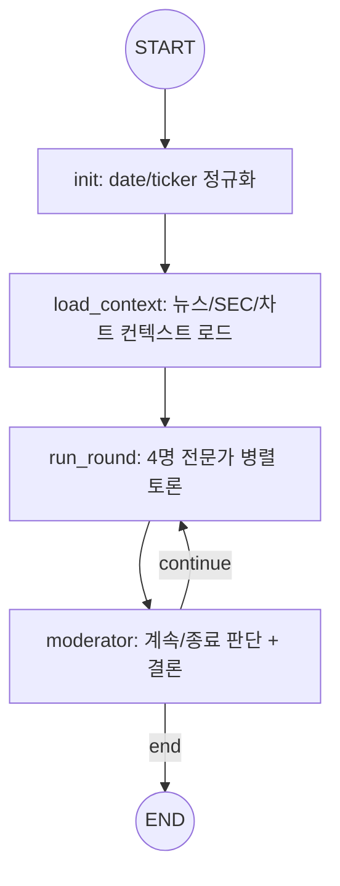
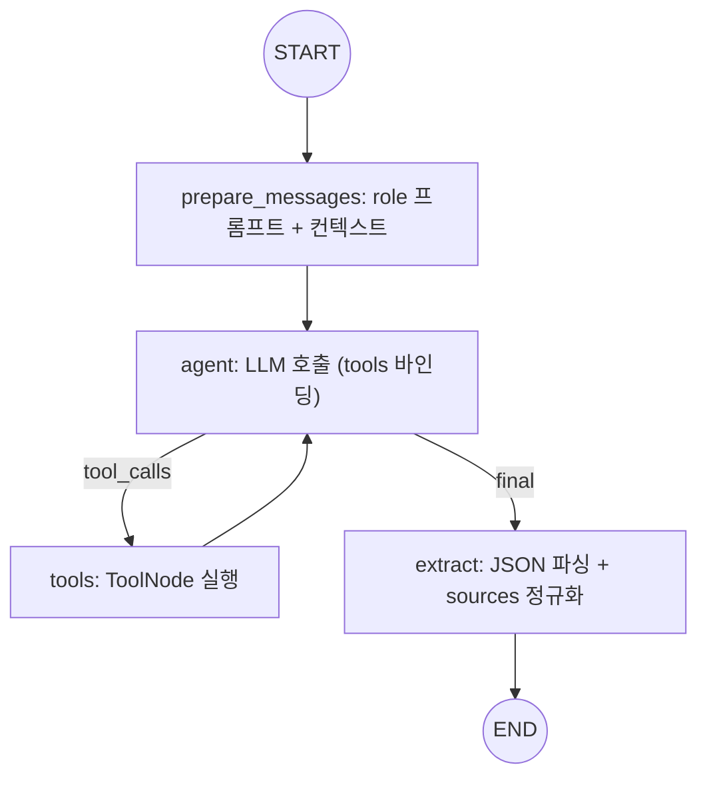
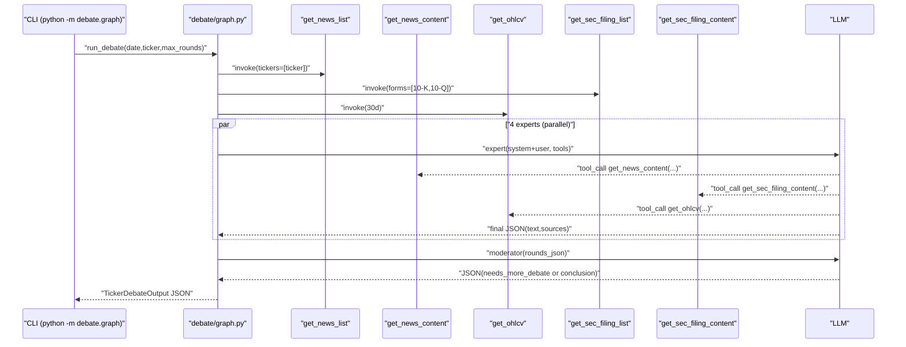
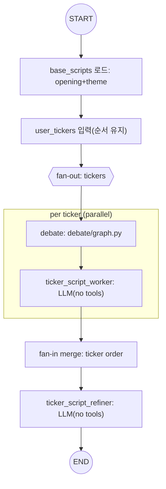

# `debate/` 아키텍처 & Tool 스키마

`debate/`는 “티커 1개 → 4인(펀더멘털/리스크/성장/심리) 토론(라운드) → 중재자 결론”을 실행해, 이후 단계(예: script_writer)에서 **모든 토론 턴을 컨텍스트로 주입**할 수 있는 **Debate JSON 아티팩트**를 생성합니다.

## 1) 파이프라인 개요



- 구현 파일: `debate/graph.py`
- 상태 타입: `debate/types.py` (`TickerDebateState`, `TickerDebateOutput`)

### 1.1 LLM 모델/프로파일(요약)

- 전문가 4명: `build_llm("DEBATE_{ROLE}")` → `DEBATE_*_OPENAI_MODEL`, `DEBATE_*_OPENAI_REASONING_EFFORT`로 제어
- 중재자: `build_llm("DEBATE_MODERATOR")` → `DEBATE_MODERATOR_OPENAI_MODEL`, `DEBATE_MODERATOR_OPENAI_REASONING_EFFORT`로 제어
- SEC filing 페이지 요약(index 생성): `SEC_PAGE_SUMMARY_MODEL`(기본 `gpt-5-mini`)로 제어, thinking none(=reasoning_effort 미전달)

## 2) 최종 출력(JSON) 구조

출력은 아래 4개 top-level 필드만 유지합니다.

```json
{
  "ticker": "GOOG",
  "date": "20251222",
  "rounds": [
    {
      "round": 1,
      "fundamental": { "text": "string", "action": "BUY|HOLD|SELL", "confidence": 0.0, "sources": [/* Source[] */] },
      "risk": { "text": "string", "action": "BUY|HOLD|SELL", "confidence": 0.0, "sources": [/* Source[] */] },
      "growth": { "text": "string", "action": "BUY|HOLD|SELL", "confidence": 0.0, "sources": [/* Source[] */] },
      "sentiment": { "text": "string", "action": "BUY|HOLD|SELL", "confidence": 0.0, "sources": [/* Source[] */] }
    }
  ],
  "conclusion": {
    "text": "string",
    "action": "BUY|HOLD|SELL",
    "confidence": 0.0
  }
}
```

### 2.1 `Source` 스키마

기본적으로 `shared/types.py`의 `article|chart|event`를 그대로 쓰고, **debate 프로토타입에서만** `sec_filing`을 추가로 허용합니다 (`debate/types.py`).

```json
// article
{ "type": "article", "pk": "id#...", "title": "..." }

// chart
{ "type": "chart", "ticker": "GOOG", "start_date": "YYYY-MM-DD", "end_date": "YYYY-MM-DD" }

// event (현재 debate에서는 기본 제공하지 않지만 스키마는 허용)
{ "type": "event", "id": "123", "title": "...", "date": "YYYY-MM-DD" }

// sec_filing (debate 전용)
{ "type": "sec_filing", "ticker": "GOOG", "form": "10-K", "filed_date": "YYYY-MM-DD", "accession_number": "000..." }
```

## 3) Expert(전문가) 서브그래프 구조

전문가 1명당 아래 서브그래프를 실행하고(`ToolNode` 루프 포함), 4명을 batch로 병렬 실행합니다.



핵심 원리:
- LLM 출력은 반드시 `{"text": "...", "action": "...", "confidence": 0.0, "sources": [...]}` JSON 1개만 허용 (`debate/prompt_new.py`).
- `sources`는 **allowed_sources에서만** 고르도록 강제하고, 코드에서 **교집합 매칭(정규화)**로 재검증합니다 (`debate/graph.py`의 `_canonical_source`, `_normalize_sources`).
- 최소 2라운드를 강제합니다(`DEBATE_MIN_ROUNDS`, 기본 2). 즉, 최소 1번은 전문가 간 상호 반응(논쟁)이 발생하도록 설계합니다.
- 중재자 단계는 "협의(합의)"를 엄격히 정의합니다: **4명 action 동일 AND 4명 confidence가 임계값 이상**일 때만 합의로 간주합니다(`DEBATE_CONSENSUS_CONFIDENCE`, 기본 0.7).

## 4) Context 로딩 원리(`load_context`)

`load_context` 단계에서 프롬프트에 넣을 “목록”만 먼저 얇게 구성하고, 상세 본문은 LLM이 필요할 때 tool-call로 가져오도록 설계했습니다.

### 4.1 뉴스(목록 → 본문 지연 로딩)
- 목록: `get_news_list.invoke({"tickers":[TICKER]})` (캐시 필터)
- 본문: `get_news_content` tool-call 시점에 S3(또는 bodies 캐시)에서 로드
- 캐시:
  - `cache/{date}/news_list.json`
  - `cache/{date}/bodies/{pk}.txt`

### 4.2 차트/가격(요약 + 필요 시 추가 조회)
- 요약(기본 2종):
  - **30일 일봉(1d)**: `get_ohlcv`를 1회 호출해 “최근 30일의 가격 흐름”을 요약
  - **당일 5분봉(5m)**: `get_ohlcv(interval="5m")`를 1회 호출해 “장중 흐름(당일)”을 요약
- 추가: LLM이 필요하면 `get_ohlcv(...)` tool-call로 기간/interval을 바꿔 추가 조회 가능

> 주의: yfinance는 **과거 날짜의 intraday(5m) 데이터 제공에 제한**이 있을 수 있습니다. 이 경우 5분봉 요약은 “데이터 없음”으로 표시됩니다.

### 4.3 SEC 공시(목록 → 본문 지연 로딩)
- 목록: `get_sec_filing_list`로 최신 `10-K`, `10-Q`를 우선 노출 (가능하면)
- 본문/목차:
  - (권장) **목차(index) 먼저**: `get_sec_filing_content(... )` (page 생략) → `index`만 반환
  - 그 다음 **필요한 페이지 content**: `get_sec_filing_content(..., page=1)` → `content`(+`index`) 반환
  - 페이지 크기: 기본 20000자(`SEC_FILING_PAGE_CHARS`로 변경 가능)
- 캐시:
  - `cache/{date}/sec/company_tickers.json`
  - `cache/{date}/sec/submissions_CIK{cik}.json`
  - `cache/{date}/sec/filings_full/{ticker}_{accessionNoDash}.txt` (정리된 전체 원문)
  - `cache/{date}/sec/filings_index/{ticker}_{accessionNoDash}.json` (페이지별 요약 index)
- **필수 환경변수**: `SEC_USER_AGENT` (없으면 SEC tool은 실패하며, 그래프는 SEC 없이 계속 진행)

#### 왜 `SEC_USER_AGENT`가 필요한가?
SEC EDGAR는 **요청 식별을 위한 User-Agent 헤더(연락처 포함)**를 요구합니다. 일반적인/빈 User-Agent는 403(Forbidden)으로 차단될 수 있으며, 요청 폭주/오남용 대응 및 운영 이슈 연락을 위해 필요합니다.  
따라서 `debate/sec_tools.py`는 `SEC_USER_AGENT`가 없으면 명시적으로 실패하도록 설계했습니다.

## 5) Tool 스키마 & 동작 원리

아래 tool들은 LLM tool-calling 및 Python `.invoke({...})` 모두를 지원하는 `StructuredTool`입니다.

### 5.1 `get_news_list` (shared tool)

- 파일: `shared/tools/news.py`
- 입력(JSON):
```json
{ "tickers": ["GOOG"], "keywords": ["ai"] }
```
- 출력(JSON):
```json
{
  "count": 0,
  "filters": { "tickers": ["GOOG"], "keywords": ["ai"] },
  "articles": [
    {
      "pk": "id#...",
      "title": "...",
      "url": "...",
      "tickers": ["GOOG"],
      "publish_et_iso": "2025-12-22T16:30:00-05:00",
      "gsi_utc_pk": "UTC#2025-12-22",
      "utc_ms": 1766458200000,
      "path": "s3/key/for/body"
    }
  ]
}
```
- 원리: `cache/{date}/news_list.json`에서 필터링만 수행(네트워크 없음).

### 5.2 `get_news_content` (shared tool)

- 파일: `shared/tools/news.py`
- 입력(JSON):
```json
{ "pks": ["id#..."], "bucket": null }
```
- 출력(JSON):
```json
{
  "count": 1,
  "articles": [
    {
      "pk": "id#...",
      "title": "...",
      "body": "LLM용 정리/절단 본문",
      "cached": true,
      "body_truncated": false
    }
  ]
}
```
- 원리:
  - `cache/{date}/bodies/{pk}.txt`가 있으면 로컬에서 반환
  - 없으면 `NEWS_BUCKET`(S3)에서 `news_list.json`의 `path`로 본문을 내려받아 캐시 후 반환

### 5.3 `get_ohlcv` (shared tool, yfinance)

- 파일: `shared/tools/ohlcv.py`
- 입력(JSON):
```json
{ "ticker": "GOOG", "start_date": "2025-12-01", "end_date": "2025-12-22", "interval": "1d" }
```
- 입력 예시(당일 5분봉):
```json
{ "ticker": "GOOG", "start_date": "2025-12-22", "end_date": "2025-12-22", "interval": "5m" }
```
- 출력(JSON):
```json
{
  "ticker": "GOOG",
  "start_date": "2025-12-01",
  "end_date": "2025-12-22",
  "interval": "1d",
  "rows": [
    { "ts": "2025-12-02T00:00:00", "open": 0.0, "high": 0.0, "low": 0.0, "close": 0.0, "volume": 0 }
  ]
}
```
- 원리: yfinance로 조회 후 정규화(`MAX_OHLCV_ROWS` 초과 시 `too_many_rows`로 실패 응답).

### 5.4 `get_sec_filing_list` (debate-local)

- 파일: `debate/sec_tools.py`
- 입력(JSON):
```json
{ "ticker": "GOOG", "forms": ["10-K", "10-Q"], "limit": 6 }
```
- 출력(JSON):
```json
{
  "ticker": "GOOG",
  "cik": "0001652044",
  "company_name": "Alphabet Inc.",
  "count": 2,
  "filings": [
    {
      "form": "10-Q",
      "filed_date": "2025-10-30",
      "report_date": "2025-09-30",
      "accession_number": "0001652044-25-000091",
      "primary_document": "..." 
    }
  ]
}
```
- 원리:
  - `https://www.sec.gov/files/company_tickers.json`로 ticker→CIK 매핑(캐시)
  - `https://data.sec.gov/submissions/CIK{cik}.json`로 최근 공시 목록 조회(캐시)
  - form 필터/limit 적용 후 반환

### 5.5 `get_sec_filing_content` (debate-local)

- 파일: `debate/sec_tools.py`
- 입력(JSON):
```json
{ "ticker": "GOOG", "accession_numbers": ["0001652044-25-000091"] }
```
- 출력(JSON):
```json
{
  "count": 1,
  "filings": [
    {
      "accession_number": "0001652044-25-000091",
      "form": "10-Q",
      "filed_date": "2025-10-30",
      "url": "https://www.sec.gov/Archives/edgar/data/...",
      "index": [
        { "page": "1", "page_summary": "..." },
        { "page": "2", "page_summary": "..." }
      ],
      "total_pages": 12,
      "cached": false
    }
  ]
}
```
- content 조회 입력(JSON):
```json
{ "ticker": "GOOG", "accession_numbers": ["0001652044-25-000091"], "page": 1 }
```
- content 조회 출력(JSON): 위 응답 필드에 더해 `page`, `content`가 포함됩니다.
- 원리:
  - SEC Archives에서 `primary_document`(가능하면) 또는 `{accessionNoDash}.txt`를 다운로드
  - HTML tag 제거 + 공백 정리
  - (권장) `page`를 생략하면 **페이지 요약 index만 반환** (content 미포함)
  - `page`를 주면 **20000자 단위 content**를 해당 page만 반환 (index는 항상 포함)
  - 최초 생성 시 `SEC_PAGE_SUMMARY_MODEL`(기본 `gpt-5-mini`)로 **각 페이지(청크) 요약**을 생성해 `index`로 캐시/반환
  - 캐시:
    - `cache/{date}/sec/filings_full/`에 원문(정리본) 저장 후 재사용
    - `cache/{date}/sec/filings_index/`에 페이지 요약 index 저장 후 재사용

## 6) 실행 시퀀스(정리)



## 7) Debate 결과 → UserTicker 스크립트 작성(추가 아키텍처)

목표:
- 여러 개의 `user_tickers`가 있을 때, **티커별 debate 결과물을 기반으로 기업 분석 대본을 생성**하고,
- fan-out/fan-in 병렬 구조를 유지한 채,
- 최종적으로 **순서대로 병합 후 전환(refine)** 하여 다음 단계(예: Closing)로 넘길 수 있는 형태로 만듭니다.

중요 제약:
- 이 단계의 LLM에는 **tool을 부여하지 않습니다.**
- 오직 입력으로 주어진
  - (1) 이전 스크립트(오프닝+테마)
  - (2) 티커별 debate 출력물(JSON)
  만으로만 대본을 작성합니다.

### 7.1 파이프라인(팬아웃/팬인)



- worker/refiner 프롬프트 파일:
  - `debate/prompt/ticker_script_worker.yaml`
  - `debate/prompt/ticker_script_refine.yaml`
- (구현) 스크립트 파이프라인 실행 모듈:
  - `debate/ticker_script.py` (fan-out worker -> merge -> refiner)
- (예정) worker/refiner LLM 프로파일:
  - worker: `TICKER_SCRIPT_WORKER_OPENAI_MODEL`, `TICKER_SCRIPT_WORKER_OPENAI_REASONING_EFFORT` (권장: `gpt-5.1` + `none`)
  - refiner: `TICKER_SCRIPT_REFINER_OPENAI_MODEL`, `TICKER_SCRIPT_REFINER_OPENAI_REASONING_EFFORT` (권장: `gpt-5.1` + `none`)

### 7.2 티커별 Worker 입력/출력 개념

입력(개념):
- `base_scripts_json`: 오프닝+테마까지의 누적 스크립트(JSON)
- `debate_json`: 티커 1개에 대한 `TickerDebateOutput` (모든 rounds 포함)
- `intraday_ohlcv_5m_json`: {date} 당일 5분봉 OHLCV(JSON, tool로 수집 후 주입)
- `ticker`, `date`, `ticker_index/tickers_total`, `all_tickers_json`

출력(JSON, 개념):
```json
{
  "ticker": "GOOG",
  "scripts": [
    { "id": 0, "speaker": "진행자", "text": "...", "sources": [] },
    { "id": 1, "speaker": "해설자", "text": "...", "sources": [{"type":"article","pk":"id#...","title":"..."}] }
  ]
}
```

핵심 원리:
- worker는 **tool-less**이므로, debate_json과 base_scripts_json에 *명시되지 않은* 사실/숫자를 새로 만들지 않습니다.
- sources는 debate_json 또는 base_scripts_json에 포함된 sources 중에서만 재사용합니다.
- 대본 sources는 `article|chart|event|sec_filing`을 허용합니다. (단, 입력 컨텍스트에 있는 sources만 재사용)

### 7.3 Fan-in 병합 + Refiner 입력/출력

병합(개념):
- `user_tickers`의 입력 순서를 그대로 유지해 worker 결과를 순서대로 이어붙입니다.
- 이후 전체를 `normalize_script_turns`와 유사한 방식으로 정규화해 id를 재부여합니다.
- ticker 구간 메타데이터(예: `{ticker,start_id,end_id}`)를 생성해 refiner에 제공합니다.

Refiner 입력(개념):
- `scripts_minimal`: 전체 스크립트의 최소 표현(id/speaker/text)
- `tickers_json`: 티커 순서
- `ticker_sections_json`: 티커별 구간(start_id/end_id)

Refiner 출력(JSON, 개념):
```json
{
  "edits": [
    { "id": 12, "speaker": "진행자", "text": "..." },
    { "id": 13, "speaker": "해설자", "text": "..." }
  ]
}
```

핵심 원리:
- refiner는 **tool-less**이며, id 추가/삭제/재정렬 없이 **전환 문장만 최소 수정**합니다.

### 7.4 최종 스크립트 출력(챕터) 구성 제안

최종 `script.json`(예: `Podcast/{date}/script.json`)에 user ticker 파트를 넣을 때는,
기존 `chapter` 구조에 티커별 구간을 **순서대로 삽입**하는 형태를 권장합니다.

예시(개념):
```json
{
  "date": "20251222",
  "user_tickers": ["GOOG", "AAPL"],
  "chapter": [
    { "name": "opening", "start_id": 0, "end_id": 3 },
    { "name": "theme", "start_id": 4, "end_id": 27 },
    { "name": "ticker:GOOG", "start_id": 28, "end_id": 35 },
    { "name": "ticker:AAPL", "start_id": 36, "end_id": 43 },
    { "name": "closing", "start_id": 44, "end_id": 56 }
  ],
  "scripts": [/* ScriptTurn[] */]
}
```
