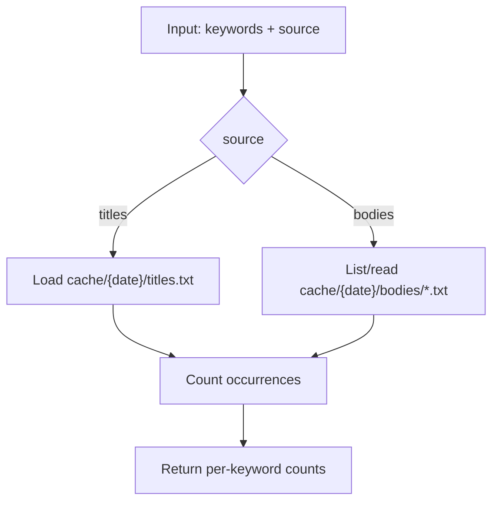

# Tool: `count_keyword_frequency`

`count_keyword_frequency`는 키워드 목록을 받아, 다음 중 하나에서 등장 빈도를 계산합니다.

- `titles`: `cache/{date}/titles.txt`
- `bodies`: `cache/{date}/bodies/*.txt` (선택적으로 `news_pks`로 스캔 범위를 제한)

대소문자는 무시하며, 단순 “부분 문자열 포함” 기준으로 카운트합니다.

## 사용 시나리오

- `titles` 모드: “오늘 뉴스 제목에서 많이 등장하는 키워드”를 빠르게 파악
- `bodies` 모드: 이미 내려받은 본문들에 한해 “특정 키워드가 실제 본문에서 얼마나 등장하는지” 확인
  - `bodies` 모드는 먼저 `get_news_content`로 본문을 내려받아야 의미가 있습니다.

## Flow



## 상태 스키마 (State Schema)

```yaml
RuntimeState:
  BRIEFING_DATE: string
  source=titles:
    cache/{date}/titles.txt: file
  source=bodies:
    cache/{date}/bodies/: directory
```

## 요청 스키마 (Request Schema)

```json
{
  "type": "object",
  "required": ["keywords"],
  "properties": {
    "keywords": { "type": "array", "items": { "type": "string" }, "minItems": 1 },
    "source": { "type": "string", "enum": ["titles", "bodies"], "default": "titles" },
    "news_pks": {
      "type": ["array", "null"],
      "items": { "type": "string" },
      "description": "Only used when source=bodies; limits the scanned body files."
    }
  },
  "additionalProperties": false
}
```

## 응답 스키마 (Response Schema)

키워드별 결과를 반환하는 “키-값 맵” 형태입니다.

```json
{
  "type": "object",
  "additionalProperties": {
    "type": "object",
    "required": ["count", "article_pks"],
    "properties": {
      "count": { "type": "integer", "minimum": 0 },
      "article_pks": { "type": "array", "items": { "type": "string" } }
    },
    "additionalProperties": true
  }
}
```

## 에러 처리 및 주의사항

- `source=titles`인데 `titles.txt`가 없으면 실패합니다.
- `source=bodies`에서 `bodies/`가 비어있으면 모든 키워드의 `count=0`이 됩니다.
- 본문 파일이 많으면 I/O 비용이 커질 수 있으므로, `news_pks`로 스캔 대상을 제한하는 것이 안전합니다.

