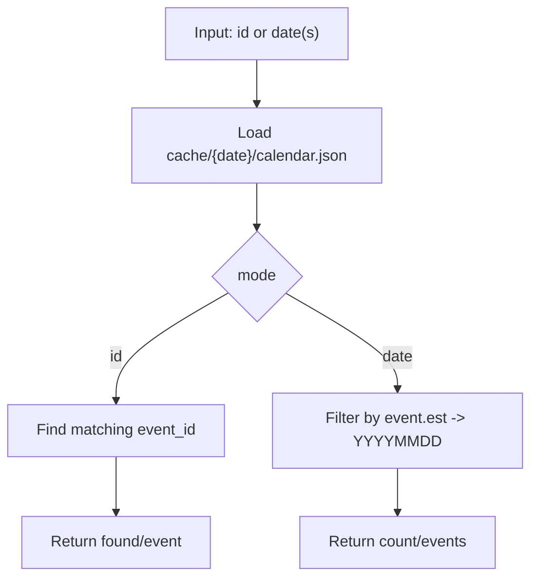

# Tool: `get_calendar`

`get_calendar`는 `cache/{date}/calendar.json`에 저장된 “거시경제 이벤트 캘린더”를 조회합니다.

- `id` 모드: 단일 이벤트를 `event_id`로 조회
- `date` 모드: `YYYYMMDD`(1개 또는 여러 개)에 해당하는 이벤트를 조회

이 툴은 네트워크 호출을 하지 않습니다. `calendar.json`은 선행 프리페치 단계에서 생성되어야 합니다.

## 데이터 소스 및 캐시 계약

- 캐시 생성 주체: `shared/fetchers/calendar.py::prefetch_calendar()`
- 원천 데이터: TradingEconomics 캘린더 페이지(스크래핑)
- 캐시 파일:
  - `cache/{date}/calendar.json`: 이벤트 상세(필수)
  - `cache/{date}/calendar.csv`: 요약 TSV/프롬프트 컨텍스트용(선택)

### `calendar.json` 이벤트 엔트리 주요 필드(요약)

| 필드 | 타입 | 설명 |
| --- | --- | --- |
| `event_id` | string | 이벤트 식별자 |
| `utc` | string | UTC 기준 시각(ISO) |
| `est` | string | ET 기준 시각(ISO) |
| `title` | string | 이벤트 제목 |
| `category` | string | 섹션/카테고리 |
| `series` | string | 시리즈명 |
| `importance` | number | 중요도(예: 1~3) |
| `actual/previous/consensus/forecast` | string | 값(있을 때만) |

## Flow



## 상태 스키마 (State Schema)

```yaml
RuntimeState:
  BRIEFING_DATE: string
  cache/{date}/calendar.json: file
```

## 요청 스키마 (Request Schema)

```json
{
  "type": "object",
  "properties": {
    "id": { "type": ["string", "null"] },
    "date": {
      "description": "YYYYMMDD or list of YYYYMMDD. Comma-separated strings are accepted.",
      "oneOf": [
        { "type": "string", "pattern": "^[0-9]{8}([,][0-9]{8})*$" },
        { "type": "array", "items": { "type": "string", "pattern": "^[0-9]{8}$" }, "minItems": 1 },
        { "type": "null" }
      ]
    }
  },
  "additionalProperties": false
}
```

## 응답 스키마 (Response Schema)

`id` 모드:

```json
{
  "type": "object",
  "required": ["mode", "found", "event"],
  "properties": {
    "mode": { "type": "string", "enum": ["id"] },
    "found": { "type": "boolean" },
    "event": { "type": ["object", "null"] }
  },
  "additionalProperties": true
}
```

`date` 모드:

```json
{
  "type": "object",
  "required": ["mode", "count", "dates", "events"],
  "properties": {
    "mode": { "type": "string", "enum": ["date"] },
    "count": { "type": "integer", "minimum": 0 },
    "dates": { "type": "array", "items": { "type": "string", "pattern": "^[0-9]{8}$" } },
    "events": { "type": "array", "items": { "type": "object" } }
  },
  "additionalProperties": true
}
```

## 에러 처리 및 주의사항

- `id/date` 둘 다 없으면 `ValueError`로 실패합니다.
- `calendar.json`이 없으면 `FileNotFoundError`로 실패합니다.
- `date` 형식이 `YYYYMMDD`가 아니면 `ValueError`로 실패합니다.

