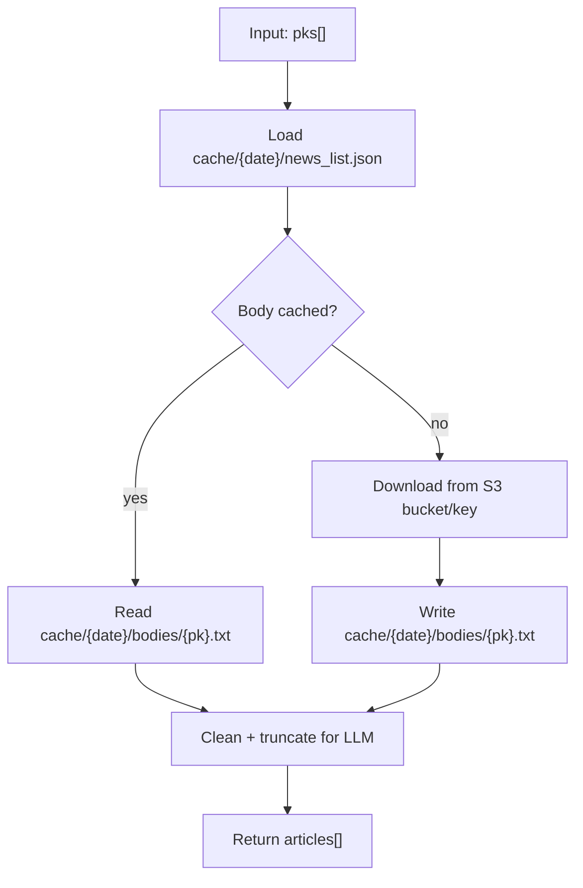

# Tool: `get_news_content`

`get_news_content`는 기사 `pk` 목록을 입력받아 **본문 텍스트**를 반환합니다.

동작 순서:

1. 우선 로컬 캐시(`cache/{date}/bodies/{pk}.txt`)를 확인합니다.
2. 캐시 미스일 때는 `cache/{date}/news_list.json`의 `path`(S3 객체 키)를 이용해 S3에서 다운로드합니다.
3. 다운로드한 원본은 `cache/{date}/bodies/{pk}.txt`로 저장하고, LLM 입력을 위해 **클린/절단**한 본문을 응답에 담습니다.

## 데이터 소스 및 캐시 계약

- 인덱스 파일: `cache/{date}/news_list.json` (pk → S3 key 매핑)
- 로컬 본문 캐시: `cache/{date}/bodies/{pk}.txt`
- 원천 본문: S3(`NEWS_BUCKET` 또는 `BUCKET_NAME`)
- 절단 규칙: `NEWS_BODY_MAX_CHARS` (기본 8000)
  - 절단은 **응답에 포함되는 body 문자열에만 적용**됩니다.
  - 로컬 파일에는 다운로드한 원본이 그대로 저장됩니다(단, 오케스트레이터 종료 시 `cache/{date}`가 삭제되므로 “런타임 캐시” 성격입니다).

## Flow



## 상태 스키마 (State Schema)

```yaml
RuntimeState:
  BRIEFING_DATE: string                     # YYYYMMDD, used to resolve cache/{date}
  cache/{date}/news_list.json: file         # must include article.pk + article.path
  cache/{date}/bodies/: directory           # created on demand
  NEWS_BUCKET: string                       # required when cache miss (or pass bucket arg)
  NEWS_BODY_MAX_CHARS: integer              # default 8000 (LLM input truncation only)
  AWS credentials/profile: required         # for S3 download
```

## 요청 스키마 (Request Schema)

```json
{
  "type": "object",
  "required": ["pks"],
  "properties": {
    "pks": { "type": "array", "items": { "type": "string" }, "minItems": 1 },
    "bucket": { "type": ["string", "null"], "description": "Optional override for NEWS_BUCKET." }
  },
  "additionalProperties": false
}
```

## 응답 스키마 (Response Schema)

```json
{
  "type": "object",
  "required": ["count", "articles"],
  "properties": {
    "count": { "type": "integer", "minimum": 0 },
    "articles": {
      "type": "array",
      "items": {
        "type": "object",
        "required": ["pk", "title", "body", "cached", "body_truncated"],
        "properties": {
          "pk": { "type": "string" },
          "title": { "type": ["string", "null"] },
          "body": { "type": "string" },
          "cached": { "type": "boolean", "description": "True if loaded from local cache." },
          "body_truncated": { "type": "boolean" }
        },
        "additionalProperties": true
      }
    }
  },
  "additionalProperties": true
}
```

## 에러 처리 및 주의사항

- `cache/{date}/news_list.json`이 없으면 실패합니다.
- `pk`가 인덱스에 없으면 경고 로그를 남기고 해당 항목은 스킵합니다.
- `NEWS_BUCKET`(또는 `BUCKET_NAME`)이 없으면 캐시 미스 시 실패합니다.
- S3 본문이 XML/HTML 등 태그를 포함할 수 있어, 응답 본문은 간단한 태그 제거 후 반환됩니다.
