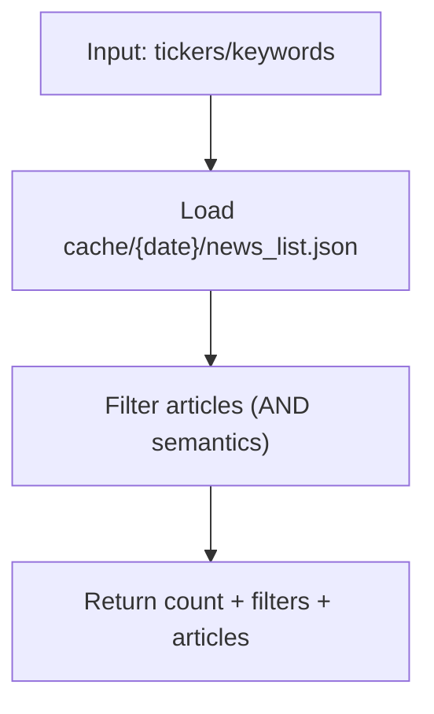

# Tool: `get_news_list`

`get_news_list`는 **이미 캐시된 뉴스 인덱스**(`cache/{date}/news_list.json`)에서 조건에 맞는 기사 목록을 필터링해 반환합니다.

이 툴은 네트워크 호출을 하지 않습니다. 오케스트레이터의 `global_prefetch_node()` 또는 standalone 실행의 `prefetch_all()`이 **선행되어** `news_list.json`이 존재해야 합니다.

## 데이터 소스 및 캐시 계약

- 캐시 생성 주체: `shared/fetchers/news.py::prefetch_news()`
- 원천 데이터: DynamoDB 테이블(`NEWS_TABLE`)의 기사 메타데이터
- 캐시 파일:
  - `cache/{date}/news_list.json`: 기사 메타데이터 목록
  - `cache/{date}/titles.txt`: 기사 제목만 모은 텍스트(키워드 빈도용)

### `news_list.json` 기사 엔트리 주요 필드(요약)

| 필드 | 타입 | 설명 |
| --- | --- | --- |
| `pk` | string | 기사 식별자(DynamoDB PK) |
| `title` | string | 기사 제목 |
| `url` | string | 원문 URL |
| `tickers` | string[] | 관련 티커 목록 |
| `publish_et_iso` | string | ET 기준 발행시각(ISO) |
| `gsi_utc_pk` | string | UTC 날짜 버킷(예: `UTC#2025-03-01`) |
| `utc_ms` | number | UTC epoch ms |
| `path` | string | S3 객체 키(본문 조회용) |

## 필터링 규칙

- `tickers`: 기사 `tickers` 배열에 **모든** 티커가 포함되어야 합니다(AND).
- `keywords`: 기사 `title`에 **모든** 키워드가 포함되어야 합니다(AND, 대소문자 무시).

## Flow



## 상태 스키마 (State Schema)

```yaml
RuntimeState:
  BRIEFING_DATE: string           # YYYYMMDD, used to resolve cache/{date}
  cache/{date}/news_list.json: file
```

## 요청 스키마 (Request Schema)

```json
{
  "type": "object",
  "properties": {
    "tickers": {
      "type": ["array", "null"],
      "items": { "type": "string" },
      "description": "All tickers must be included in article.tickers (AND)."
    },
    "keywords": {
      "type": ["array", "null"],
      "items": { "type": "string" },
      "description": "All keywords must appear in article.title (AND, case-insensitive)."
    }
  },
  "additionalProperties": false
}
```

## 응답 스키마 (Response Schema)

```json
{
  "type": "object",
  "required": ["count", "filters", "articles"],
  "properties": {
    "count": { "type": "integer", "minimum": 0 },
    "filters": {
      "type": "object",
      "properties": {
        "tickers": { "type": ["array", "null"], "items": { "type": "string" } },
        "keywords": { "type": ["array", "null"], "items": { "type": "string" } }
      },
      "additionalProperties": true
    },
    "articles": {
      "type": "array",
      "items": { "type": "object" },
      "description": "Raw entries from news_list.json (pk/title/url/tickers/path/...)."
    }
  },
  "additionalProperties": true
}
```

## 에러 처리 및 주의사항

- `cache/{date}/news_list.json`이 없으면 `FileNotFoundError`로 실패합니다.
- `tickers/keywords`가 너무 광범위하면 반환 payload가 커질 수 있으므로, LLM 프롬프트에서 필요 범위를 제한하는 것이 안전합니다.

