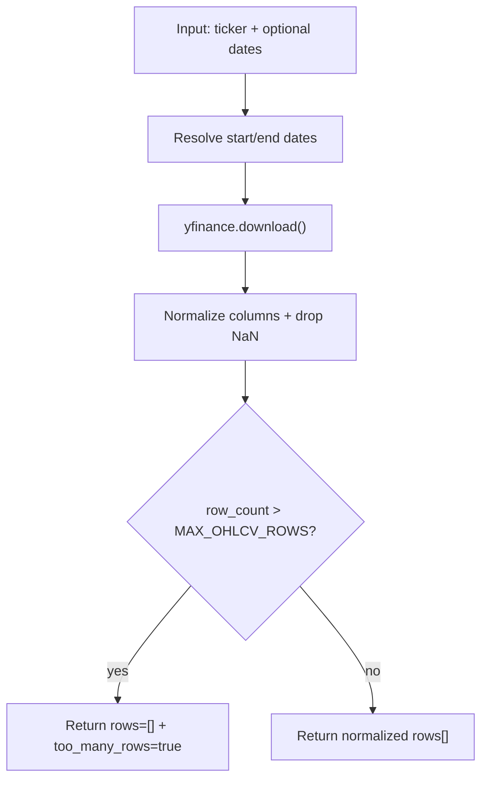

# Tool: `get_ohlcv`

`get_ohlcv`는 `yfinance`를 사용해 특정 티커의 OHLCV 데이터를 조회합니다.

기본값:

- `end_date`: 지정하지 않으면 `BRIEFING_DATE`(YYYYMMDD)를 기준으로 해석
- `start_date`: 지정하지 않으면 `end_date - 30일`
- `interval`: `1d`

## 데이터 소스

- 원천 데이터: Yahoo Finance(yfinance)
- 네트워크 호출이 필요합니다.

## 결과 크기 제한

- 내부적으로 최대 `MAX_OHLCV_ROWS=200`를 허용합니다.
- 조회 결과가 너무 크면:
  - `rows=[]`
  - `too_many_rows=true`
  - `suggested_intervals` 등을 포함해 반환합니다.

## Flow



## 상태 스키마 (State Schema)

```yaml
RuntimeState:
  BRIEFING_DATE: string           # required when end_date is omitted
  network: required               # yfinance HTTP requests
```

## 요청 스키마 (Request Schema)

```json
{
  "type": "object",
  "required": ["ticker"],
  "properties": {
    "ticker": { "type": "string" },
    "start_date": { "type": ["string", "null"], "pattern": "^[0-9]{4}-[0-9]{2}-[0-9]{2}$" },
    "end_date": { "type": ["string", "null"], "pattern": "^[0-9]{4}-[0-9]{2}-[0-9]{2}$" },
    "interval": { "type": "string", "default": "1d" }
  },
  "additionalProperties": false
}
```

## 응답 스키마 (Response Schema)

```json
{
  "type": "object",
  "required": ["ticker", "start_date", "end_date", "interval", "rows"],
  "properties": {
    "ticker": { "type": "string" },
    "start_date": { "type": "string", "pattern": "^[0-9]{4}-[0-9]{2}-[0-9]{2}$" },
    "end_date": { "type": "string", "pattern": "^[0-9]{4}-[0-9]{2}-[0-9]{2}$" },
    "interval": { "type": "string" },
    "rows": {
      "type": "array",
      "items": {
        "type": "object",
        "required": ["ts", "open", "high", "low", "close", "volume"],
        "properties": {
          "ts": { "type": "string" },
          "open": { "type": ["number", "null"] },
          "high": { "type": ["number", "null"] },
          "low": { "type": ["number", "null"] },
          "close": { "type": ["number", "null"] },
          "volume": { "type": ["integer", "null"] }
        },
        "additionalProperties": true
      }
    },
    "too_many_rows": { "type": ["boolean", "null"] },
    "row_count": { "type": ["integer", "null"] },
    "max_rows": { "type": ["integer", "null"] },
    "message": { "type": ["string", "null"] },
    "suggested_intervals": { "type": ["array", "null"], "items": { "type": "string" } }
  },
  "additionalProperties": true
}
```

## 에러 처리 및 주의사항

- `BRIEFING_DATE`가 설정되어 있지 않고 `end_date`도 없으면 실패합니다.
- yfinance 결과가 비어 있거나 컬럼이 예상과 다르면 `rows=[]`로 반환할 수 있습니다.

