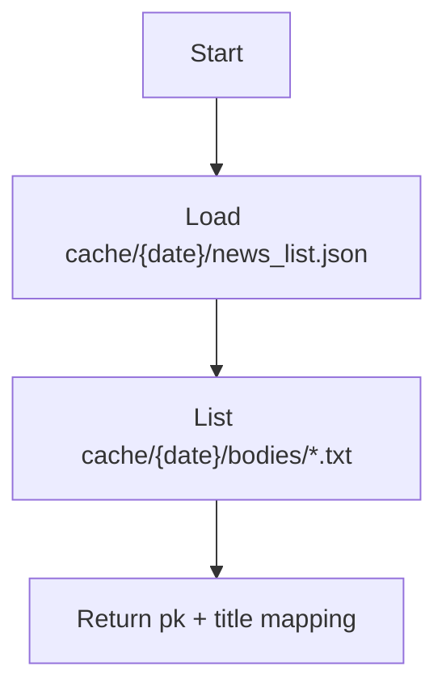

# Tool: `list_downloaded_bodies`

`list_downloaded_bodies`는 `cache/{date}/bodies/` 하위에 다운로드된 본문 파일 목록을 나열합니다. LLM이 “이미 내려받은 본문이 무엇인지” 확인하거나, 중복 다운로드를 피하는 흐름을 만들 때 사용할 수 있습니다.

## 데이터 소스 및 캐시 계약

- 인덱스 파일: `cache/{date}/news_list.json`
- 로컬 본문 캐시: `cache/{date}/bodies/*.txt`

이 툴은 네트워크 호출을 하지 않습니다.

## Flow



## 상태 스키마 (State Schema)

```yaml
RuntimeState:
  BRIEFING_DATE: string
  cache/{date}/news_list.json: file
  cache/{date}/bodies/: directory
```

## 요청 스키마 (Request Schema)

```json
{
  "type": "object",
  "properties": {},
  "additionalProperties": false
}
```

## 응답 스키마 (Response Schema)

```json
{
  "type": "object",
  "required": ["count", "articles"],
  "properties": {
    "count": { "type": "integer", "minimum": 0 },
    "articles": {
      "type": "array",
      "items": {
        "type": "object",
        "required": ["pk"],
        "properties": {
          "pk": { "type": "string" },
          "title": { "type": ["string", "null"] }
        },
        "additionalProperties": true
      }
    }
  },
  "additionalProperties": true
}
```

## 에러 처리 및 주의사항

- `cache/{date}/news_list.json`이 없으면 실패합니다.
- `bodies/`는 없으면 자동으로 생성되며, 그 경우 `count=0`을 반환합니다.

